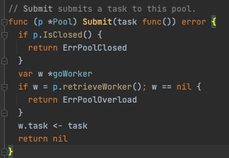
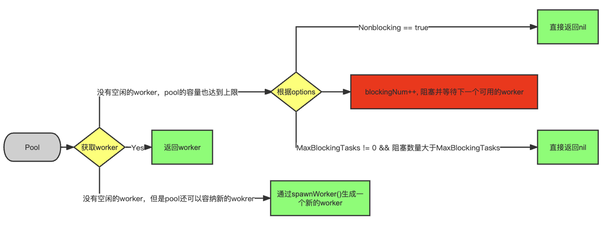

### 1. 背景

我们的项目有大量的api请求由goroutine完成，所以我们需要引入一个pool来节省频繁创建goroutine所造成的的开销，同时也可以更简易的调度goroutine，在对github上多个协程池的对比后，我们最终选定了[ants](https://github.com/panjf2000/ants)作为我们的调度管理pool。

1. 最近在测试中偶然发现系统出现了“死锁”的情况，进而采取断网的方式发现“死锁”在极端情况下是稳定出现，经过满篇的log，break，最终把问题定位到了ants的submit方法。这个问题来自于在使用ants pool的过程中，为了实现重试，我们在方法中又递归调用了方法本身，也就是submit task内部又submit一个task，下面是简化后的代码：

<!--truncate-->


```Go
func (apiClient *ApiAsyncClient) DoAsync(

   retry int,

) error {

   return apiClient.scheduler.Submit(func() error {

      _, err := apiClient.Do()

      if err != nil {

         if retry < apiClient.maxRetry {

            return apiClient.DoAsync(retry+1)

         }

      }

      return err

   })

}
```

在上面的代码块中，可以看到return apiClient.DoAsync(retry+1)这一步递归调用了自己，即在submit中又调用了submit


### 2. 深入ants分析



- 在上面submit源码中可以看到，首先是通过retrieveWorker回去一个worker，然后把task放入到worker的task channel当中，很简单，也看不出来为什么会“dead lock”，没办法，去到retrieveWorker

```Go
// retrieveWorker returns a available worker to run the tasks.

func (p *Pool) retrieveWorker() (w *goWorker) {

 spawnWorker := func() {

  w = p.workerCache.Get().(*goWorker)

  w.run()

 }


 p.lock.Lock()


 w = p.workers.detach()

 if w != nil { // first try to fetch the worker from the queue

  p.lock.Unlock()

 } else if capacity := p.Cap(); capacity == -1 || capacity > p.Running() {

  // if the worker queue is empty and we don't run out of the pool capacity,

  // then just spawn a new worker goroutine.

  p.lock.Unlock()

  spawnWorker()

 } else { // otherwise, we'll have to keep them blocked and wait for at least one worker to be put back into pool.

  if p.options.Nonblocking {

   p.lock.Unlock()

   return

  }

 retry:

  if p.options.MaxBlockingTasks != 0 && p.blockingNum >= p.options.MaxBlockingTasks {

   p.lock.Unlock()

   return

  }

  p.blockingNum++

  p.cond.Wait() // block and wait for an available worker

  p.blockingNum--

  var nw int

  if nw = p.Running(); nw == 0 { // awakened by the scavenger

   p.lock.Unlock()

   if !p.IsClosed() {

    spawnWorker()

   }

   return

  }

  if w = p.workers.detach(); w == nil {

   if nw < capacity {

    p.lock.Unlock()

    spawnWorker()

    return

   }

   goto retry

  }


  p.lock.Unlock()

 }

 return

}
```



- 这个方法的大概流程就是先对pool上锁，然后从pool的worker队列中去取一个worker，detach其实就是返回了worker，并且把这个worker从队列中删除掉了，接下来有三种情况
  - 如果成功取到worker，解锁p，返回取到的worker
  - 如果worker队列是空的并且pool的容量没有耗尽，就解锁pool并生成一个新的worker返回给submit
  - 最后一种情况就是pool容量耗尽了，worker队列也没有空闲的worker，那就要根据我们创建pool时传入的参数来决定下一步情况了
    - 首先说一下这里涉及的两个重要参数，一个是capacity，这个值如果在new pool的时候不设置，会是MaxInt32，相当于无限制的goroutine，但是情况不同的是，我们会首先复用空闲的worker，还可以定时清空多余的空闲worker，blockingNum为正在等待的goroutine，初始为0
    - 如果设置了Nonblocking为true，直接解锁，返回nil，submit就会直接返回一个错误ErrPoolOverload，代表pool超负荷了，不做任何其他处理，submit失败，结束~~
    - 另一种情况就是没有设置Nonblocking，默认为false，就进入到了一个retry标签，这里面就涉及到了另一个创建pool时候的参数MaxBlockingTasks，这个MaxBlockingTasks就是一个threshold
      - 首先判断如果设置了MaxBlockingTasks并且当前blockingNum大于或者等于MaxBlockingTasks，那么直接解锁pool并且返回nil，submit失败，结束~~
      - 上面的条件不满足，则首先blockingNum++，然后开始wait一直到有worker摸完鱼回来工作，则blockingNum--。问题就在这里了！！！如果所有的worker都在工作（也许是看起来在工作，实际上在摸鱼），这里就会一直wait()，也就是我们自己代码中return后面的DoAsync会一直wait()，从我们自己的项目来讲，就是所有worker这个时候都在submit一个新的task到同一个pool中，而这个时候pool已经满了，导致所有worker都阻塞在了这里，“死锁”也就出现了

### 3. 最后聊几句自己对于golang内存模型的理解

1. go的调度流程本质上是一个生产-消费的过程，我们利用go func是生产了一个task放到队列中，由系统线程从队列中获取协程然后执行
2. 讲到go的调度流程，咱们就不能不说一下go的MPG（分别解释一下，就不做深入了，如果有人看，后期再努力整理一份详细聊聊）
   1. M 代表着一个内核线程，也可以称为一个工作线程，所有的goroutine都是跑在M之上的
   2. P可以理解为一个逻辑处理器，主要由P来执行goroutine
   3. G就是go func封装的这个方法
3. 真正的并发数是由GOMAXPROCS来决定的，并不是提交多少goroutine，并发数就是多少，GOMAXPROCS是由机器的cpu核数来决定的
4. 所以回到第2部分，pool.cond.wait等待的是绑定上一个goroutine，和其他语言的等待线程具有相似却完全不同的意义，每一个worker是一个G，pool也就是一个队列，而M会从队列中获取可以执行的G，当所有的G都在等待创建新的G时，M全部都处于空闲状态

### 4. 解决方案

1. 当然，最靠谱的应该是尽量避免类似这样的递归调用操作
2. 如果实在不行，可以考虑添加一个sub pool，作为次级队列，让递归生成的G可以在sub pool里等待空闲的M来处理

### 5. 对比不同size的pool和两个pool的内存（alloc_space）和CPU开销

| Pool size           | CPU(ants)% | CPU(runtime.gcBgMarkWorker)% | CPU(runtime.mcall)% | 内存(runtime.allocm)kB | 内存(runtime.gcBgMarkWorker)kB | 内存(root) |
| ------------------- | ---------- | ---------------------------- | ------------------- | ---------------------- | ------------------------------ | ---------- |
| Two pools(158, 632) | 27.98      | 7.73                         | 25.44               | 2050.25                | 512.02                         | 8798       |
| Pool 158            | 28.11      | 6.61                         | 25.08               | 2050                   |                                | 6661       |
| Pool 1580           | 27.41      | 12.96                        | 23.17               | 3075.38                |                                | 10264      |
| Pool 7900           | 25.89      | 9.82                         | 22.52               | 3587.94                |                                | 5725       |
| Pool 790000         | 25.12      | 12.79                        | 23.44               | 3075.38                |                                | 9748       |

runtime.gcBgMarkWorker: 用于标记垃圾对象

从上面的表格可以看到，可能存在多核的影响，所以对于我们公司现在需要的并发数量级来讲，pool的size对系统影响并不大。