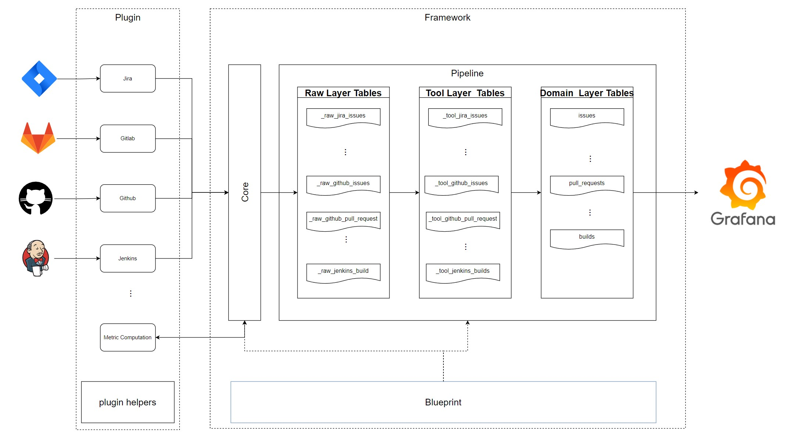

We are excited to share today that the Apache Software Foundation (ASF) voted to make DevLake an officially supported project of the Apache Incubator.

### What is DevLake?

Launched in December of 2021, [DevLake](https://github.com/apache/incubator-devlake) is an open-source dev data platform that ingests, analyzes, and visualizes the fragmented data in developer tools. 

Software development is complex, requiring many tools and processes, and as a result creates a storm of data scattered across tools in many formats. This makes it difficult to organize, query, and make sense of.  We built DevLake, to make it easy to make sense of this rich data and to translate it into actionable insights.

<!--truncate-->

### DevLake's key features:

- Collect DevOps data across software development lifecycle (SDLC) to connect data islands.
- Standardized data models with out-of-the-box metrics and customizable dashboards.
- Flexible plugin system for user-defined data integration and transformation.

Below is the architecture of DevLake: 

### Why join Apache Incubator?

First and foremost, we firmly believe in Apache's principle of "Community over Code" and ["The Apache Way"](https://www.apache.org/theapacheway/index.html). We look forward to building a vibrant, inclusive, and diverse community under the guidance of our mentors through the incubator journey.

We also feel that the Apache community has one of the strongest ecosystems when it comes to data-oriented open-source projects. 

Last and not least, the support and enthusiasm of the Apache community and mentors made it clear to us that this would be a place where we can truly evolve and nurture DevLake.

In the months leading up to DevLake's acceptance, our mentors provided guidance and suggestions instrumental to making this important moment a reality. We want to take this opportunity to thank and acknowledge them: 

- **[Willem Ning Jiang](https://github.com/WillemJiang)**: DevLake Champion; ASF Member & Board Director
- **[Liang Zhang](https://github.com/terrymanu)**: Founder & CEO of SphereEx; ASF Member, Founder & PMC Chair of Apache ShardingSphere
- **[Lidong Dai](https://github.com/dailidong)**: ASF Member; Apache DolphinScheduler PMC Chair
- **[Sijie Guo](https://github.com/sijie)**: ASF Member, PMC member of Apache Pulsar; Founder & CEO of StreamNative

- **[Felix Cheung](https://github.com/felixcheung)**: ASF Member, PMC on Spark, Superset, Yunikorn, Zeppelin, Pinot, and Incubator. SVP of Engineering at SafeGraph.

- **[Jean-Baptiste Onofré](https://github.com/jbonofre)**: ASF Member, Karaf PMC Chair, PMC on ActiveMQ, Archiva, Aries, Beam, Brooklyn, Camel, Carbondata, Felix, Incubator, and [many more](http://people.apache.org/committer-index.html).

### DevLake Future Roadmap

- Enhance system scalability and performance in large-scale data scenarios.
- Integrate more data sources and tools (JIRA, GitHub, GitLab, and Jenkins are already supported.)
- Enable support for OLAP databases, providing users with more choices.
- Provide more scenario-specific, out-of-the-box dashboards and templates reflecting best practices and well-known methodologies to improve usability.

### Join us! 

We invite developers and those passionate about data-driven engineering to 'dive into the lake' with us, and welcome contributions of all kinds. 
Join us on Slack and at our weekly open source community meetups🥳

**Apache DevLake (Incubating) Links:**

- GitHub:  https://github.com/apache/incubator-devlake
- DevLake Official Website: https://devlake.apache.org/
- Slack:  https://join.slack.com/t/devlake-io/shared_invite/zt-18uayb6ut-_P30EyJIxavGtZ3vTHWLJA
- DevLake Podling Website：https://incubator.apache.org/projects/devlake.html