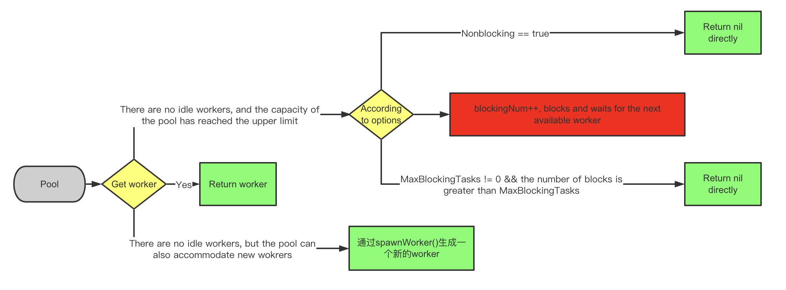

### 1.Background
Our project has a lot of api requests done by goroutine, so we need to introduce a pool to save the overhead caused by frequent goroutine creation, and also to make scheduling goroutines easier, after comparing multiple pools on github, we finally chose [ants](https://github.com/panjf2000/ants) as our scheduling management pool.

1. Recently, we found a "deadlock" in the system by chance in the test, and then we found that the "deadlock" is stable in extreme cases by disconnecting the network. After a full log, break, and finally locate the problem to the submit method of ants. This problem comes from the process of using the ants pool, in order to achieve retry, we recursively call the method itself in the method, that is, submit task and submit a task inside, the following is the simplified code:
```go
func (apiClient *ApiAsyncClient) DoAsync(

   retry int,

) error {

   return apiClient.scheduler.Submit(func() error {

      _, err := apiClient.Do()

      if err != nil {

         if retry < apiClient.maxRetry {

            return apiClient.DoAsync(retry+1)

         }

      }

      return err

   })

}

```
In the block above, you can see that return apiClient.DoAsync(retry+1) recursively calls itself, that is, it calls submit again in submit.

### 2.In-depth ants analysis


-In the above submit source code, you can see that the first is to go back to a worker through retrieveWorker, and then put the task into the task channel of the worker, very simple, and do not see why it will "dead lock", no way, go to retrieveWorker.

```go
// retrieveWorker returns a available worker to run the tasks.

func (p *Pool) retrieveWorker() (w *goWorker) {

 spawnWorker := func() {

  w = p.workerCache.Get().(*goWorker)

  w.run()

 }


 p.lock.Lock()


 w = p.workers.detach()

 if w != nil { // first try to fetch the worker from the queue

  p.lock.Unlock()

 } else if capacity := p.Cap(); capacity == -1 || capacity > p.Running() {

  // if the worker queue is empty and we don't run out of the pool capacity,

  // then just spawn a new worker goroutine.

  p.lock.Unlock()

  spawnWorker()

 } else { // otherwise, we'll have to keep them blocked and wait for at least one worker to be put back into pool.

  if p.options.Nonblocking {

   p.lock.Unlock()

   return

  }

 retry:

  if p.options.MaxBlockingTasks != 0 && p.blockingNum >= p.options.MaxBlockingTasks {

   p.lock.Unlock()

   return

  }

  p.blockingNum++

  p.cond.Wait() // block and wait for an available worker

  p.blockingNum--

  var nw int

  if nw = p.Running(); nw == 0 { // awakened by the scavenger

   p.lock.Unlock()

   if !p.IsClosed() {

    spawnWorker()

   }

   return

  }

  if w = p.workers.detach(); w == nil {

   if nw < capacity {

    p.lock.Unlock()

    spawnWorker()

    return

   }

   goto retry

  }


  p.lock.Unlock()

 }

 return

}
```



* The approxmate process of this method is to first lock the pool, and then to fetch a worker from the pool's worker queue, detach actually returns the worker, and the worker is removed from the queue, then there are three cases:
    * If the worker is successfully fetched, unlock p and return the fetched worker.
    * If the worker queue is empty and the pool capacity is not exhausted, the pool is unlocked and a new worker is generated and returned to submit.
    * The last case is that the pool capacity is exhausted and there are no free workers in the worker queue, then it's up to us to decide what happens next depending on the parameters we pass in when we create the pool.
        * First of all, there are two important parameters involved here, one is capacity, this value if not set at the time of new pool, will be MaxInt32, equivalent to unlimited goroutine, but the situation is different, we will first reuse the free worker, can also be timed to empty the excess free worker, blockingNum is waiting goroutine, the initial 0.
        * If you set Nonblocking to true, directly unlock, return nil, submit will directly return an error ErrPoolOverload, on behalf of the pool overload, do not do any other processing, submit failed, end ~~
        * Another case is not set Nonblocking, the default is false, it goes to a retry tag, which involves another parameter MaxBlockingTasks when creating a pool, this MaxBlockingTasks is a threshold.
            * First decide if MaxBlockingTasks is set and the current blockingNum is greater than or equal to MaxBlockingTasks, then directly unlock the pool and return nil, submit failed, end ~~
            * The above condition is not satisfied, then first blockingNum++, then start wait until a worker come back from a break, then blockingNum --. Here's the problem!!! If all the workers are working (maybe it looks like they are working, but actually is taking a break), here will always wait(), that is, our own code after the return DoAsync will always wait(), from our own project, that is, all workers at this time are submitting a new task to the same pool, and this time the pool is already full, resulting in all workers are blocked here, "deadlock" also appeared.

### 3.Finally, a few words about my understanding of the golang memory model
1. The scheduling process of go is essentially a production-consumption process. We use the go func to produce a task and put it in the queue, and the system thread gets the concurrent thread from the queue and executes it.
2. Sperking of go's scheduling process, MPG is a topic that cannot be ignored(explain it separately, so we won't do it in depth, and if someone reads it, we'll try to organize a detail chat later).
    i. M represents a kernel thread, which can also be called a worker thread, and all goroutines are running on top of M.
    ii. P can be understood as a logical processor, mainly by P to execute goroutine.
    iii. G is the go func wrapper for this method.
3. The real number of concurrency is determined by GOMAXPROCS, not how many goroutines are submitted, the number of concurrency is determined by the number of cpu cores of the machine.
4. So back to part 2, pool.cond.wait is bound to a goroutine, and other languages waiting thread has a similar but completely different meaning, each worker is a G, pool is also a queue, and M will get the G from the queue can be executed, when all the G are waiting for the creation of a new G, M all in the free state.

### 4.Solutions
1. Of course, the most reliable thing to do is to try to avoid recursive calls like this.
2. If this is not possible, consider adding a sub pool as a secondary queue, so that the recursively generated G can wait in the sub pool for the free M to process.

### 5.Compare the memory (alloc_space) and CPU overhead of different size pools and two pools
<table><tbody>
<tr>
        <th bgcolor="#ebedf0">Pool size</th><th bgcolor="#ebedf0">CPU(ants)%</th><th bgcolor="#ebedf0">Memory(runtime.allocm)kB(runtime.gcBgMarkWorker)%	</th><th bgcolor="#ebedf0">CPU(runtime.mcall)%</th><th bgcolor="#ebedf0">Memory(runtime.allocm)kB</th><th bgcolor="#ebedf0">Memory(runtime.gcBgMarkWorker)kB</th><th bgcolor="#ebedf0">Memory(root)</th>
</tr>
<tr>
    <td>
    Two pools(158, 632)
    </td>
    <td>
    27.98
    </td>
    <td>
    7.73
    </td>
    <td>
    25.44
    </td>
    <td>
    2050.25
    </td>
    <td>
    512.02
    </td>
    <td>
    8798
    </td>
</tr>
<tr>
    <td bgcolor="#ebedf0">
    Pool 158
    </td>
    <td bgcolor="#ebedf0">
    28.11
    </td>
    <td bgcolor="#ebedf0">
    6.61
    </td>
    <td bgcolor="#ebedf0">
    25.08
    </td>
    <td bgcolor="#ebedf0">
    2050
    </td>
    <td bgcolor="#ebedf0">
    </td>
    <td bgcolor="#ebedf0">
    6661
    </td>
</tr>
<tr>
    <td>
    Pool 1580
    </td>
    <td>
    27.41
    </td>
    <td>
    12.96
    </td>
    <td>
    23.17
    </td>
    <td>
    3075.38
    </td>
    <td>
    </td>
    <td>
    10264
    </td>
<tr>
    <td bgcolor="#ebedf0">
    Pool 7900	
    </td>
    <td bgcolor="#ebedf0">
    25.89
    </td>
    <td bgcolor="#ebedf0">
    9.82
    </td>
    <td bgcolor="#ebedf0">
    22.52
    </td>
    <td bgcolor="#ebedf0">
    3587.94
    </td>
    <td bgcolor="#ebedf0">
    </td>
    <td bgcolor="#ebedf0">
    5725
    </td>
<tr>
    <td>
    Pool 790000
    </td>
    <td>
    25.12
    </td>
    <td>
    12.79
    </td>
    <td>
    23.44
    </td>
    <td>
    3075.38	
    </td>
    <td>
    </td>
    <td>
    9748
    </td>
</tr>
</table>
runtime.gcBgMarkWorker: Used to mark trash objects

As you can see from the table above, there may be a multicore effect that. So for the level of concurrency our company needs now, the size of the pool does not have much impact on the system.