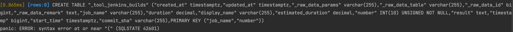
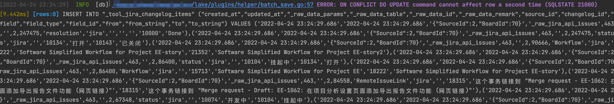
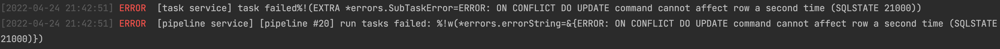
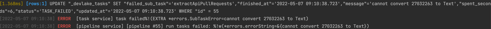

# Apache DevLake 兼容 PostgreSQL 踩坑小结


本文作者：ZhangLiang  
个人主页：https://github.com/mindlesscloud

Apache DevLake 是一个研发数据平台，可以收集和整合各类研发工具的数据，比如 Jira、Github、Gitlab、Jenkins。

**本文并不打算对数据库兼容这个问题做全面的总结，只是对我们实际遇到的问题做一个记录，希望能对有相似需求的人提供一个参考。**

**1、数据类型差异**

### PostgreSQL 不支持 uint 类型的数据类型
```go
type JenkinsBuild struct {
	common.NoPKModel
	JobName           string  `gorm:"primaryKey;type:varchar(255)"`
	Duration          float64 // build time
	DisplayName       string  // "#7"
	EstimatedDuration float64
	Number            int64 `gorm:"primaryKey;type:INT(10) UNSIGNED NOT NULL"`
	Result            string
	Timestamp         int64     // start time
	StartTime         time.Time // convered by timestamp
	CommitSha         string
}

```
其中的`JenkinsBuild.Number`字段的`gorm` struct tag 使用了`UNSIGNED`会导致建表失败，需要去掉。




### MySQL 没有 bool 型
对于 model 里定义为 bool 型的字段，gorm 会把它映射成 MySQL 的 TINYINT 类型，在 SQL 里可以直接用 0 或者 1 查询，但是 PostgreSQL 里是有 bool 类型的，所以 gorm 会把它映射成 BOOL 类型，如果 SQL 里还是用的 0 或者 1 去查询就会报错。

以下是一个具体的例子（为了清晰起见我们删掉了无关的字段），下面的查询语句在 MySQL 里是没有问题的，但是在  PostgreSQL 上就会报错。
```go
type GitlabMergeRequestNote struct {
	MergeRequestId  int    `gorm:"index"`
	System          bool 
}
	
db.Where("merge_request_id = ? AND `system` = 0", gitlabMr.GitlabId).
```
语句改成这样后仍然会有错误，具体请见下面关于反引号的问题。
```go
db.Where("merge_request_id = ? AND `system` = ?", gitlabMr.GitlabId, false)  
```

**2、行为差异**

### 批量插入
如果使用了`ON CONFLIT UPDATE ALL`从句批量插入的时候，本批次如果有多条主键相同的记录会导致 PostgreSQL 报错，MySQL 则不会。






### 字段类型 model 定义与 schema 不一致
例如在 model 定义中`GithubPullRequest.AuthorId`是 int 类型，但是数据库里这个字段是 VARCHAR 类型，插入数据的时候 MySQL 是允许的，PostgreSQL 则会报错。
```go
type GithubPullRequest struct {
	GithubId        int    `gorm:"primaryKey"`
	RepoId          int    `gorm:"index"`
	Number          int    `gorm:"index"` 
	State           string `gorm:"type:varchar(255)"`
	Title           string `gorm:"type:varchar(255)"`
	GithubCreatedAt time.Time
	GithubUpdatedAt time.Time `gorm:"index"`
	ClosedAt        *time.Time
	// In order to get the following fields, we need to collect PRs individually from GitHub
	Additions      int
	Deletions      int
	Comments       int
	Commits        int
	ReviewComments int
	Merged         bool
	MergedAt       *time.Time
	Body           string
	Type           string `gorm:"type:varchar(255)"`
	Component      string `gorm:"type:varchar(255)"`
	MergeCommitSha string `gorm:"type:varchar(40)"`
	HeadRef        string `gorm:"type:varchar(255)"`
	BaseRef        string `gorm:"type:varchar(255)"`
	BaseCommitSha  string `gorm:"type:varchar(255)"`
	HeadCommitSha  string `gorm:"type:varchar(255)"`
	Url            string `gorm:"type:varchar(255)"`
	AuthorName     string `gorm:"type:varchar(100)"`
	AuthorId       int
	common.NoPKModel
}

```




**3、MySQL 特有的函数**

在一个复杂查询中我们曾经使用了 `GROUP_CONCAT` 函数，虽然 PostgreSQL 中有功能类似的函数但是函数名不同，使用方式也有细微差别。

```go
cursor2, err := db.Table("pull_requests pr1").
		Joins("left join pull_requests pr2 on pr1.parent_pr_id = pr2.id").Group("pr1.parent_pr_id, pr2.created_date").Where("pr1.parent_pr_id != ''").
		Joins("left join repos on pr2.base_repo_id = repos.id").
		Order("pr2.created_date ASC").
		Select(`pr2.key as parent_pr_key, pr1.parent_pr_id as parent_pr_id, GROUP_CONCAT(pr1.base_ref order by pr1.base_ref ASC) as cherrypick_base_branches, 
			GROUP_CONCAT(pr1.key order by pr1.base_ref ASC) as cherrypick_pr_keys, repos.name as repo_name, 
			concat(repos.url, '/pull/', pr2.key) as parent_pr_url`).Rows()
```
解决方案：
我们最终决定把` GROUP_CONCAT `函数的功能拆分成两步，先用最简单的 SQL 查询得到排序好的多条数据，然后用代码做聚合。


修改后：
```go
cursor2, err := db.Raw(
		`
			SELECT pr2.pull_request_key                 AS parent_pr_key,
			       pr1.parent_pr_id                     AS parent_pr_id,
			       pr1.base_ref                         AS cherrypick_base_branch,
			       pr1.pull_request_key                 AS cherrypick_pr_key,
			       repos.NAME                           AS repo_name,
			       Concat(repos.url, '/pull/', pr2.pull_request_key) AS parent_pr_url,
 				   pr2.created_date
			FROM   pull_requests pr1
			       LEFT JOIN pull_requests pr2
			              ON pr1.parent_pr_id = pr2.id
			       LEFT JOIN repos
			              ON pr2.base_repo_id = repos.id
			WHERE  pr1.parent_pr_id != ''
			ORDER  BY pr1.parent_pr_id,
			          pr2.created_date,
					  pr1.base_ref ASC
			`).Rows()
```

**4、语法差异**

### 反引号
某些 SQL 语句中我们使用了反引号，用来保护字段名，以免跟 MySQL 保留字有冲突，这种做法在 PostgreSQL 会导致语法错误。为了解决这个问题我们重新审视了我们的代码，把所有跟保留字冲突的字段名做了修改，同时去掉了 SQL 语句中的反引号。例如刚才提到的这个例子：
```go
db.Where("merge_request_id = ? AND `system` = ?", gitlabMr.GitlabId, false)
```
解决方案：我们把`system`改个名字`is_system`，这样就可以把反引号去掉。
```go
db.Where("merge_request_id = ? AND is_system = ?", gitlabMr.GitlabId, false)
```
### 不规范的删除语句
我们的代码中曾经出现过这种删除语句，这在 MySQL 中是合法的，但是在 PostgreSQL 中会报语法错误。
```go
err := db.Exec(`
	DELETE ic
	FROM jira_issue_commits ic
	LEFT JOIN jira_board_issues bi ON (bi.source_id = ic.source_id AND bi.issue_id = ic.issue_id)
	WHERE ic.source_id = ? AND bi.board_id = ?
	`, sourceId, boardId).Error
```
解决方案：我们把` DELETE `后面的表别名去掉就可以了。

**了解更多最新动态**

官网：[https://devlake.incubator.apache.org/](https://devlake.incubator.apache.org/)

GitHub：[https://github.com/apache/incubator-devlake/](https://github.com/apache/incubator-devlake/)

Slack：通过 [Slack](https://devlake-io.slack.com/join/shared_invite/zt-18uayb6ut-cHOjiYcBwERQ8VVPZ9cQQw#/shared-invite/email) 联系我们


  