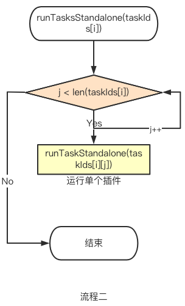

[Apache DevLake](https://github.com/apache/incubator-devlake) is an integration tool with the DevOps data collection functionality, which presents a different stage of data to development teams via Grafana. which also can leverage teams to improve the development process with a data-driven model.

### Apache DevLack Architecture Overview
- The left side of the following screenshot is an [integrative DevOps data plugin](https://devlake.apache.org/docs/next/Overview/SupportedDataSources/), the existing plugins include Github, GitLab, JIRA, Jenkins, Tapd, Feishu, and the most featured analysis engine in the Simayi platform.
- The main framework in the middle of the following screenshot, completes data collection, expansion, and conversion to the domain layer by running subtasks in the plugins. The user can trigger the tasks by config-UI or all API.
- RMDBS currently supports Mysql and PostgresSQL, more databases will be supported in the future.
- Grafana can generate different types of needed data by using SQL.


> Then let’s move on to how to start running DevLake.

<!--truncate-->

### Start the system
Before the Golang program runs, it will automatically call the init() method in the package. We need to focus on the loading of the services package. The following code has detailed comments:
```go
func init() {
var err error
// get initial config information
cfg = config.GetConfig()
// get Database
db, err = runner.NewGormDb(cfg, logger.Global.Nested("db"))
// configure time zone
location := cron.WithLocation(time.UTC)
// create scheduled task manager
cronManager = cron.New(location)
if err != nil {
panic(err)
}
// initialize the data migration
migration.Init(db)
// register the framework's data migration scripts
migrationscripts.RegisterAll()
// load plugin, loads all .so files in the folder cfg.GetString("PLUGIN_DIR")，in th LoadPlugins method()，specifically, LoadPlugins stores the pluginName:PluginMeta key-value pair into core.plugins by calling runner.
err = runner.LoadPlugins(
cfg.GetString("PLUGIN_DIR"),
cfg,
logger.Global.Nested("plugin"),
db,
)
if err != nil {
panic(err)
}
// run data migration scripts to complete the initializztion work of tables in the databse framework layer.
err = migration.Execute(context.Background())
if err != nil {
panic(err)
}

// call service init
pipelineServiceInit()
}

```
### The execution principle of DevLake
**The running process of the pipeline**
Before we go through the pipeline process, we need to know the [Blueprint](https://devlake.apache.org/docs/Overview/KeyConcepts#blueprints) first.

Blueprint is a timed task that contains all the subtasks and plans that need to be executed. Each execution record of Blueprint is a historical run, AKA Pipeline. Which presents a trigger for DevLack to complete one or more data collection transformation tasks through one or more plugins.


The following is the pipeline running flow chart.


A pipeline contains a two-dimensional array of tasks, mainly to ensure that a series of tasks are executed in a preset order. Like the following screenshot if the plugin of Stage 3 needs to rely on the other plugin to prepare the data(eg: the operation of refdiff needs to rely on gitextractor and Github, for more information on data sources and plugins, please refer to the [documentation](https://devlake.apache.org/docs/next/Overview/SupportedDataSources/), then when Stage 3 starts to execute, it needs to ensure that its dependencies have been executed in Stage 1 and Stage 2.


**Task running process**

The plugin tasks in stage1, stage2, and stage3 are executed in parallel:



**The next step is to execute the subtasks in the plugin sequentially.**


1. The work before the RunTask is to prepare the params for the RunTask method to call, like logger, db, context and etc.
2. The main method of RunTask is mainly to update the tasks in the Database, at the same time prepare to run the options of the plugins task.
3. RunpluginTask will obtain the corresponding  [PluginMeta](#pm) through core.Getplugin(pluginName), then obtains the [PluginTask](#pt) via PluginMeta, and then executes RunPluginSubTasks.

**The running process of each plugin subtask(the relevant interface and func will be explained in the next section)**


1. Get all available subtasks subtaskMeta of all th4e plugins by calling SubTaskMetas().
2. Use options[‘task’] and subtaskMeta to form a set of subtasks to be executed subtaskMetas.
3. Calculate how many subtasks in total
4. Build taskCtx via helper.NewDefaultTaskContext.
5. Build taskData via call pluginTask.PrepareTaskData.
6. Iterate over all subtasks in subtaskMetas.
    1. Get subtaskCtx of subtask via call taskCtx.SubTaskContext(subtaskMeta.Name).
    2. Run subtaskMeta.EntryPoint(subtaskCtx)
## Important interfaces in DevLake
1. <a id="pm">PluginMeta</a>: Contains the two basic methods of plugins, which all plugins need to implement. And stored in core.plugins when the system starts. And obtained through core.GetPlugin when executing plugin tasks.

```go
type PluginMeta interface {
   Description() string
   //PkgPath information will be lost when compiled as plugin(.so), this func will return that info
   RootPkgPath() string
}

```

2. <a id="pt">PluginTask</a>: It can be obtained by PluginMeta, after the plugin implemented this method, Framework can run the subtask directly, instead of letting the plugin itself run it, the biggest benefit of this is that the subtasks of the plugin are easier to implement, and we can more easily leverage(such as adding logs, etc.) during the operation of the plugin.

```go
type PluginTask interface {
   // return all available subtasks, framework will run them for you in order
   SubTaskMetas() []SubTaskMeta
   // based on task context and user input options, return data that shared among all subtasks
   PrepareTaskData(taskCtx TaskContext, options map[string]interface{}) (interface{}, error)
}
```

3. Every plugin has a <a id="td">taskData</a>, which contains configuration options, apiClient, and other properties of plugins.(like the github has repo information)
4. <a id="stm">SubTaskMeta</a>:: the meta data of a subtask, every subtask will define a SubTaskMeta.

```go
var CollectMeetingTopUserItemMeta = core.SubTaskMeta{
   Name: "collectMeetingTopUserItem",
   EntryPoint: CollectMeetingTopUserItem,
   EnabledByDefault: true,
   Description: "Collect top user meeting data from Feishu api",
}
```

5. <a id="ec">ExecContext</a>: defines all resources needed to execute (sub)tasks.
6. <a id="stc">SubTaskContext</a>: defines all resources need to execute subtask(including ExecContext).
7. <a id="tc">TaskContext</a>: defines all resources need to execute tasks(including ExecContext). The difference with SubTaskContext is the TaskContext() method in SubTaskContext can retire TaskContext, but SubTaskContext(subtask string) method in TaskContext can return SubTaskContext, which means the subtask belongs to the plugin task, so we use the different contexts to distinguish this.
8. <a id="step">SubTaskEntryPoint</a>: all the subtasks in the plugin have to implement this function so that they can be coordinated and arranged by the framework layer.

## Further Plan
This blog introduced the basics of the DevLack framework and how it starts and runs, there are 3 more contexts api\_collector, api\_extractor, and data\_convertor will be explained in the next blog.

