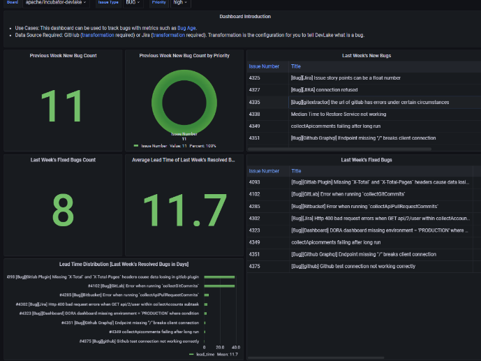
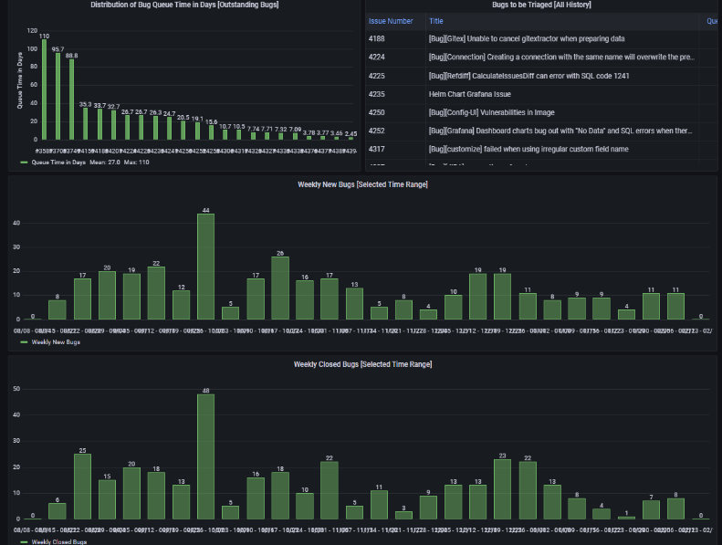

# Time Investment using Analysis of Issue tracking- A Use Case of DevLake

Welcome to our blog! Here, we will explore how a team’s efforts are invested among features, maintenance tasks, and bug fixes through the analysis of issue tracking data, which presents an interesting use case of DevLake.

## Introduction

### A. Introduction to DevLake: 

- DevLake is a data analytics solution that aids software development teams in the analysis of data from many sources, including problem tracking, version control, and communication tools. 
- It helps teams in making knowledgeable choices regarding their software development procedure.
- It collects data from various DevOps sources like GitHub, GitLab, Jira, etc. & helps in analyzing the data in the form of charts & graphs.

### B. The value of data-driven decision-making in software development: 
Teams can optimize their software development process, lower errors, and increase productivity with the support of data-driven decision-making.

### C. Use case overview: 

Evaluating teamwork using issue-tracking data:
In this use case, we'll utilize DevLake to evaluate issue-tracking data in order to gauge the team's level of commitment to putting up the necessary time and effort to create features, carry out maintenance tasks, and address problems.

<!--truncate-->

## Data Analysis for Issue Tracking Using DevLake

### A. Retrieving issue-tracking information: 

The team's tool must be utilized to retrieve issue-tracking information as the initial step. This can be accomplished by exporting the data to a CSV file or by extracting the data using an API.

### B. Preparing data for analysis: 

To be used for analysis, the extracted data needs to be cleaned and prepared. In this process, irrelevant information is removed, errors are fixed, and the data is organized into a format that is simple to study.

### C. Using DevLake to evaluate data: 

DevLake may be used to examine issue-tracking data in order to manage maintenance chores, monitor bug fixes, and identify features that have been implemented.

#### C. i. Identifying features implemented:

DevLake can be used to evaluate the data and find the features that were put into place over a certain time frame. The team can use this information to determine how much time was spent creating new features.

#### C. ii. Monitoring maintenance tasks: 

The team can use DevLake to monitor the maintenance tasks they carried out during the same time period. This might assist the team in estimating the time required to maintain the current codebase.

#### C. iii. Bug fix tracking: 

During the period under consideration, the team made bug fixes, which can be tracked using DevLake. This can assist the team in determining how much time was spent resolving bugs and how effectively they did so.

### D. Visualizing outcomes: 

- DevLake can also be utilized to display the analysis outcomes. The team will be better able to analyze the facts and make defensible judgments as a result.

- The usage of a burndown chart is one effective method of visualizing this data. Teams can monitor their progress toward finishing a specific set of tasks using this type of chart, which depicts the evolution of work through time. Teams may see how their efforts are distributed across developing new features, performing maintenance, and fixing bugs by segmenting the chart by task type. In order to better allocate their resources, businesses can also spot any bottlenecks or places where they are lagging.

## Minimizing team efforts

### A. Making educated judgments using issue-tracking data: 

The team can make educated decisions about their software development process by analyzing issue-tracking data.

### B. Juggling the tasks of feature development and maintenance: 

The analysis can assist the team in juggling the tasks of feature development and codebase maintenance.

### C. Setting priorities for bug fixes:

Based on their impact on the program and the time and effort needed to fix them, the analysis can assist the team in setting priorities for issue solutions.

## Analysis of Time Investment using DevLake

### Time invested on different tasks:

### A. Determining the amount of time spent on features: 

For a product to remain competitive and satisfy users' shifting needs, new features are crucial. The team can determine the amount of time spent on building new features over a certain time period by analyzing issue-tracking data.

### B. Determining the amount of time spent on maintenance jobs: 

Making sure the software functions smoothly and effectively is the main goal of maintenance tasks. This may involve activities like upgrades, backups, and security audits. The analysis can also assist the team in determining the time spent on maintenance duties throughout the same time period.

### C. Calculating time spent on bug fixes: 

The tasks that assist in locating and resolving problems that affect the user experience or the functionality of the product are known as bug fixes. The analysis can also assist the team in determining how much time was spent on bug fixes throughout the course of the given time frame.

### D. Examining the findings: 

The team can review the findings to pinpoint problem areas and bottlenecks and then modify team activities as necessary.

### E. Benefits of using DevLake for Analysis of Time Investment:

- DevLake helps teams to track the amount of time spent on each of these tasks. Teams may easily categorize and keep track of their progress using the application, which makes it simple to create tickets or issues for each activity. The information gathered can be utilized to produce graphs and reports that give a thorough breakdown of how the team is allocating its time.

- Devlake's ability to produce burndown charts is one of its most helpful capabilities. Teams may easily determine how much work needs to be done and how long it will take to finish by using these charts, which display the progress of the project over time. Teams may monitor how much time they are spending on new features, maintenance, and bug fixes by segmenting the chart by task type.

- Devlake's capability to track the amount of time needed to finish each activity is an additional useful feature. Teams may discover any areas where their workflow needs to be optimized by gathering this data and understanding how long it takes to accomplish certain tasks. This can assist them in precisely estimating upcoming duties and better allocating their time and resources.

- Teams can learn a lot about their workflow by utilizing Devlake to analyze the time spent on various tasks, and they can use this knowledge to decide how best to use their resources. For instance, the team may need to address the underlying problems that are producing the bugs if they are spending too much time fixing bugs.

- The proportion of new features to maintenance tasks is an additional helpful measure to monitor. Teams should strive to spend a major portion of their time developing new features while still allocating a sufficient amount of time to maintenance work to keep the product up and running. 

## Conclusion

In conclusion, software development teams can benefit greatly from the adoption of data analytics solutions like DevLake. Teams may better understand how much time is spent on features, maintenance chores, and problem fixes by evaluating issue-tracking data. Teams can use this information to streamline their development procedures and decide how to best spend their time and money.

Modern software development requires data-driven decision-making because it enables teams to move away from assumptions and intuition and towards making decisions based on factual evidence. Teams may communicate more effectively, reduce risk, and increase productivity by leveraging data to support decisions. This blog's use case is only one illustration of how data-driven decision-making can be beneficial.

