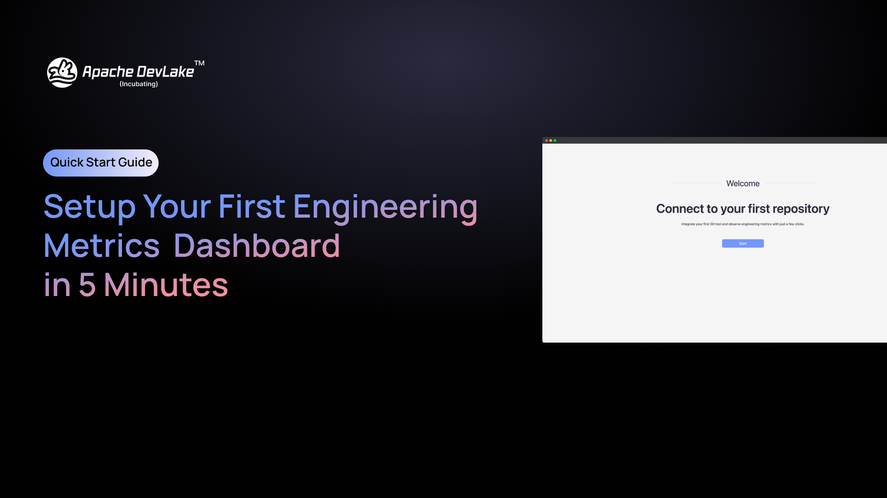
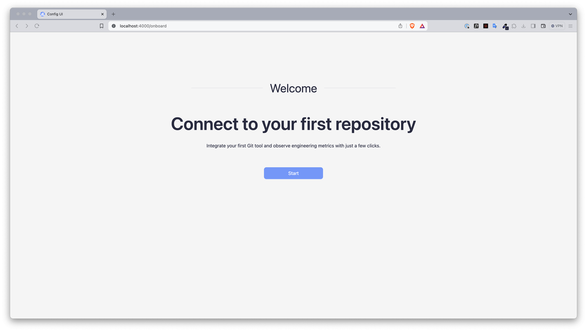
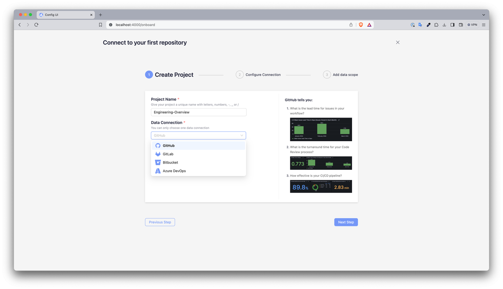
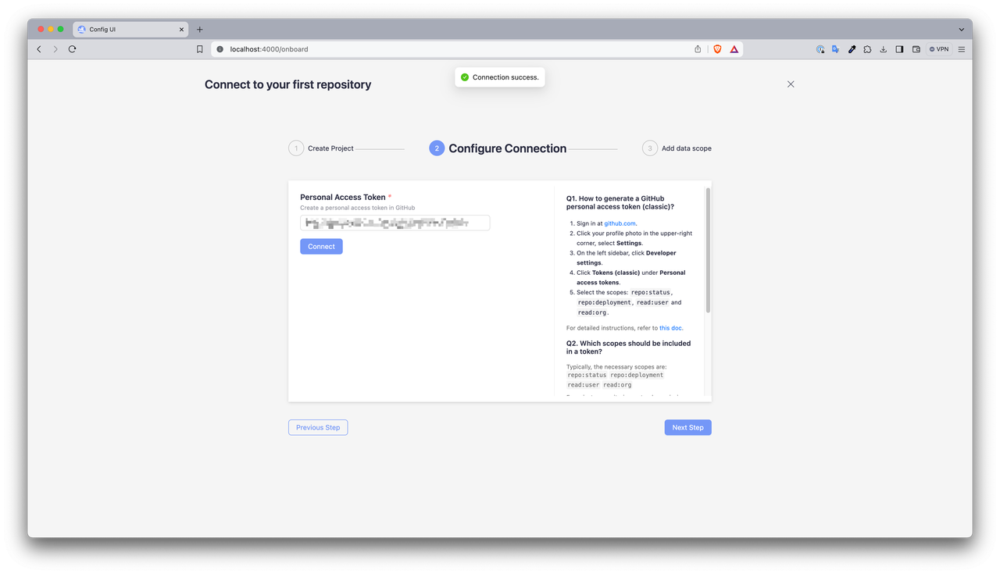
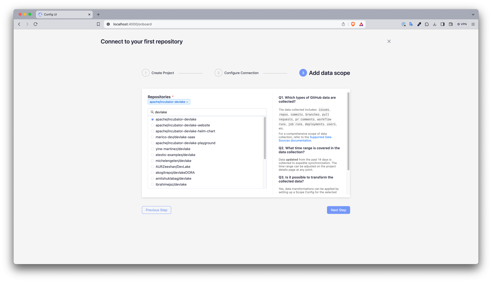
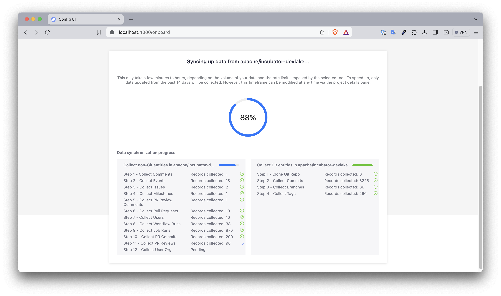
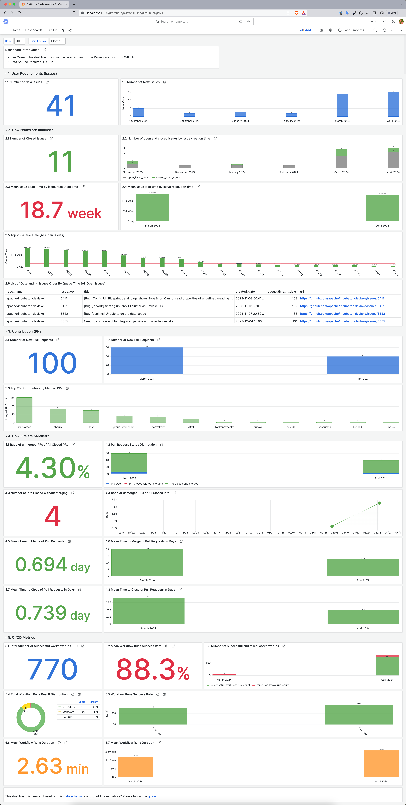

In the marathon of software development, teams can be overwhelmed by the complexity of tasks and the pressure to perform. The real challenge lies in understanding which efforts lead to success and which need refinement. That's the power of metrics. They transform endless streams of data into actionable insights. Apache DevLake provides the means to harness these insights, offering a metrics dashboard that aligns daily tasks with strategic goals. This guide is your first step towards a more informed and intentional approach to development. Let’s embark on this journey to make every commit, issue, and pull request an opportunity for improvement.

<!--truncate-->

## Getting Started
Before setting up your first Engineering Metrics Dashboard with Apache DevLake, ensure you have the following **pre-requisites** ready:
- **DevLake Version:** This feature is available from 1.0.0-beta3 or higher [[Installation Guide](https://devlake.apache.org/docs/GettingStarted)]
- **Repository:** Your code should be on GitHub, GitLab, BitBucket, or Azure DevOps. This requirement is just for the initial setup; you can connect other tools later.

## Set Up The Workflow
After installation, connect to your first repository by opening the Config UI or `localhost:4000/onboard` and you will start the onboarding session as shown in the screenshot below

### Step-1: Create Project
In this step, you'll define a project that aims to enhance your software development process within your organization or team. Remember, the true value lies in the goals behind the metrics rather than the metrics themselves. Focus on setting clear, strategic objectives to ensure that the metrics you track are meaningful and directly contribute to your broader organizational goals.

### Step-2: Configure Connection
- Initiate by creating a Personal Access Token (PAT) on your chosen platform—be it [GitHub](https://devlake.apache.org/docs/Configuration/GitHub/#github-personal-access-tokensrecommended), [GitLab](https://devlake.apache.org/docs/Configuration/GitLab/#personal-access-token), [BitBucket](https://devlake.apache.org/docs/Configuration/BitBucket/#username-and-app-password), or [Azure DevOps](https://devlake.apache.org/docs/Configuration/AzureDevOps/#tokenhttps://devlake.apache.org/docs/Configuration/AzureDevOps#token)
- This token empowers DevLake to securely interact with the specific repository you're setting up for metric analysis.

### Step-3: Add Data Scope
Adding your data scope is a crucial step where you select the specific repository you want to monitor. Once selected, the dashboard aggregates data pertaining to issues, deployments, pull requests (PRs), workflow runs, GitHub actions, and more, giving you a comprehensive view of your operations. 
To streamline the onboarding experience and swiftly deliver your initial metrics, the system is configured to collect only the **last 14 days of data** by default. This ensures a rapid setup so you can start analyzing your metrics almost immediately. However, this setting is flexible— you can adjust the data collection window at any time to suit your project’s needs and objectives.

## Metrics Dashboard Overview
This metrics dashboard provides a clear visualization of the development processes by tracking various key performance indicators from GitHub. The dashboard covers:
- **User Requirements (Issues)**: Monitors new issues and how they are resolved over time, providing insights into the demands and responsiveness of the team.
- **Issue Resolution**: Shows the number of closed issues and the average time taken for issue resolution, offering a measure of efficiency and agility in problem-solving.
- **Pull Requests**: Details the number of new pull requests, an indicator of collaboration, alongside the merge time, indicating the pace of code integration.
- **Workflow Runs**: Highlights the total number of workflow runs and their success rates, illustrating the robustness of the CI/CD pipeline.
- **Queue and Processing Times**: Analyzes the time taken from issue opening to closure and pull request opening to merge, shedding light on the throughput and process optimization.

By consolidating these metrics, the dashboard serves as a crucial tool for teams to evaluate their development lifecycle and make data-driven improvements.

## Next Steps
Congratulations on setting up your first engineering metrics dashboard using GitHub and Grafana in just a few minutes! As an open-source tool, DevLake [supports various data sources and plugins](https://devlake.apache.org/docs/Overview/SupportedDataSources/) while ensuring that your data remains securely under your control. Learn more about how DevLake can help you by checking the [DORA guide](https://devlake.apache.org/docs/DORA/), how to [customize dashboards](https://devlake.apache.org/docs/Configuration/Dashboards/GrafanaUserGuide#customizing-a-dashboard), and how to [customize data model](https://devlake.apache.org/docs/DataModels/DevLakeDomainLayerSchema/#how-to-customize-data-models).

If you haven't already, star [DevLake GitHub repository](https://github.com/apache/incubator-devlake) to follow the updates and feel free to post your queries on [slack](https://join.slack.com/t/devlake-io/shared_invite/zt-2ox842kuu-_6x3Lwdj88YpzKhMRpgnMg) - our vibrant community includes engineering leaders, users, experts, and contributors from diverse backgrounds around the world.

Watch this tutorial on [YouTube](https://www.youtube.com/watch?v=DPp6PIUDE1k)