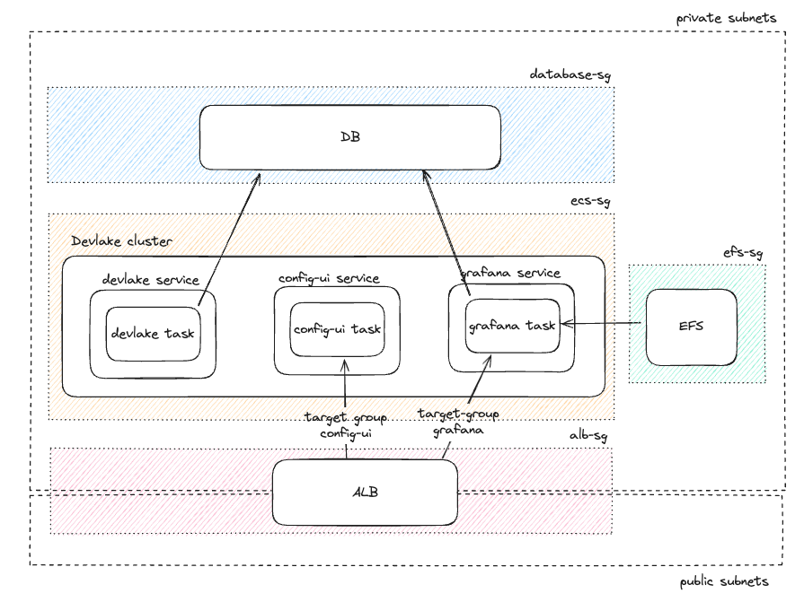
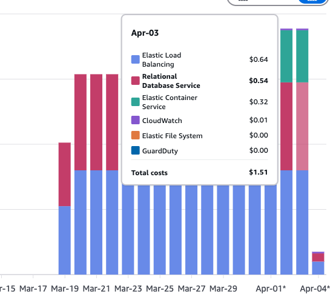

This guide provides an alternative to Devlake's Kubernetes setup and will walk you through setting up DevLake in an AWS ECS (Elastic Container Service) cluster using Terraform, providing you with a scalable and maintainable infrastructure as code solution that is also cost effective.

Basic knowledge of AWS ECS, Terraform, and your network where your cluster will be deployed is necessary to follow this guide effectively.

<!--truncate-->

# Setting up terraform structure
To configure devlake, we will use a terraform module and pass the necessary variables. The final structure of the module would be something like this:

```
terraform-root/
├── main.tf
├── ...
├── modules/
│   ├── devlake/
│   │   ├── main.tf
│   │   ├── variables.tf
│   │   ├── outputs.tf
│   │   ├── rds.tf
│   │   ├── alb.tf
│   │   ├── efs.tf
│   │   ├── iam.tf
│   │   ├── logs.tf
│   │   ├── security.tf
│   │   └── providers.tf
│   │

As we go in this tutorial, we will be populating individual files.
```
The AWS provider that is being used is `version = "~> 5.91.0"`.

Fist of, lets populate the `variables.tf`:
```terraform
variable "aws_region" {
  description = "AWS region where resources will be created"
  type        = string
  default     = "YOUR-AWS-REGION" 
}

variable "tag_name" { # for cost monitoring
  description = "Name tag for all DevLake resources"
  type        = string
  default     = "devlake"
}
```


# High level architecture
The goal is to create an AWS ECS cluster running on fargate spot instances, with an RDS mysql database and efs for grafana as a storage layer. We also need an application load balancer on top which we can optionally configure authentication (like OKTA).



## Storage
Let's start with provisioning the necessary storage layer. First of, let's create a database and tis security group in the `rds.tf` file. For that we will need the subnets that you want to deploy your database, the vpc id and the database password (adding them to the `variable.tf`):

```terraform
module "devlake-rds" {
  source  = "terraform-aws-modules/rds/aws"
  version = "~> 6.10.0"

  identifier = "devlake-db"

  engine               = "mysql"
  engine_version       = "8.0"
  instance_class       = "db.t3.micro"
  allocated_storage    = 20
  major_engine_version = "8.0"
  family               = "mysql8.0"

  manage_master_user_password = false 
  db_name                     = "devlake"
  username                    = "devlake"
  password                    = var.db_password # todo
  port                        = 3306

  create_db_subnet_group = true
  subnet_ids             = var.private_subnets # todo
  vpc_security_group_ids = [aws_security_group.rds.id]

  skip_final_snapshot = true

  enabled_cloudwatch_logs_exports = ["error", "general", "slowquery"]
  create_cloudwatch_log_group     = true

  tags = {
    Name = var.tag_name
  }
}

resource "aws_security_group" "rds" {
  name        = "devlake-rds"
  description = "Security group for DevLake RDS"
  vpc_id      = var.vpc_id # todo

  tags = {
    Name = var.tag_name
  }

  ingress {
    from_port       = 3306
    to_port         = 3306
    protocol        = "tcp"
    security_groups = [aws_security_group.ecs_tasks.id]
  }
}

```

And also let's create the EFS for grafana and its own security group in `efs.tf`. Since we know that grafana will also need to access this efs, lets go ahead and also create the access point and mount targets:
```terraform
resource "aws_efs_file_system" "grafana" {
  creation_token = "grafana-storage"
  encrypted      = true

  lifecycle_policy {
    transition_to_ia = "AFTER_30_DAYS"
  }

  tags = {
    Name = var.tag_name
  }
}

resource "aws_efs_access_point" "grafana" {
  file_system_id = aws_efs_file_system.grafana.id

  posix_user {
    gid = 472
    uid = 472
  }

  root_directory {
    path = "/var/lib/grafana" # from devlake documentation
    creation_info { # this is necessary to give write permissions
      owner_gid   = 472
      owner_uid   = 472
      permissions = "755"
    }
  }

  tags = {
    Name = var.tag_name
  }
}

resource "aws_efs_mount_target" "grafana" {
  count           = length(var.private_subnets)
  file_system_id  = aws_efs_file_system.grafana.id
  subnet_id       = var.private_subnets[count.index]
  security_groups = [aws_security_group.efs.id]
}

resource "aws_security_group" "efs" {
  name        = "grafana-efs"
  description = "Security group for Grafana EFS mount targets"
  vpc_id      = var.vpc_id

  tags = {
    Name = var.tag_name
  }

  ingress {
    from_port       = 2049
    to_port         = 2049
    protocol        = "tcp"
    security_groups = [aws_security_group.ecs_tasks.id]
  }
} 
```

## Cluster

Let's start with creating a cluster in the module's `main.tf`:
```
resource "aws_ecs_cluster" "devlake" {
  name = "devlake-cluster"

  setting {
    name  = "containerInsights"
    value = "enabled"
  }

  tags = {
    Name = var.tag_name
  }
}
```

We also need to make sure that the services can talk to each other, therefore we need to create a service discovery namespace. This is crucial to allow for proper host resolution (side note, I also tested this with service connect and it did not work):

```
resource "aws_service_discovery_private_dns_namespace" "devlake" {
  name        = "devlake-ns"
  description = "Private DNS namespace for DevLake services"
  vpc         = var.vpc_id
  tags = {
    Name = var.tag_name
  }
}

# one for each service
resource "aws_service_discovery_service" "devlake" {
  name = "devlake" // "config-ui" // "grafana"

  dns_config {
    namespace_id = aws_service_discovery_private_dns_namespace.devlake.id

    dns_records {
      ttl  = 10
      type = "A"
    }

    routing_policy = "MULTIVALUE"
  }

  health_check_custom_config {
    failure_threshold = 1
  }

  tags = {
    Name = var.tag_name
  }
}
```

### Permissions
We also need to create IAM roles with necessary permissions to run our cluster. And a separate task role for the grafana container for efs permissions:
```
resource "aws_iam_role" "ecs_task_execution_role" {
  name = "devlake-ecs-task-execution-role"

  assume_role_policy = jsonencode({
    Version = "2012-10-17"
    Statement = [
      {
        Action = "sts:AssumeRole"
        Effect = "Allow"
        Principal = {
          Service = "ecs-tasks.amazonaws.com"
        }
      }
    ]
  })

  tags = {
    Name = var.tag_name
  }
}

resource "aws_iam_role_policy_attachment" "ecs_task_execution_role_policy" {
  role       = aws_iam_role.ecs_task_execution_role.name
  policy_arn = "arn:aws:iam::aws:policy/service-role/AmazonECSTaskExecutionRolePolicy"
}

resource "aws_iam_role_policy_attachment" "ecs_task_execution_role_policy_cloudwatch" {
  role       = aws_iam_role.ecs_task_execution_role.name
  policy_arn = "arn:aws:iam::aws:policy/CloudWatchLogsFullAccess"
}

# IAM Task Role for Grafana container
resource "aws_iam_role" "grafana_task_role" {
  name = "devlake-grafana-task-role"

  assume_role_policy = jsonencode({
    Version = "2012-10-17"
    Statement = [
      {
        Action = "sts:AssumeRole"
        Effect = "Allow"
        Principal = {
          Service = "ecs-tasks.amazonaws.com"
        }
      }
    ]
  })

  tags = {
    Name = var.tag_name
  }
}

# Policy allowing Grafana task to access EFS
resource "aws_iam_role_policy" "grafana_efs_access_policy" {
  name = "grafana-efs-access-policy"
  role = aws_iam_role.grafana_task_role.id

  policy = jsonencode({
    Version = "2012-10-17"
    Statement = [
      {
        Effect = "Allow"
        Action = [
          "elasticfilesystem:ClientMount",
          "elasticfilesystem:ClientWrite",
          "elasticfilesystem:DescribeAccessPoints",
          "elasticfilesystem:DescribeFileSystems"
        ]
        Resource = "*"
      }
    ]
  })
}

```


### Task definition
Since the task definition is more or less identical, I will provide an example for one and just the differences in configuration for others.

```
resource "aws_ecs_task_definition" "devlake" {
  family                   = "devlake"
  network_mode             = "awsvpc"
  requires_compatibilities = ["FARGATE"]
  cpu                      = 256
  memory                   = 512
  execution_role_arn       = aws_iam_role.ecs_task_execution_role.arn

  container_definitions = jsonencode([
    {
      name  = "devlake"
      image = "devlake.docker.scarf.sh/apache/devlake:v1.0.1"
      portMappings = [
        {
          name          = "devlake-port" 
          containerPort = 8080
          hostPort      = 8080
          protocol      = "tcp"
        }
      ]
      environment = [
        {
          name  = "DB_URL"
          value = "mysql://devlake:${var.db_password}@${module.devlake-rds.db_instance_endpoint}/devlake?charset=utf8mb4&parseTime=True&loc=UTC"
        },
        {
          name  = "LOGGING_DIR"
          value = "/app/logs"
        },
        {
          name  = "TZ"
          value = "UTC"
        },
        {
          name  = "ENCRYPTION_SECRET"
          value = var.encryption_secret # your encryption secret
        },
      ]
      logConfiguration = {
        logDriver = "awslogs"
        options = {
          "awslogs-group"         = aws_cloudwatch_log_group.devlake.name
          "awslogs-region"        = var.aws_region
          "awslogs-stream-prefix" = "devlake"
        }
      }
    }
  ])

  tags = {
    Name = var.tag_name
  }
}
```

for config-ui, all is same except for the definition. Take a note on how the endpoints look like, as they are using the namespace we created before:

```
resource "aws_ecs_task_definition" "config_ui" {
  family                   = "config-ui"
  ...
  container_definitions = jsonencode([
    {
      name  = "config-ui"
      image = "devlake.docker.scarf.sh/apache/devlake-config-ui:latest"
      portMappings = [
        {
          name          = "config-ui-port" 
          containerPort = 4000
          hostPort      = 4000
          protocol      = "tcp"
        }
      ]
      environment = [
        {
          "name" : "DEVLAKE_ENDPOINT",
          "value" : "devlake.devlake-ns:8080"
        },
        {
          name  = "GRAFANA_ENDPOINT"
          value = "grafana.devlake-ns:3000"
        },
        {
          name  = "TZ"
          value = "UTC"
        }
      ]
      logConfiguration = {
        logDriver = "awslogs"
        options = {
          "awslogs-group"         = aws_cloudwatch_log_group.config_ui.name
          "awslogs-region"        = var.aws_region
          "awslogs-stream-prefix" = "config-ui"
        }
      }
    }
  ])
  ...
}
```

and for grafana, we need to define the task role as well as the volume mount:
```
resource "aws_ecs_task_definition" "grafana" {
  family                   = "grafana"
  ...
  task_role_arn            = aws_iam_role.grafana_task_role.arn

  container_definitions = jsonencode([
    {
      name  = "grafana"
      image = "devlake.docker.scarf.sh/apache/devlake-dashboard:v1.0.1"
      portMappings = [
        {
          name          = "grafana-port" 
          containerPort = 3000
          hostPort      = 3000
          protocol      = "tcp"
        }
      ]
      environment = [
        {
          name  = "GF_SERVER_ROOT_URL"
          value = "https://devlake.${var.domain_name}/grafana"
        },
        {
          name  = "TZ"
          value = "UTC"
        },
        {
          name  = "MYSQL_URL"
          value = module.devlake-rds.db_instance_endpoint
        },
        {
          name  = "MYSQL_DATABASE"
          value = "devlake"
        },
        {
          name  = "MYSQL_USER"
          value = "devlake"
        },
        {
          name  = "MYSQL_PASSWORD"
          value = var.db_password
        }
      ]
      mountPoints = [
        {
          sourceVolume  = "grafana-storage"
          containerPath = "/var/lib/grafana"
          readOnly      = false
        }
      ]
      logConfiguration = {
        logDriver = "awslogs"
        options = {
          "awslogs-group"         = aws_cloudwatch_log_group.grafana.name
          "awslogs-region"        = var.aws_region
          "awslogs-stream-prefix" = "grafana"
        }
      }
    }
  ])

  volume {
    name = "grafana-storage"
    efs_volume_configuration {
      file_system_id     = aws_efs_file_system.grafana.id
      root_directory     = "/"
      transit_encryption = "ENABLED"
      authorization_config {
        access_point_id = aws_efs_access_point.grafana.id
        iam             = "ENABLED"
      }
    }
  }
  ...
}
```

### Security 
To create the service we also need to create a task security group in `security.tf`. 
```
resource "aws_security_group" "ecs_tasks" {
  name        = "devlake-ecs-tasks"
  description = "Security group for ECS tasks"
  vpc_id      = var.management_vpc.vpc_id

  ingress {
    from_port   = 8080
    to_port     = 8080
    protocol    = "tcp"
    self        = true
    description = "Allow traffic from other ECS tasks to DevLake API"
  }

  egress {
    from_port   = 0
    to_port     = 0
    protocol    = "-1"
    cidr_blocks = ["0.0.0.0/0"]
  }

  tags = {
    Name = var.tag_name
  }
}
```

We also need to add ingress rules to the RDS and EFS security groups in `rds.tf` and `efs.tf` so that the tasks can reach these services.

```
resource "aws_security_group" "rds" {
  ...
  ingress {
    from_port       = 3306
    to_port         = 3306
    protocol        = "tcp"
    security_groups = [aws_security_group.ecs_tasks.id]
  }
  ...
}
```

```
resource "aws_security_group" "efs" {
  ...
  ingress {
    from_port       = 2049
    to_port         = 2049
    protocol        = "tcp"
    security_groups = [aws_security_group.ecs_tasks.id]
  }
  ...
} 
```

### Logs

To ensure proper monitoring and debugging capabilities, we'll set up CloudWatch log groups for each service. 

```
resource "aws_cloudwatch_log_group" "devlake" {
  name              = "/ecs/devlake"
  retention_in_days = 30

  tags = {
    Name = var.tag_name
  }
}

resource "aws_cloudwatch_log_group" "config_ui" {
  name              = "/ecs/config-ui"
  retention_in_days = 30

  tags = {
    Name = var.tag_name
  }
}

resource "aws_cloudwatch_log_group" "grafana" {
  name              = "/ecs/grafana"
  retention_in_days = 30

  tags = {
    Name = var.tag_name
  }
}
```


### Services

Now that we have our infrastructure and task definitions set up, let's create the ECS services. We'll deploy three services: DevLake, Config UI, and Grafana. Each service will use Fargate Spot instances for cost optimization and will be configured with service discovery for internal communication.

```
resource "aws_ecs_service" "devlake" {
  name            = "devlake"
  cluster         = aws_ecs_cluster.devlake.id
  task_definition = aws_ecs_task_definition.devlake.arn
  desired_count   = 1

  health_check_grace_period_seconds = 120 # 2 minutes grace period for startup

  capacity_provider_strategy {
    base              = 1
    weight            = 100
    capacity_provider = "FARGATE_SPOT"
  }

  network_configuration {
    subnets         = var.management_vpc.private_subnets
    security_groups = [aws_security_group.ecs_tasks.id]
  }

  # Configure Service Discovery
  service_registries {
    registry_arn = aws_service_discovery_service.devlake.arn
  }

  deployment_circuit_breaker {
    enable   = true
    rollback = true
  }

  # Configure deployment settings
  deployment_maximum_percent         = 100
  deployment_minimum_healthy_percent = 0

  propagate_tags = "SERVICE"
  tags = {
    Name = var.tag_name
  }
}

```
Take a note of the deployment setting in devlake service configuration. This is not needed for config ui or grafana, but only for devlake as only one instance od devlake can connect to DB, therefore we need to first kill the instance completely before starting a new one.
```
resource "aws_ecs_service" "config_ui" {
  name            = "config-ui"
  task_definition = aws_ecs_task_definition.config_ui.arn
  
  ...

  service_registries {
    registry_arn = aws_service_discovery_service.config_ui.arn
  }

  # Wait for DevLake to be ready
  depends_on = [aws_ecs_service.devlake]
}

```

```
resource "aws_ecs_service" "grafana" {
  name            = "grafana"
  task_definition = aws_ecs_task_definition.grafana.arn
  
  ...

  service_registries {
    registry_arn = aws_service_discovery_service.grafana.arn
  }

  # Wait for both DevLake and Config UI to be ready
  depends_on = [aws_ecs_service.devlake, aws_ecs_service.config_ui]
}
```

At this point your containers should be up and running, without any errors regarding DB connection or write permissions to efs. Now we need to setup the load balancer and domain name.

## Load balancer

Load balancer helps us route secure traffic to correct containers. We want to have a human readable url, like https://devlake.YOUR-DOMAIN.com to access config ui and https://devlake.YOUR-DOMAIN.com/grafana to access grafana dashboards.


### Security

Firts we need to create a security group for our alb in `security.tf`:
```
resource "aws_security_group" "alb" {
  name        = "devlake-alb"
  description = "Security group for DevLake ALB"
  vpc_id      = var.vpc_id

  ingress {
    from_port   = 80
    to_port     = 80
    protocol    = "tcp"
    cidr_blocks = ["0.0.0.0/0"]
    description = "Allow HTTP traffic"
  }

  ingress {
    from_port   = 443
    to_port     = 443
    protocol    = "tcp"
    cidr_blocks = ["0.0.0.0/0"]
    description = "Allow HTTPS traffic"
  }

  egress {
    from_port   = 0
    to_port     = 0
    protocol    = "-1"
    cidr_blocks = ["0.0.0.0/0"]
    description = "Allow all outbound traffic"
  }

  tags = {
    Name = var.tag_name
  }
} 
```
We also need to allow traffic from alb to the task security groups. This creates a secure path for external traffic to reach our services:

```
resource "aws_security_group" "ecs_tasks" {
  ...

  ingress {
    from_port       = 8080
    to_port         = 8080
    protocol        = "tcp"
    security_groups = [aws_security_group.alb.id]
    description     = "Allow traffic from ALB to DevLake API"
  }

  ingress {
    from_port       = 4000
    to_port         = 4000
    protocol        = "tcp"
    security_groups = [aws_security_group.alb.id]
    description     = "Allow traffic from ALB to DevLake UI"
  }

  ingress {
    from_port       = 3000
    to_port         = 3000
    protocol        = "tcp"
    security_groups = [aws_security_group.alb.id]
    description     = "Allow traffic from ALB to Grafana UI"
  }
  ...
}
```

### Certificate
To create an alb we also need a valid certificate. The certificate must be in the same region as the alb. This are probably created outside of the devlake module.

```
resource "aws_acm_certificate" "devlake_cert" {
  domain_name       = "*.YOUR-DOMAIN.COM"
  validation_method = "DNS"

  lifecycle {
    create_before_destroy = true
  }

  tags = {
    Name = "devlake"
  }
}

resource "aws_route53_record" "cert_validation" {
  for_each = {
    for dvo in aws_acm_certificate.devlake_cert.domain_validation_options : dvo.domain_name => {
      name   = dvo.resource_record_name
      record = dvo.resource_record_value
      type   = dvo.resource_record_type
    }
  }

  allow_overwrite = true
  zone_id         = YOUR_DOMAIN_ROUTE53.zone_id
  name            = each.value.name
  type            = each.value.type
  records         = [each.value.record]
  ttl             = 60
}

```

### ALB
To create alb, we need two variables - public subnets and certificate created in the previous step. 

Target groups are essential components that route traffic to our ECS tasks. We'll create two target groups:
1. Grafana target group - routes traffic to port 3000 and checks health at `/api/health`
2. Config UI target group - routes traffic to port 4000 and checks health at the root path `/`

The health checks ensure that traffic is only routed to healthy containers, maintaining service reliability.

Listeners define how the ALB routes incoming traffic to our target groups. 

The HTTPS listener uses our ACM certificate and routes traffic based on host headers:
- `devlake.${var.domain_name}/grafana*` → Grafana target group
- `devlake.${var.domain_name}` → Config UI target group

This setup ensures secure access to our services while maintaining proper routing based on the requested paths.

```
module "devlake_alb" {
  source  = "terraform-aws-modules/alb/aws"
  version = "~> 9.13.0"

  name = "devlake-alb"

  load_balancer_type = "application"
  internal           = false
  security_groups    = [aws_security_group.alb.id]
  subnets            = var.public_subnets
  vpc_id             = var.vpc_id

  listeners = {
    https = {
      port            = 443
      protocol        = "HTTPS"
      ssl_policy      = "ELBSecurityPolicy-TLS13-1-2-Res-2021-06"
      certificate_arn = var.certificate_arn
      
      # default action
      forward = {
        target_group_key = "devlake-config-ui-tg"
      }

      rules = {
        grafana = {
          priority = 100
          actions = [{
            type             = "forward"
            target_group_key = "devlake-grafana-tg"
          }]
          conditions = [{
            host_header = {
              values = ["devlake.${var.domain_name}"]
            }
            path_pattern = {
              values = ["/grafana", "/grafana/*"]
            }
          }]
        }
      }
    }
  }

  target_groups = {
    "devlake-grafana-tg" = {
      name        = "devlake-grafana-tg"
      protocol    = "HTTP"
      port        = 3000
      target_type = "ip"
      health_check = {
        enabled             = true
        interval            = 30
        path                = "/api/health"
        port                = "traffic-port"
        timeout             = 5
        healthy_threshold   = 3
        unhealthy_threshold = 3
        matcher             = "200"
      }
      create_attachment = false
    },

    "devlake-config-ui-tg" = {
      name        = "devlake-config-ui-tg"
      protocol    = "HTTP"
      port        = 4000
      target_type = "ip"
      health_check = {
        enabled             = true
        interval            = 30
        path                = "/"
        port                = "traffic-port"
        timeout             = 5
        healthy_threshold   = 3
        unhealthy_threshold = 3
        matcher             = "200"
      }
      create_attachment = false
    }
  }

  tags = {
    Name = var.tag_name
  }
}

```

### DNS Records

Finally, to use a human readable url, we need to create DNS records in our route53 that points to our alb. For simplicity's sake, I am referencing directly the alb module's outputs, in reality you will probably need to ooutput these from the devlake module itself: 

```
resource "aws_route53_record" "devlake" {
  zone_id = YOUR_DOMAIN_ROUTE53.zone_id
  name    = "devlake.YOUR-DOMAIN.com"
  type    = "A"

  alias {
    name                   = module.devlake_alb.dns_name
    zone_id                = module.devlake_alb.zone_id
    evaluate_target_health = true
  }
}

```

And thats it, you should be able to access devlake on https://devlake.YOUR-DOMAIN.com!

# Cost breakdown
 If you want to monitor your costs, first of you need to provide tags with all your resources and second you need to [activate the tag on aws](https://docs.aws.amazon.com/awsaccountbilling/latest/aboutv2/activating-tags.html) so it is registered. 



The daily cost is stable on aroun `$1.51` a day, which gives about `$45` a month. The cost does not include the route53 domain though. 