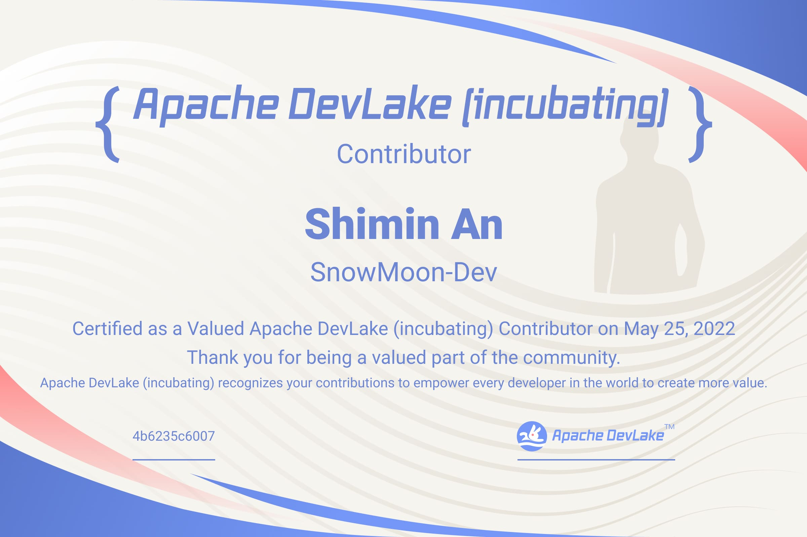

# Team

## PPMC
- [Willem Ning Jiang](https://github.com/WillemJiang)
- [Liang Zhang](https://github.com/terrymanu)
- [Lidong Dai](https://github.com/davidzollo)
- [Sijie Guo](https://github.com/sijie)
- [Felix Cheung](https://github.com/felixcheung)
- [Jean-Baptiste Onofré](https://github.com/jbonofre)
- [Klesh Wong](https://github.com/klesh)
- [Julien Chinapen](https://github.com/e2corporation)
- [Liang Zhang](https://github.com/mindlesscloud)
- [Yingchu Chen](https://github.com/warren830)
- [Jonathan O'Donnell](https://github.com/joncodo)
- [Hezheng Yin](https://github.com/hezyin)
- [Maxim Wheatley](https://github.com/MaximDub)

## Committers
- [Kaiyun (Louis) Zhang](https://github.com/startrekzky)
- [Jinglei Ren](https://github.com/basicthinker)
- [Zhicheng Jiang](https://github.com/mappjzc)
- [Zikuan An](https://github.com/abeizn)

## Contributors

All DevLake contributors will be awarded with a certificate once their first PRs 
get merged into the codebase. We deeply appreciate your contribution!

- [Jingyang Liang](https://github.com/liangjingyang)
- [Yumeng Wang](https://github.com/yumengwang03)
- [Yanghui Lin](https://github.com/likyh)
- [Hao Ke](https://github.com/KeHaohaoke)
- [Cong (Narro) Wang](https://github.com/narrowizard)
- [Jinxiu (Jax) Zhou](https://github.com/jaxzhou)
- [Jiageng Li](https://github.com/skyleaworlder)
- [Xiaolei Wang](https://github.com/fatelei)
- [Peng Su](https://github.com/supersupeng)
- [Dunyu Song](https://github.com/songdunyu)
- [Nikita Koselev](https://github.com/nikitakoselev)
- [Shimin An](https://github.com/snowmoon-dev)
- [Abhishek KM](https://github.com/sync271)
- [Guiping Tan](https://github.com/thenicetgp)
- [Bin Ji](https://github.com/matrixji)
- [Prajwal Borkar](https://github.com/PrajwalBorkar)
- [Keon Amini](https://github.com/keon94)
- [Zhenlei Li](https://github.com/moonlzl)
- [Danna Wang](https://github.com/banshengbushu)
- [Geyu Chen](https://github.com/fredtheflat)

### New Contributors June 2022

#### Zhenlei Li

---

#### Danna Wang

---

### New Contributors May 2022

#### Jiageng Li

---

#### Xiangyu Zhang

---

#### Xiaolei Wang

---

#### Peng Su

---

#### Dunyu Song

---

#### Nikita Koselev

---

#### Shimin An

---

#### Abhishek KM

---

#### Guiping Tan

---

#### Bin Ji

---

#### Prajwal Borkar

---

#### Keon Amini

---

#### Geyu Chen

---

