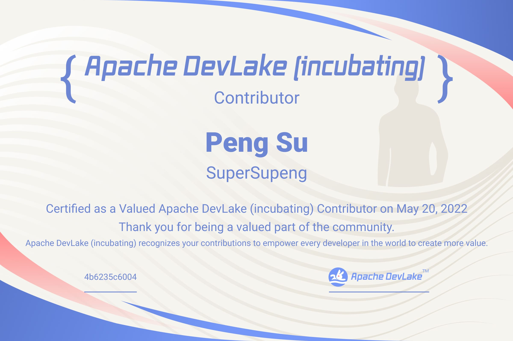

# DevLake Team

The DevLake team consists of members and contributors. Members have direct access to the DevLake project's source code and actively develop the codebase. Contributors improve the project by submitting patches and suggestions to members. The number of contributions to the project is unlimited. Whether it's trivial cleanups, important new features or improved documentation, all contributions to DevLake will be greatly appreciated and some outstanding contributors will be rewarded handsomely.

## Members

- [Willem Ning Jiang](https://github.com/WillemJiang)
- [Liang Zhang](https://github.com/terrymanu)
- [Lidong Dai](https://github.com/davidzollo)
- [Sijie Guo](https://github.com/sijie)
- [Felix Cheung](https://github.com/felixcheung)
- [Jean-Baptiste Onofré](https://github.com/jbonofre)
- [Klesh Wong](https://github.com/klesh)
- [Julien Chinapen](https://github.com/e2corporation)
- [Liang Zhang](https://github.com/mindlesscloud)
- [Yingchu Chen](https://github.com/warren830)
- [Jonathan O'Donnell](https://github.com/joncodo)
- [Hezheng Yin](https://github.com/hezyin)
- [Maxim Wheatley](https://github.com/MaximDub)

### Committers

- [Kaiyun (Louis) Zhang](https://github.com/startrekzky)
- [Jinglei Ren](https://github.com/basicthinker)
- [Zhicheng Jiang](https://github.com/mappjzc)
- [Zikuan An](https://github.com/abeizn)

### Contributors

All DevLake contributors will be awarded with a certificate once their first PRs
get merged into the codebase. We deeply appreciate your contribution!

- [Jingyang Liang](https://github.com/liangjingyang)
- [Yumeng Wang](https://github.com/yumengwang03)
- [Yanghui Lin](https://github.com/likyh)
- [Hao Ke](https://github.com/KeHaohaoke)
- [Cong (Narro) Wang](https://github.com/narrowizard)
- [Jinxiu (Jax) Zhou](https://github.com/jaxzhou)
- [Jiageng Li](https://github.com/skyleaworlder)
- [Xiaolei Wang](https://github.com/fatelei)
- [Peng Su](https://github.com/supersupeng)
- [Dunyu Song](https://github.com/songdunyu)
- [Nikita Koselev](https://github.com/nikitakoselev)
- [Shimin An](https://github.com/snowmoon-dev)
- [Abhishek KM](https://github.com/sync271)
- [Guiping Tan](https://github.com/thenicetgp)
- [Bin Ji](https://github.com/matrixji)
- [Prajwal Borkar](https://github.com/PrajwalBorkar)
- [Keon Amini](https://github.com/keon94)

### Becoming a Committer

DevLake Team follows the Apache way to build the community. Anyone can become a committer once they have contributed sufficiently to the project and earned the trust. 

The DevLake TeamCommunity follows the [Apache Community’s process](http://community.apache.org/newcommitter.html) on accepting a new committer.

1. Start the discussion and vote in @private. Only current PMC member could nominate.
2. If the vote passes, send an offer to become a committer with @private CC’ed.
3. Setup committer rights

### New Contributors May 2022

#### Jiageng Li

---

#### Xiangyu Zhang

---

#### Xiaolei Wang

---

#### Peng Su

---

#### Dunyu Song

---

#### Nikita Koselev

---

#### Shimin An

---

#### Abhishek KM

---

#### Guiping Tan

---

#### Bin Ji

---

#### Prajwal Borkar

---

#### Keon Amini

---

