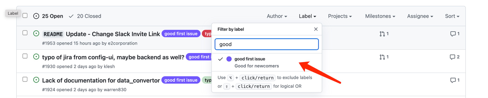

# Contribute to issues
> @Klesh

Last week(2022-05-12), we had 2 designated Good First Issues listed out for everyone
in a First Come, First Served manner, which was fun, and they were taken almost instantly...
but not so fun for those who were interested and failed to get one.

So, we decided, no more competition, you can pick whatever 
you like from our github issue pages, or even create your own one if no more left! 
We are community after all!

Now, how do we proceed? It's simple! Go to our [issues page](https://github.com/apache/incubator-devlake/issues?q=is%3Aopen+is%3Aissue+label%3A%22good+first+issue%22), and then click here. all our Good First Issue are listed out here.

- Firstly, go for existing issues if any, find one that you like, 
you can claim it by sending comment like "I'll take it", 
you can choose to write a Plan of Attack to show your understanding of the problem and 
what steps would you take to solve the problem, and then start working on PR for the issue. 

- Secondly, what if no more GFI left? yes, that is the most import part. 
Create your own issues! Now, by looking into our code base, 
you can definitely find many problem, like documentation, unit-test, even typo. 
File issues for things you don't feel right, and we will verify if it is valid,
and then you can work on it. 

- Finally, you may ask, why do I go through all these troubles to write code for you? 
No, you don't code for us, you code for everyone in the community, you code for yourself, 
for your skills, to learn how to cooperate with others. And for those who made significant contribution,  
we offer you, a seat of Apache Committer, or even PPMC.

That's all, feel free to ask any questions. And Happy Coding!
