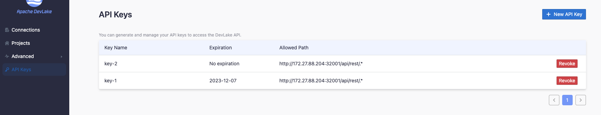
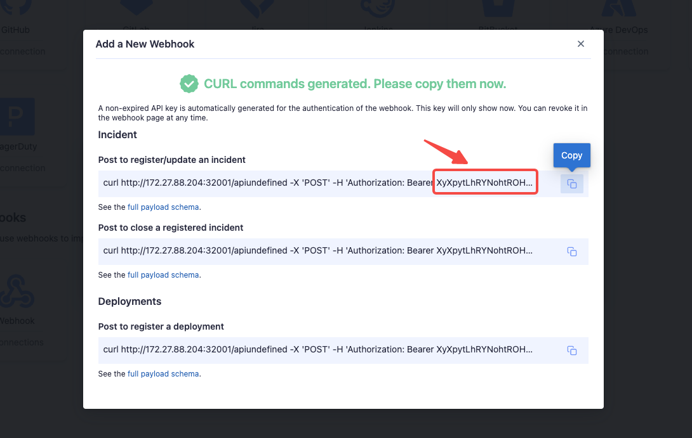

## What is an 'API Key'

An API key, also known as an API token, is a string used for authentication when making requests to DevLake's open API or webhook. It serves as a form of identification to ensure authorized access.

An API key contains three components:
1. Name: This is the descriptive name assigned to the key for easy identification.
2. Expiration: You have the option to set an expiration period for the API key, such as 7 days, 30 days, 90 days, or choose for it to never expire.
3. Allowed Path: The API URL or endpoint that the API key is permitted to access. It defines the specific resources that the key can interact with.

## How does an API key work?
### Accessing DevLake Open APIs
Check out the [API docs](/docs/Overview/References.md).

### Utilizing API Key in [Incoming Webhooks](webhook.md)
It is typically not necessary to manually create an API key from the 'API keys' page. Instead, you can follow these steps:

1. Navigate to the 'Data Connection' page.
2. Create a new webhook, and an API key will be automatically generated for you.
3. You can copy the provided curl commands, which include the API key, and save them in your local environment for future use.
4. If you happen to forget to save the API key, do not worry. You can view the webhook details and regenerate a new API key if needed. It is important to note that the API keys automatically generated for webhooks will not be displayed on the 'API keys' page.

## Troubleshooting

If you run into any problems, please check the [Troubleshooting](/Troubleshooting/Installation.md) or [create an issue](https://github.com/apache/incubator-devlake/issues)
