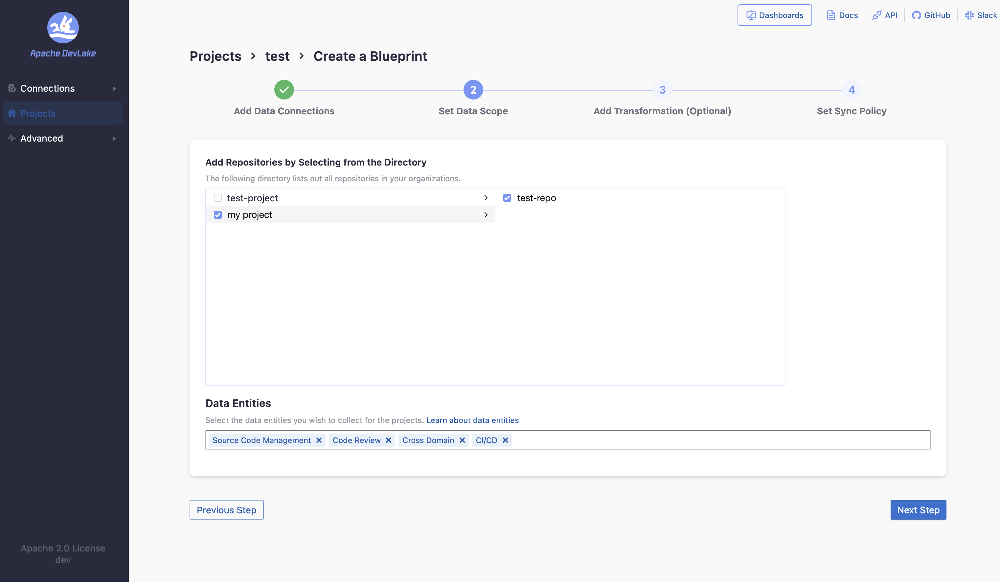
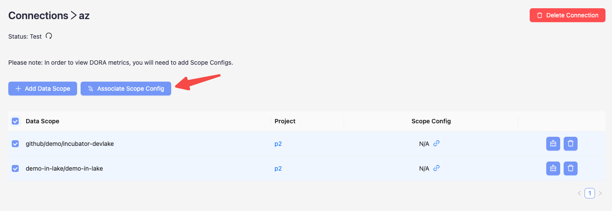
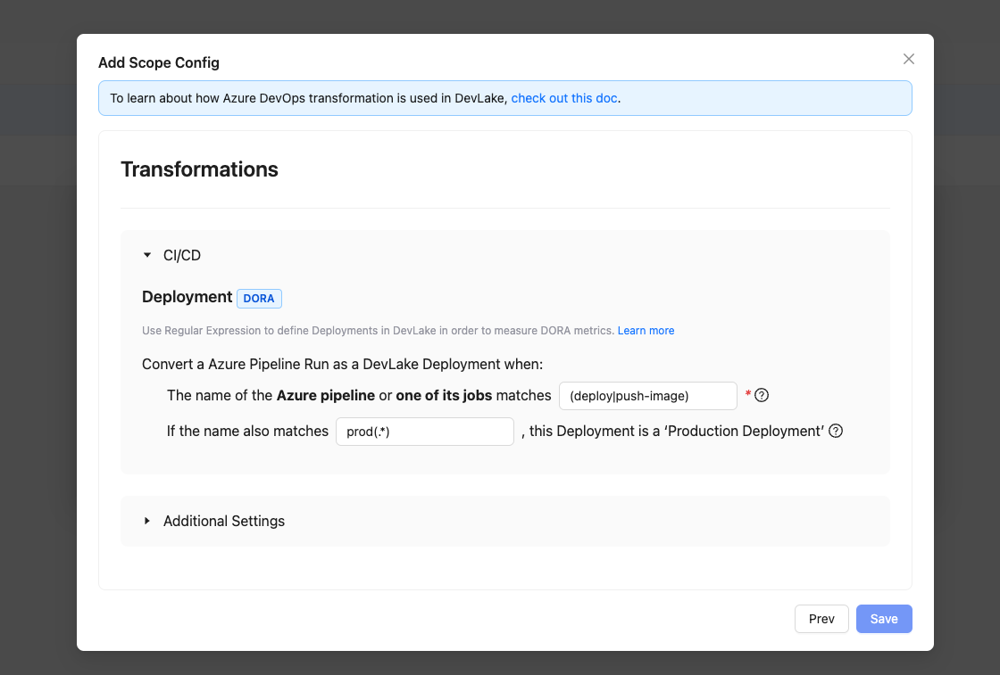
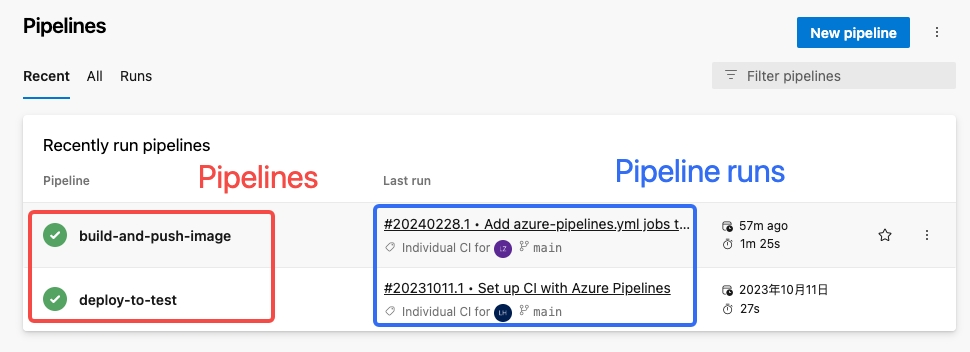
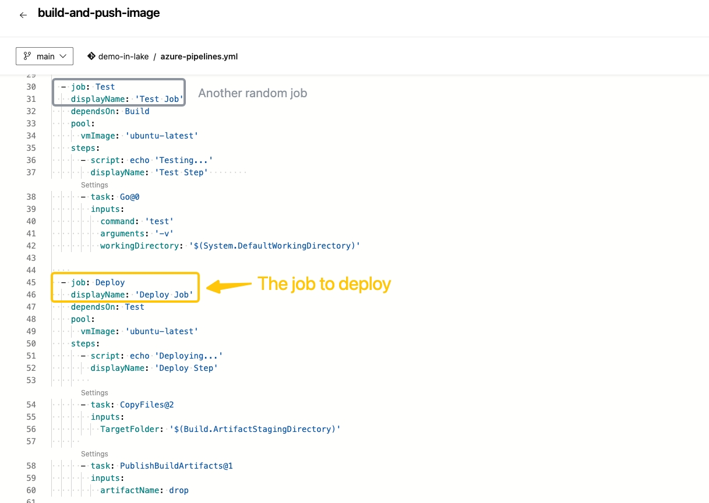
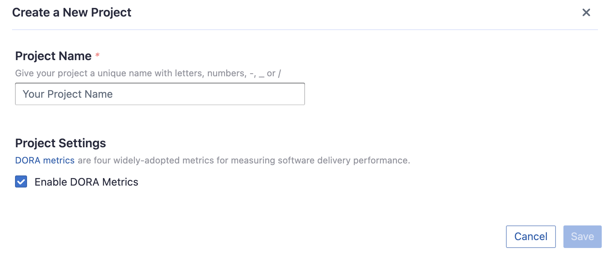

Visit Config UI at: `http://localhost:4000`.

## Step 1 - Add Data Connections

On the Connections page, you can select GitHub and create a new connection or it.

### Step 1.1 - Authentication

#### Connection Name

Give your connection a unique name to help you identify it in the future.

#### Token

Paste your Azure DevOps personal access token (PAT) here. Check [Azure's official doc](https://learn.microsoft.com/en-us/azure/devops/organizations/accounts/use-personal-access-tokens-to-authenticate?view=azure-devops&tabs=Windows#create-a-pat) on how to create a PAT. 
Make sure that the Organization field is set to "All accessible organizations" when creating the PAT.

#### Test and Save Connection

Click `Test Connection`, if the connection is successful, click `Save Connection` to add the connection.

### Step 1.2 - Add Data Scopes

#### Select repositories

Select the repositories you want to collect data from.

#### Data Entities

Azure DevOps supports the following data entities.

- CI/CD: builds and jobs.
- Source Code Management: repositories and their commits.
- Code Review: pull requests and their commits.

### Step 1.3 - Add Scope Config (Optional)

Scope config contains two parts: 
- The entities of which domain you wish to collect: Usually, you don't have to modify this part. However, if you don't want to collect certain Azure DevOps entities, you can unselect some entities to accelerate the collection speed.
  - Source Code Management: Azure repos, refs, commits, etc.
  - Code Review: Azure PRs, PR comments and reviews, etc.
  - CI/CD: Azure pipelines, jobs, etc.
  - Cross Domain: Azure accounts, etc.
- The transformations on the Azure DevOps data you are going to collect. 

#### CI/CD

To effectively measure [DORA metrics](../DORA.md) through Azure DevOps, it is necessary to define the concept of a 'deployment'. DevLake considers an Azure Pipeline Run (see the blue rectangle) as a DevLake deployment using specific conditions expressed through regular expressions (regex):

- Deployment: The provided regex should match either the name of the Azure pipeline (see the red rectangle) that the pipeline run belongs to or any of the job display names (see the yellow rectangle) associated with the pipeline run. This will designate it as a deployment. For example, if the deployment pipeline is named 'build-and-push-image', you can input (push-image) as the regex. To ensure case insensitivity, include (?i) before the regex.
- Production: The given regex should match either the pipeline run's name or any of its job display names to classify it as a deployment within the production environment. For instance, if the deployment pipeline is named 'build-to-prod', you can input (prod) as the regex. To ensure case insensitivity, include (?i) before the regex.

#### Additional Settings

The additional settings for transformations are RefDiff options:
- Tags Limit: the number of tags to compare.
- Tags Pattern: Only tags that match the given regex are taken into account.

## Step 2 - Collect Data in a Project
### Step 2.1 - Create a Project
Collecting Azure DevOps data requires creating a project first. You can visit the Project page from the side menu and create a new project by following the instructions on the user interface.

### Step 2.2 - Add a Azure DevOps Connection
You can add a previously configured GitLab connection to the project and select the boards for which you wish to collect the data for. 
Please note: if you don't see the repositories you are looking for, please check if you have added them to the connection first.

### Step 2.3 - Set the Sync Policy
There are three settings for Sync Policy:
- Data Time Range: You can select the time range of the data you wish to collect. The default is set to the past six months.
- Sync Frequency: You can choose how often you would like to sync your data in this step by selecting a sync frequency option or entering a cron code to specify your prefered schedule.
- Skip Failed Tasks: sometime a few tasks may fail in a long pipeline; you can choose to skip them to avoid spending more time in running the pipeline all over again.

### Step 2.4 - Start Data Collection
Click on "Collect Data" to start collecting data for the whole project. You can check the status in the Status tab on the same page.

## Troubleshooting

If you run into any problem, please check the [Troubleshooting](/Troubleshooting/Configuration.md) or [create an issue](https://github.com/apache/incubator-devlake/issues)
