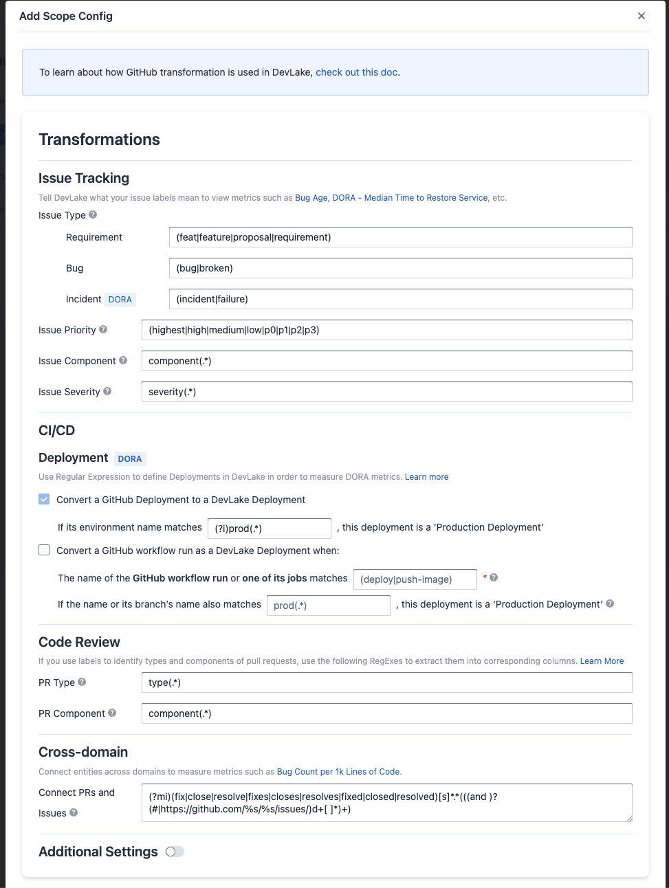

Visit Config UI at: `http://localhost:4000`.

## Step 1 - Add Data Connections

On the Connections page, you can select GitHub and create a new connection on it.

### Step 1.1 - Authentication

#### Connection Name

Give your connection a unique name to help you identify it in the future.

#### Endpoint URL

This should be a valid REST API endpoint, e.g. `https://api.github.com/`. The URL should end with `/`.

#### Personal Access Token(s)

You can use one of the following GitHub tokens: personal access tokens(PATs) or fine-grained personal access tokens.

##### GitHub Personal Access Tokens(Recommended)

> Prerequisites: please make sure your organization has enabled Personal Access Token before configuration. See the [detailed doc](https://docs.github.com/en/organizations/managing-programmatic-access-to-your-organization/setting-a-personal-access-token-policy-for-your-organization).

Learn about [how to create a GitHub personal access token](https://docs.github.com/en/authentication/keeping-your-account-and-data-secure/creating-a-personal-access-token). The following permissions are required to collect data from repositories:

- `repo:status`
- `repo_deployment`
- `read:user`
- `read:org`

However, if you want to collect data from private repositories, the following permissions are required:

- `repo`
- `read:user`
- `read:org`

The difference is that you have to give full permission for `repos`, not just `repo:status` and `repo_deployment`. Starting from v0.18.0, DevLake provides the auto-check for the permissions of your token(s).

The data collection speed is restricted by the **rate limit of [5,000 requests](https://docs.github.com/en/rest/overview/resources-in-the-rest-api#rate-limiting) per hour per token** (15,000 requests/hour if you pay for GitHub enterprise). You can accelerate data collection by configuring _multiple_ personal access tokens. Please note that multiple tokens should be created by different GitHub accounts. Tokens belonging to the same GitHub account share the rate limit.

##### Fine-grained Personal Access Tokens

Note: this token doesn't support GraphQL APIs. You have to disable `Use GraphQL APIs` on the connection page if you want to use it. However, this will significantly increase the data collection time.

If you're concerned with giving classic PATs full unrestricted access to your repositories, you can use fine-grained PATs announced by GitHub recently. With fine-grained PATs, GitHub users can create read-only PATs that only have access to repositories under certain GitHub orgs. But in order to do that, org admin needs to enroll that org with fine-grained PATs beta feature first. Please check [this doc](https://docs.github.com/en/authentication/keeping-your-account-and-data-secure/creating-a-personal-access-token#creating-a-fine-grained-personal-access-token) for more details.
The token should be granted read-only permission for the following entities.
  - `Actions`
  - `Contents`
  - `Discussions`
  - `Issues`
  - `Metadata`
  - `Pull requests`

##### GitHub Apps 
Learn about [how to create a GitHub Apps](https://docs.github.com/en/apps/maintaining-github-apps/modifying-a-github-app-registration#navigating-to-your-github-app-settings). The following permissions are required to collect data from repositories:
- Repository
    - Actions
    - Administration
    - Checks
    - Commit statuses
    - Contents
    - Deployments
    - Issues
    - Metadata
    - Pull requests
- Organization
    - Members

#### Use Graphql APIs

If you are using `github.com` or your on-premise GitHub version supports GraphQL APIs, toggle on this setting to collect data quicker.

- GraphQL APIs are 10+ times faster than REST APIs, but they may not be supported in GitHub on-premise versions.
- Instead of using multiple tokens to collect data, you can use ONLY ONE token because GraphQL APIs are quick enough.

#### Proxy URL (Optional)

If you are behind a corporate firewall or VPN you may need to utilize a proxy server. Enter a valid proxy server address on your network, e.g. `http://your-proxy-server.com:1080`

#### Fixed Rate Limit (Optional)

DevLake uses a dynamic rate limit to collect GitHub data. You can adjust the rate limit if you want to increase or lower the speed.

The maximum rate limit for GitHub is ** [5,000 requests/hour](https://docs.github.com/en/rest/overview/resources-in-the-rest-api#rate-limiting)** (15,000 requests/hour if you pay for GitHub enterprise). Please do not use a rate that exceeds this number.

#### Test and Save Connection

Click `Test Connection`, if the connection is successful, click `Save Connection` to add the connection.

### Step 1.2 - Add Data Scopes

#### Repositories

Choose the GitHub repositories you wish to collect either by finding them in the miller column, or searching. You can only add public repositories through the search box.

### Step 1.3 - Add Scope Config (Optional)
Scope config contains two parts: 
- The entities of which domain you wish to collect: Usually, you don't have to modify this part. However, if you don't want to collect certain GitHub entities, you can unselect some entities to accelerate the collection speed.
  - Issue Tracking: GitHub issues, issue comments, issue labels, etc.
  - Source Code Management: GitHub repos, refs, commits, etc.
  - Code Review: GitHub PRs, PR comments and reviews, etc.
  - CI/CD: GitHub Workflow runs, GitHub Workflow jobs, etc.
  - Cross Domain: GitHub accounts, etc.
- The transformations on the GitHub data you are going to collect.
  - The details of the transformations will be explained below.
  - Without adding transformation rules, you can still view the "[GitHub Metrics](/livedemo/DataSources/GitHub)" dashboard. However, if you want to view "[Weekly Bug Retro](/livedemo/EngineeringLeads/WeeklyBugRetro)", "[Weekly Community Retro](/livedemo/OSSMaintainers/WeeklyCommunityRetro)" or other pre-built dashboards, the following transformation rules, especially "Type/Bug", should be added.
  - Each GitHub repo has at most ONE set of transformations.

#### Issue Tracking

- Severity: Parse the value of `severity` from issue labels.

  - when your issue labels for severity level are like 'severity/p0', 'severity/p1', 'severity/p2', then input 'severity/(.\*)$'
  - when your issue labels for severity level are like 'p0', 'p1', 'p2', then input '(p0|p1|p2)$'

- Component: Same as "Severity".

- Priority: Same as "Severity".

- Type/Requirement: The `type` of issues with labels that match given regular expression will be set to "REQUIREMENT". Unlike "PR.type", submatch does nothing, because for issue management analysis, users tend to focus on 3 kinds of types (Requirement/Bug/Incident), however, the concrete naming varies from repo to repo, time to time, so we decided to standardize them to help analysts metrics.

- Type/Bug: Same as "Type/Requirement", with `type` setting to "BUG".

- Type/Incident: Same as "Type/Requirement", with `type` setting to "INCIDENT".

#### CI/CD

This set of configurations is used to define 'deployments'. Deployments are related to measure [DORA metrics](../DORA.md).

For GitHub deployments, DevLake recognizes them as deployments by specifying a regular expression (regex) to identify the production environments among all 'GitHub environments'.

If your deployments are not performed through GitHub deployments but rather specific workflow runs in GitHub, you have the option to convert a workflow run into a DevLake deployment. In this case, you need to configure two regular expressions (regex):

- Deployment: The given regex should match the name of the GitHub workflow run or one of its jobs to be considered as a deployment. For example, if the workflow run used for deployment is named 'build-and-push-image', you can input (push-image). To make the regex case insensitive, you can include (?i) before the regex.
- Production: The given regex should match either the workflow run's name or its branch's name to be considered a deployment within the production environment. For instance:
  - If the workflow run used for deployment is named 'build-to-prod', you can input (prod). To make the regex case insensitive, you can include (?i) before the regex.
  - Also, many users in GitHub utilize the same workflow for both staging and prod deployments, executing it on the release branch would indicate a production deployment.

#### Code Review

- Type: The `type` of pull requests will be parsed from PR labels by given regular expression. For example:

  - when your labels for PR types are like 'type/feature-development', 'type/bug-fixing' and 'type/docs', please input 'type/(.\*)$'
  - when your labels for PR types are like 'feature-development', 'bug-fixing' and 'docs', please input '(feature-development|bug-fixing|docs)$'

- Component: The `component` of pull requests will be parsed from PR labels by given regular expression.

#### Additional Settings (Optional)

- Tags Limit: It'll compare the last N pairs of tags to get the "commit diff", "issue diff" between tags. N defaults to 10.

  - commit diff: new commits for a tag relative to the previous one
  - issue diff: issues solved by the new commits for a tag relative to the previous one

- Tags Pattern: Only tags that meet given regular expression will be counted.

- Tags Order: Only "reverse semver" order is supported for now.

Please click `Save` to save the transformation rules for the repo. In the data scope list, click `Next Step` to continue configuring.

## Step 2 - Collect Data in a Project
### Step 2.1 - Create a Project
Collecting GitHub data requires creating a project first. You can visit the Project page from the side menu and create a new project by following the instructions on the user interface.

### Step 2.2 - Add a GitHub Connection
You can add a previously configured GitHub connection to the project and select the boards for which you wish to collect the data for.
Please note: if you don't see the repositories you are looking for, please check if you have added them to the connection first.

### Step 2.3 - Set the Sync Policy
There are three settings for Sync Policy:
- Data Time Range: You can select the time range of the data you wish to collect. The default is set to the past six months.
- Sync Frequency: You can choose how often you would like to sync your data in this step by selecting a sync frequency option or enter a cron code to specify your preferred schedule.
- Skip Failed Tasks: sometime a few tasks may fail in a long pipeline; you can choose to skip them to avoid spending more time in running the pipeline all over again.

### Step 2.4 - Start Data Collection
Click on "Collect Data" to start collecting data for the whole project. You can check the status in the Status tab on the same page.

## Troubleshooting

If you run into any problem, please check the [Troubleshooting](/Troubleshooting/Configuration.md) or [create an issue](https://github.com/apache/incubator-devlake/issues)
