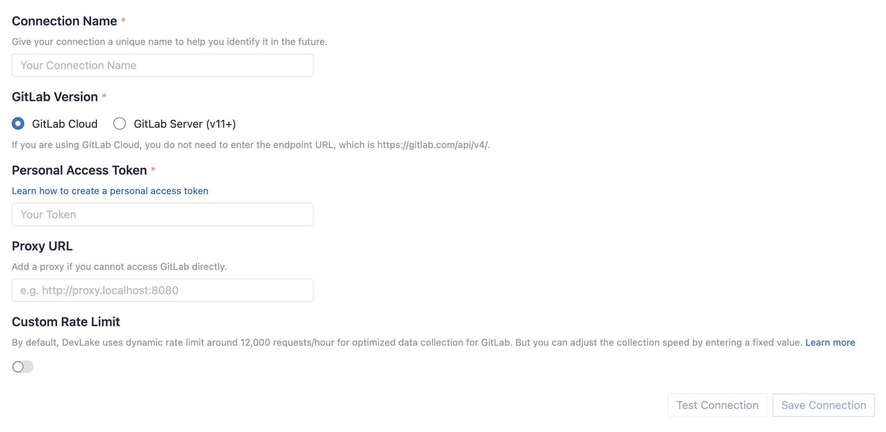
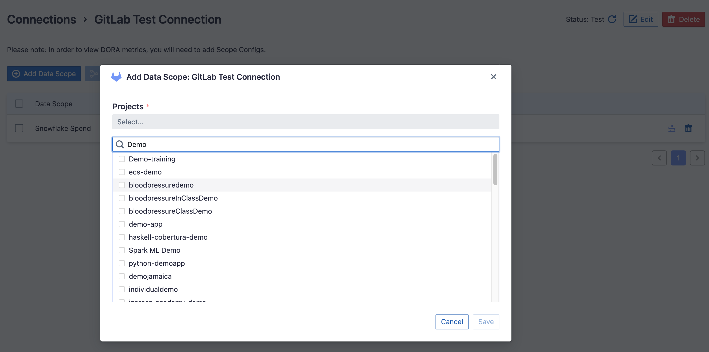
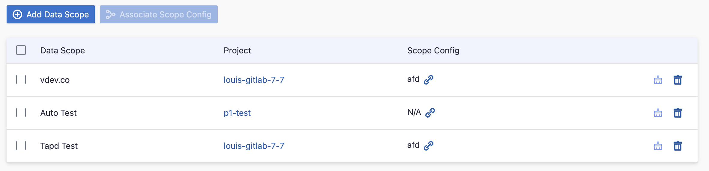
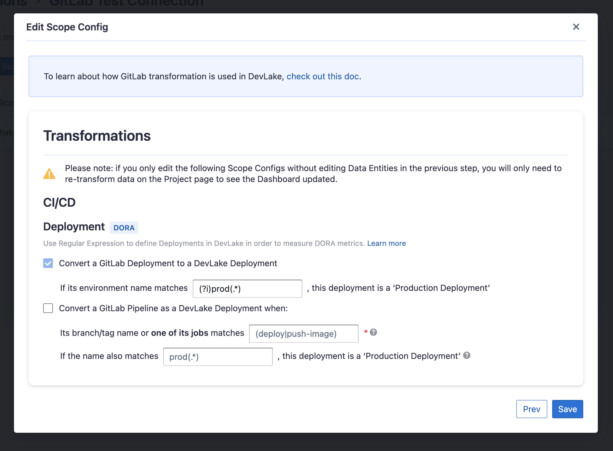

Visit Config UI: `http://localhost:4000`.

## Step 1 - Add Data Connections

On the Connections page, you can select GitHub and create a new connection or it.

### Step 1.1 - Authentication

#### Connection Name

Give your connection a unique name to help you identify it in the future.

#### GitLab Version

Select if you use GitLab Cloud or GitLab Server (v11+).

#### Endpoint URL

This should be a valid REST API endpoint.

- If you use GitLab cloud, you do not need to enter the endpoint, which is always `https://gitlab.com/api/v4/`.
- If you GitLab Server (v11+), the endpoint will look like `https://gitlab.example.com/api/v4/`.
  Please note: the endpoint URL should end with `/`.

#### Personal Access Token

Your GitLab personal access token (PAT) is required to add a connection. Learn about [how to create a GitLab personal access token](https://docs.gitlab.com/ee/user/profile/personal_access_tokens.html).

##### Personal Access Token Permissions

At least one of the following permissions is required to collect data from repositories:

- `api`
- `read_api`

You also have to double-check your GitLab user permission settings.

1. Go to the Project information -> Members page of the GitLab projects you wish to collect.
2. Check your role in this project from the Max role column. Make sure you are not the Guest role, otherwise, you will not be able to collect data from this project.

#### Proxy URL (Optional)

If you are behind a corporate firewall or VPN you may need to utilize a proxy server. Enter a valid proxy server address on your network, e.g. `http://your-proxy-server.com:1080`

#### Fixed Rate Limit (Optional)

DevLake uses a dynamic rate limit at around 12,000 requests/hour to collect GitLab data. You can adjust the rate limit if you want to increase or lower the speed.

The maximum rate limit for GitLab Cloud is ** [120,000 requests/hour](https://docs.gitlab.com/ee/user/gitlab_com/index.html#gitlabcom-specific-rate-limits)**. Tokens under the same IP address share the rate limit, so the actual rate limit for your token will be lower than this number.

For self-managed GitLab rate limiting, please contact your GitLab admin to [get or set the maximum rate limit](https://repository.prace-ri.eu/git/help/security/rate_limits.md) of your GitLab instance. Please do not use a rate that exceeds this number.

#### Test and Save Connection

Click `Test Connection`, if the connection is successful, click `Save Connection` to add the connection.

### Step 1.2 - Add Data Scopes

#### Repositories

Select the GitLab repositories you want to collect from the miller column. **Please note that repositories with guest permissions or those that are archived have already been excluded.** You can also use the search function to find them. Limited by the GitLab API, You need to type more than 2 characters to search. The repositories only with guest permissions are not shown in the list.

### Step 1.3 - Add Scope Config (Optional)
Scope config contains two parts: 
- The entities of which domain you wish to collect: Usually, you don't have to modify this part. However, if you don't want to collect certain GitLab entities, you can unselect some entities to accelerate the collection speed.
  - Issue Tracking: GitLab issues, issue comments, issue labels, etc.
  - Source Code Management: GitLab repos, refs, commits, etc.
  - Code Review: GitLab MRs, MR comments and reviews, etc.
  - CI/CD: GitLab pipelines, jobs, etc.
  - Cross Domain: GitLab accounts, etc.
- The transformations on the GitLab data you are going to collect.
  - The details of the transformations will be explained below.
  - Without adding transformation rules, you can still view some of the dashboards.
  - Each GitLab repo has at most ONE set of transformations.

#### CI/CD

This set of configurations is used to define 'deployments'. Deployments are related to measure [DORA metrics](../DORA.md).

For GitLab deployments, DevLake recognizes them as deployments by specifying a regular expression (regex) to identify the production environments among all 'GitLab environments'.

If your deployments are not performed through GitLab deployments but rather specific pipelines in GitLab, you have the option to convert a GitLab pipeline run into a DevLake deployment. In this case, you need to configure two regular expressions (regex):

- Deployment: The given regex should match the name of the GitLab pipeline's branch name or one of its job names to be considered as a deployment. For example, if the pipeline is executet on the 'build-and-push-image', you can input (push-image). To make the regex case insensitive, you can include (?i) before the regex.
- Production: The given regex should match either the pipeline's branch name or one of its job names to be considered a deployment within the production environment. For instance:
  - If the pipeline used for deployment is named 'build-to-prod', you can input (prod). To make the regex case insensitive, you can include (?i) before the regex.
  - Also, many users in GitLab utilize the same pipeline for both staging and prod deployments, executing it on the release branch would indicate a production deployment.

## Step 2 - Collect Data in a Project
### Step 2.1 - Create a Project
Collecting GitLab data requires creating a project first. You can visit the Project page from the side menu and create a new project by following the instructions on the user interface.

### Step 2.2 - Add a GitLab Connection
You can add a previously configured GitLab connection to the project and select the boards for which you wish to collect the data for. 
Please note: if you don't see the repositories you are looking for, please check if you have added them to the connection first.

### Step 2.3 - Set the Sync Policy
There are three settings for Sync Policy:
- Data Time Range: You can select the time range of the data you wish to collect. The default is set to the past six months.
- Sync Frequency: You can choose how often you would like to sync your data in this step by selecting a sync frequency option or entering a cron code to specify your prefered schedule.
- Skip Failed Tasks: sometime a few tasks may fail in a long pipeline; you can choose to skip them to avoid spending more time in running the pipeline all over again.

### Step 2.4 - Start Data Collection
Click on "Collect Data" to start collecting data for the whole project. You can check the status in the Status tab on the same page.

## Troubleshooting

If you run into any problem, please check the [Troubleshooting](/Troubleshooting/Configuration.md) or [create an issue](https://github.com/apache/incubator-devlake/issues)
