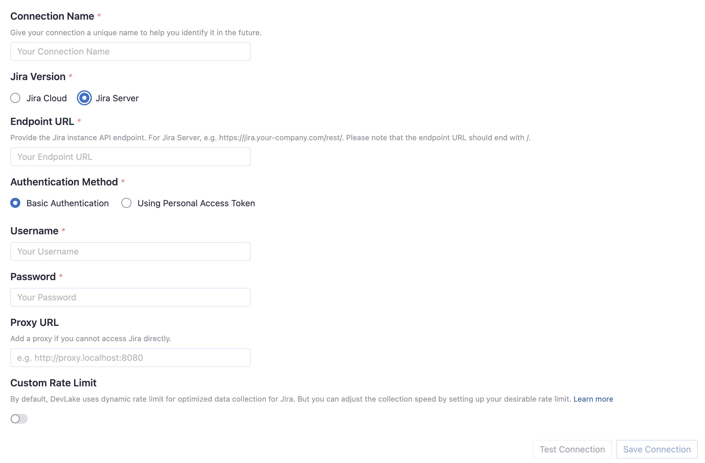
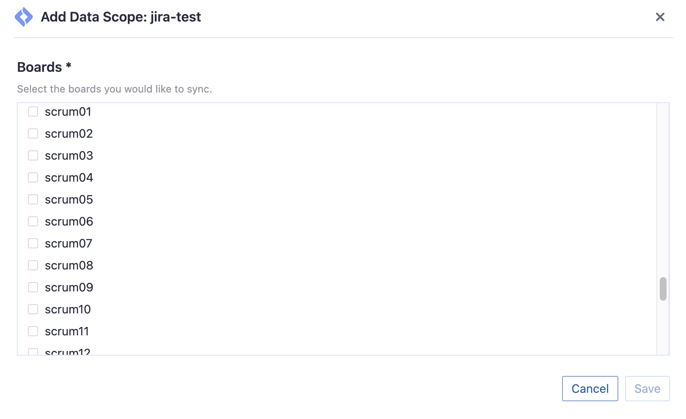
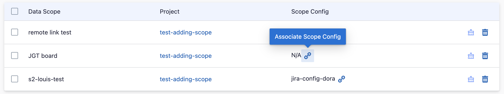
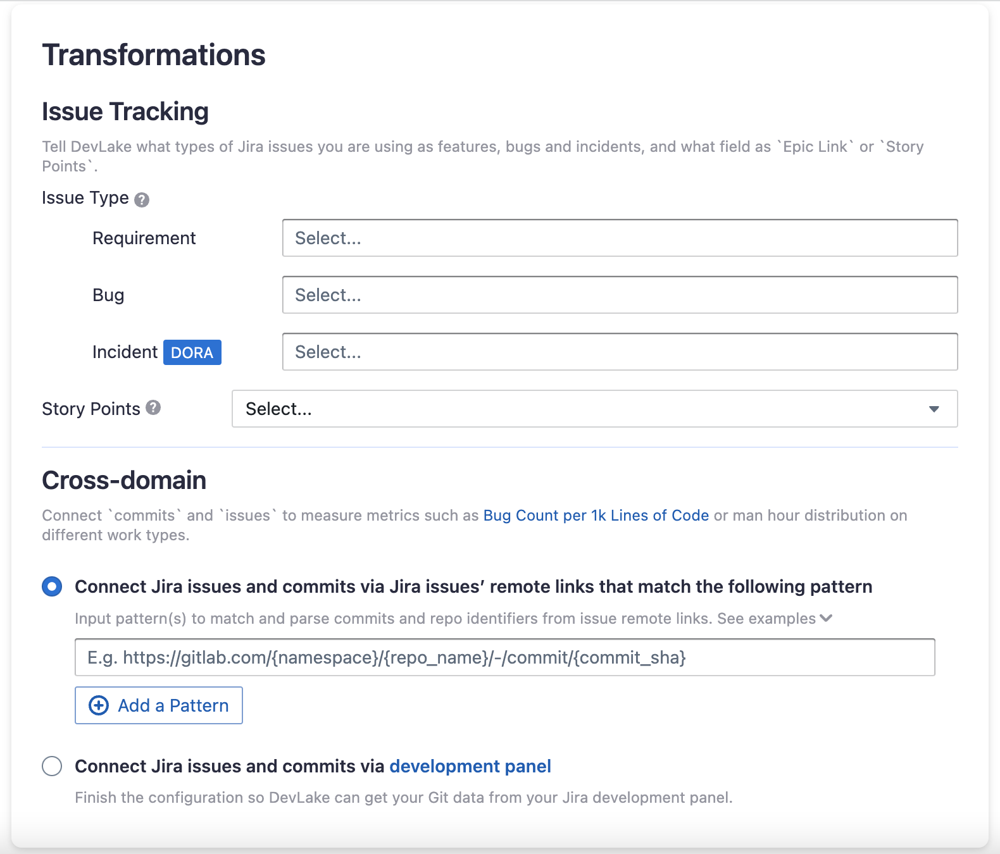
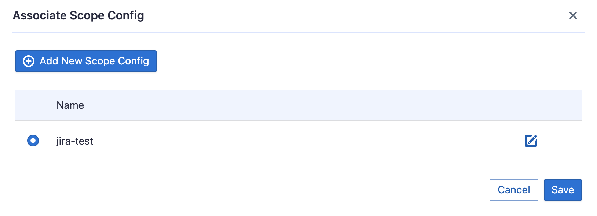

Visit Config UI at: `http://localhost:4000`.

## Step 1 - Add Data Connections

On the Connections page, you can select Jira and create a new connection or it.

### Stept 1.1 - Authentication

#### Connection Name

Give your connection a unique name to help you identify it in the future. 

Please note: the following configuration for the endpoint and authentication for your Jira connection depends on your Jira version, Jira Cloud or Server/Data Center.

#### Jira Cloud
##### Endpoint URL
This should be a valid REST API endpoint: `https://<mydomain>.atlassian.net/rest/`
  
Please note: the endpoint url should end with `/`.

##### E-mail
Please enter the e-mail of your Jira account.

##### API Token
Learn about [how to create an API token](https://support.atlassian.com/atlassian-account/docs/manage-api-tokens-for-your-atlassian-account/).

Please note: Jira API token and Personal Access Token are two different tokens.

#### Jira Server/Data Center
##### Endpoint URL
This should be a valid REST API endpoint: `https://jira.<mydomain>.com/rest/`

Please note: the endpoint url should end with `/`.

##### Authentication Method
Jira Server supports two ways of authentication: using basic authentication or Personal Access Token.

##### Username
Please enter the username of your Jira account.

##### Password
Please enter the password of your Jira account.

##### Personal Access Token
Learn about [how to create a Personal Access Token](https://confluence.atlassian.com/enterprise/using-personal-access-tokens-1026032365.html).

#### Token Permissions
For both Jira Cloud and Jira Server, when accessing Jira API, users may encounter access restrictions if their token does not have sufficient permissions. This is typically caused by insufficient scope or role settings for the Jira token.

To solve this issue, users can take the following steps:

- Checking User Permissions

Users can confirm whether they have sufficient permissions by checking their permissions in Jira. For Cloud users, they can view their global and project permissions through the "Permissions" tab on the "Profile" page. For Server users, they can log in to Jira as an administrator and view user permissions on the "User Management" page.

- Ensuring Sufficient Permissions

Before using the Jira API, users need to ensure that their account has at least the necessary project or global permissions. Global permissions include various Jira system settings and management operations, while project permissions control specific operations and configurations for each Jira project. Users can assign roles such as `Project Administrator`, `Project Lead`, `Developer`, etc. for the corresponding projects, or assign global permissions such as `Jira Administrators`, `Jira Software Administrators`, etc. It is recommended to minimize the permissions granted to the API to ensure system security.

- Solving Access Restrictions

To solve access restrictions caused by insufficient Jira token permissions, users should check the token's permission settings to ensure the correct scope and role are set. If the permission settings are correct but the required API is still inaccessible, consider using other authentication methods, such as authenticating with a username and password. If the issue persists, contact the Jira administrator for further assistance.

#### Proxy URL (Optional)

If you are behind a corporate firewall or VPN you may need to utilize a proxy server. Enter a valid proxy server address on your network, e.g. `http://your-proxy-server.com:1080`

##### Fixed Rate Limit (Optional)

DevLake uses a dynamic rate limit to collect Jira data. You can adjust the rate limit if you want to increase or lower the speed. If you encounter a 403 error during data collection, please lower the rate limit.

Jira(Cloud) uses a dynamic rate limit and has no clear rate limit. For Jira Server's rate limiting, please contact your Jira Server admin to [get or set the maximum rate limit](https://repository.prace-ri.eu/git/help/security/rate_limits.md) of your Jira instance. Please do not use a rate that exceeds this number.

#### Test and Save Connection

Click `Test Connection`, if the connection is successful, click `Save Connection` to add the connection.

### Step 1.2 - Add Data Scopes

#### Boards

Choose the Jira boards to collect.

### Step 1.3 - Add Scope Config (Optional)
Scope config contains two parts: 
- The entities of which domain you wish to collect: Usually, you don't have to modify this part. However, if you don't want to collect certain Jira entities, you can unselect some entities to accerlerate the collection speed.
   - Issue Tracking: Jira issues, issue comments, issue labels, etc.
   - Cross Domain: Jira accounts, etc.
- The transformations on the Jira data you are going to collect
   - Issue Type: Standardize the issue types to DevLake's pre-defined three issue types: REQUIREMENT, BUG, and INCIDENT.
   - Story Points: Map the custom field that represents story_point in your Jira to DevLake's issue story point.
   - Cross-domain: Get the commit(s) associated with Jira issues from Jira issues' remote links or development panels.

Although this configuration is optional, some of the above transformations are required to measure metrics such as [Requirement Lead Time](https://devlake.apache.org/docs/Metrics/RequirementLeadTime), [Bug Age](https://devlake.apache.org/docs/Metrics/BugAge) or [DORA - Median Time to Restore Service](https://devlake.apache.org/docs/Metrics/MTTR) in the built-in Grafana dashboards.

Without adding transformation rules, you can not view all charts in "Jira" or "Engineering Throughput and Cycle Time" dashboards. 

Each Jira board has at most ONE set of transformations.

#### Issue Tracking

- Requirement: choose the issue types to be transformed to "REQUIREMENT".
- Bug: choose the issue types to be transformed to "BUG".
- Incident: choose the issue types to be transformed to "INCIDENT".
- Epic Key: choose the custom field that represents Epic key. In most cases, it is "Epic Link".
- Story Point: choose the custom field that represents story points. In most cases, it is "Story Points".

#### Additional Settings

- Remotelink Commit SHA: parse the commits from an issue's remote links by the given regular expression so that the relationship between `issues` and `commits` can be created. You can directly use the regular expression `/commit/([0-9a-f]{40})$`.

## Step 2 - Collect Data in a Project
### Step 2.1 - Create a Project
Collecing Jira data reuiqres creating a project first. You can visit the Project page from the side menu and create a new project by following the instructions on the user interface.

### Step 2.2 - Add a Jira Connection
You can add a previously configured Jira connection to the project and select the boards for which you wish to collect the data for.
Please note: if you don't see the boards you are looking for, please check if you have added them to the connection first.

### Step 2.3 - Set the Sync Policy
There are three settings for Sync Policy:
- Data Time Range: You can select the time range of the data you wish to collect. The default is set to the past six months.
- Sync Frequency: You can choose how often you would like to sync your data in this step by selecting a sync frequency option or enter a cron code to specify your prefered schedule.
- Skip Failed Tasks: sometime a few tasks may fail in a long pipeline; you can choose to skip them to avoid spending more time in running the pipeline all over again.

### Step 2.4 - Start Data Collection
Click on "Collect Data" to start collecting data for the whole project. You can check the status in the Status tab on the same page.

## Troubleshooting

If you run into any problem, please check the [Troubleshooting](/Troubleshooting/Configuration.md) or [create an issue](https://github.com/apache/incubator-devlake/issues)
