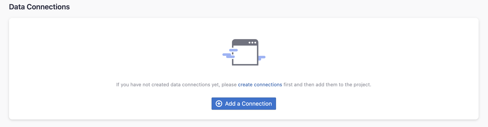

Visit Config UI at: `http://localhost:4000`.

## Step 1 - Add Data Connections

On the Connections page, you can select Opsgenie and create a new connection on it.

### Step 1.1 - Authentication

#### Connection Name

Give your connection a unique name to help you identify it in the future.

#### Endpoint URL

Opsgenie makes available two types of REST API endpoints, US and EU, eg. `https://api.opsgenie.com/` or `https://api.eu.opsgenie.com/`. You can choose wich instance by selecting the due radio input.

#### API Access Key

In the `API key management` section of your Atlassian Opsgenie account settings, you can create a API key to manage your requests.

Learn about [how to create a Opsgenie API key](https://support.atlassian.com/opsgenie/docs/api-key-management/). The following permissions are required to collect data from repositories:

- `Read`
- `Create and Update`
- `Configuration Access`

#### Proxy URL (Optional)

If you are behind a corporate firewall or VPN you may need to utilize a proxy server. Enter a valid proxy server address on your network, e.g. `http://your-proxy-server.com:1080`

#### Fixed Rate Limit (Optional)

DevLake uses a dynamic rate limit to collect Opsgenie data. You can adjust the rate limit if you want to increase or lower the speed.

Opsgenie doesn't establishes a maximum rate limit for its API request, thus you should check this **[detailed doc](https://docs.opsgenie.com/docs/api-rate-limiting)** on how to calculate your rate limit, based on number of user and account plan that you hired. For now, the default rate limit is in 6,000 request/hour (100 request/minute).

#### Test and Save Connection

Click `Test Connection`, if the connection is successful, click `Save Connection` to add the connection.

### Step 1.2 - Add Data Scopes

#### Services

Choose the Opsgenie services you wish to collect either by finding them in the miller column, or searching.

## Step 2 - Collect Data in a Project
### Step 2.1 - Create a Project
Collecing Opsgenie data requires creating a project first. You can visit the Project page from the side menu and create a new project by following the instructions on the user interface.

### Step 2.2 - Add a Opsgenie Connection
You can add a previously configured Opsgenie connection to the project and select the boards for which you wish to collect the data for.
Please note: if you don't see the services you are looking for, please check if you have added them to the connection first.

### Step 2.3 - Set the Sync Policy
There are three settings for Sync Policy:
- Data Time Range: You can select the time range of the data you wish to collect. The default is set to the past six months.
- Sync Frequency: You can choose how often you would like to sync your data in this step by selecting a sync frequency option or enter a cron code to specify your prefered schedule.
- Skip Failed Tasks: sometime a few tasks may fail in a long pipeline; you can choose to skip them to avoid spending more time in running the pipeline all over again.

### Step 2.4 - Start Data Collection
Click on "Collect Data" to start collecting data for the whole project. You can check the status in the Status tab on the same page.

## Troubleshooting

If you run into any problem, please check the [Troubleshooting](/Troubleshooting/Configuration.md) or [create an issue](https://github.com/apache/incubator-devlake/issues)
