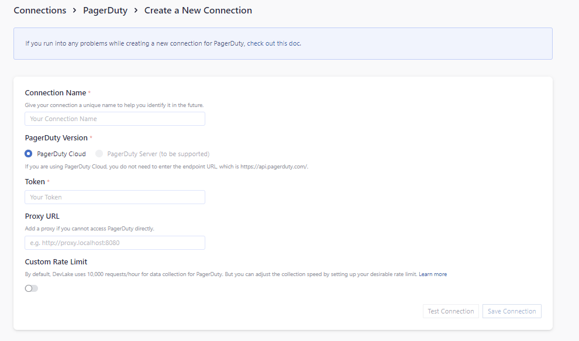

Visit Config UI at: `http://localhost:4000`.

## Step 1 - Add Data Connections

### Step 1.1 - Authentication

#### Connection Name

Give your connection a unique name to help you identify it in the future.

#### Token

Paste your PagerDuty personal access token (PAT) here. You may make it a Read-Only token for the plugin's purposes.

#### Test and Save Connection

Click `Test Connection`, if the connection is successful, click `Save Connection` to add the connection.

### Step 1.2 - Add Data Scopes

Choose the **PagerDuty services** to collect.

Only PagerDuty incidents will be collected. The data will be stored in table issues and incidents.

Note: PagerDuty plugin does not support any scope config.

## Step 2 - Collect PagerDuty Data in a Project
### Step 2.1 - Create a Project
Collecting PagerDuty data requires creating a project first. 

Navigate to the **Projects** page from the side menu and create a new project.

### Step 2.2 - Add a PagerDuty Connection
Create a project, add the PagerDuty connection.

Please note: if you don't see the repositories you are looking for, please check if you have added them to the connection first.

### Step 2.3 - Set the Sync Policy (Optional)
There are three settings for Sync Policy:
- Data Time Range: You can select the time range of the data you wish to collect. The default is set to the past six months.
- Sync Frequency: You can choose how often you would like to sync your data in this step by selecting a sync frequency option or enter a cron code to specify your preferred schedule.
- Skip Failed Tasks: sometime a few tasks may fail in a long pipeline; you can choose to skip them to avoid spending more time in running the pipeline all over again.

### Step 2.4 - Start Data Collection
Click on **Collect Data** to start collecting data for the whole project, including the SonarQube data. 

You can also trigger the data sync at the **General Settings/Status** page (The previous **Blueprint/Status** page).

## Troubleshooting

If you run into any problem, please check the [Troubleshooting](/Troubleshooting/Configuration.md) or [create an issue](https://github.com/apache/incubator-devlake/issues)
