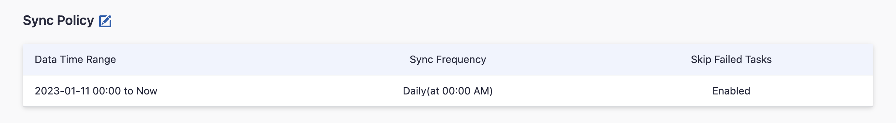

Visit Config UI at: `http://localhost:4000`.

## Step 1 - Add Data Connections

### Step 1.1 - Authentication

#### Connection Name

Name your connection.

#### Endpoint URL

This should be a valid REST API endpoint

- `http://<host>:<port>/api/`

The endpoint url should end with `/`.

#### Token

Please use a system admin account to create the SonarQube token, because some SonarQube APIs require this permission to list all projects. Learn about [how to create a SonarQube token](https://docs.sonarsource.com/sonarqube/8.9/user-guide/user-account/generating-and-using-tokens/#generating-a-token).

#### Proxy URL (Optional)

If you are behind a corporate firewall or VPN you may need to utilize a proxy server. Enter a valid proxy server address on your network, e.g. `http://your-proxy-server.com:1080`

#### Fixed Rate Limit (Optional)

DevLake uses a dynamic rate limit at around 18,000 requests/hour to collect SonarQube data. You can adjust the rate limit if you want to increase or lower the speed.

#### Test and Save Connection

Click `Test Connection`, if the connection is successful, click `Save Connection` to add the connection.

### Step 1.2 - Add Data Scopes

Choose the **SonarQube projects** to collect. The following data entities in the selected projects will be collected:
- Code Quality Domain: SonarQube issues, issue code blocks, file metrics, hotspots, etc.
- Cross Domain: SonarQube accounts, etc.

Note: SonarQube plugin does not support any scope config.

## Step 2 - Collect SonarQube Data in a Project
### Step 2.1 - Create a Project
Collecting SonarQube data requires creating a project first. 

Navigate to the Project page from the side menu and create a new project.

### Step 2.2 - Add a SonarQube Connection
You can add a previously configured SonarQube connection to the project and select the projects you wish to collect data from.

Please note: if you don't see the repositories you are looking for, please check if you have added them to the connection first.

### Step 2.3 - Set the Sync Policy
There are two settings for Sync Policy:
- Sync Frequency: You can choose how often you would like to sync your data in this step by selecting a sync frequency option or enter a cron code to specify your preferred schedule.
- Skip Failed Tasks: sometime a few tasks may fail in a long pipeline; you can choose to skip them to avoid spending more time in running the pipeline all over again.

Please note that the 'Data Time Range' setting will not affect the SonarQube data to collect, as the SonarQube plugin will only collect the issues and metrics of the latest Sonar scan results.

### Step 2.4 - Start Data Collection
Click on **Collect Data** to start collecting data for the whole project, including the SonarQube data. 

You can also trigger the data sync at the **General Settings/Status** page (the previous **Blueprint/Status** page).

## Troubleshooting

If you run into any problem, please check the [Troubleshooting](/Troubleshooting/Configuration.md) or [create an issue](https://github.com/apache/incubator-devlake/issues)
