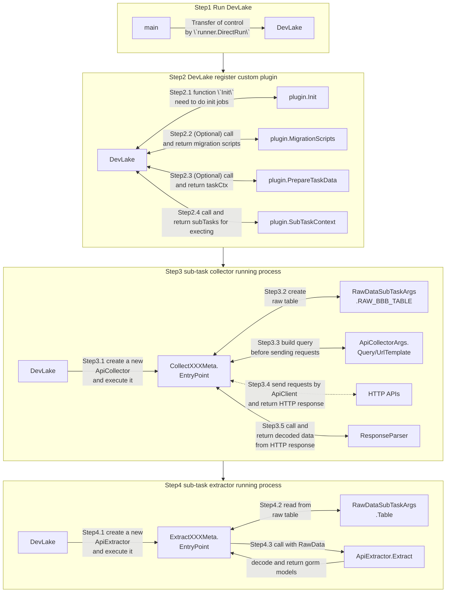

If your favorite DevOps tool is not yet supported by DevLake, don't worry. It's not difficult to implement a DevLake plugin. In this post, we'll go through the basics of DevLake plugins and build an example plugin from scratch together.

## What is a plugin?

A DevLake plugin is a shared library built with Go's `plugin` package that hooks up to DevLake core at run-time.

A plugin may extend DevLake's capability in three ways:

1. Integrating with new data sources
2. Transforming/enriching existing data
3. Exporting DevLake data to other data systems


## How do plugins work?

A plugin mainly consists of a collection of subtasks that can be executed by DevLake core. For data source plugins, a subtask may be collecting a single entity from the data source (e.g., issues from Jira). Besides the subtasks, there're hooks that a plugin can implement to customize its initialization, migration, and more. See below for a list of the most important interfaces:

1. [PluginMeta](https://github.com/apache/incubator-devlake/blob/main/plugins/core/plugin_meta.go) contains the minimal interface that a plugin should implement, with only two functions 
   - Description() returns the description of a plugin
   - RootPkgPath() returns the root package path of a plugin
2. [PluginInit](https://github.com/apache/incubator-devlake/blob/main/plugins/core/plugin_init.go) allows a plugin to customize its initialization
3. [PluginTask](https://github.com/apache/incubator-devlake/blob/main/plugins/core/plugin_task.go) enables a plugin to prepare data prior to subtask execution
4. [PluginApi](https://github.com/apache/incubator-devlake/blob/main/plugins/core/plugin_api.go) lets a plugin exposes some self-defined APIs
5. [Migratable](https://github.com/apache/incubator-devlake/blob/main/plugins/core/plugin_db_migration.go) is where a plugin manages its database migrations 

The diagram below shows the control flow of executing a plugin:


There's a lot of information in the diagram but we don't expect you to digest it right away, simply use it as a reference when you go through the example below.

## A step-by-step guide towards your first plugin

In this section, we will describe how to create a data collection plugin from scratch. The data to be collected is the information about all Committers and Contributors of the Apache project, in order to check whether they have signed the CLA. We are going to

* request `https://people.apache.org/public/icla-info.json` to get the Committers' information
* request the `mailing list` to get the Contributors' information

We will focus on demonstrating how to request and cache information about all Committers through the Apache API and extract structured data from it. The collection of Contributors will only be briefly described.

### Step 1: Bootstrap the new plugin

**Note:** Please make sure you have DevLake up and running before proceeding.

> More info about plugin:
> Generally, we need these folders in plugin folders: `api`, `models` and `tasks`
> `api` interacts with `config-ui` for test/get/save connection of data source
>       - connection [example](https://github.com/apache/incubator-devlake/blob/main/plugins/gitlab/api/connection.go)
>       - connection model [example](https://github.com/apache/incubator-devlake/blob/main/plugins/gitlab/models/connection.go)
> `models` stores all `data entities` and `data migration scripts`. 
>       - entity 
>       - data migrations [template](https://github.com/apache/incubator-devlake/tree/main/generator/template/migrationscripts)
> `tasks` contains all of our `sub tasks` for a plugin
>       - task data [template](https://github.com/apache/incubator-devlake/blob/main/generator/template/plugin/tasks/task_data.go-template)
>       - api client [template](https://github.com/apache/incubator-devlake/blob/main/generator/template/plugin/tasks/task_data_with_api_client.go-template)

Don't worry if you cannot figure out what these concepts mean immediately. We'll explain them one by one later. 

DevLake provides a generator to create a plugin conveniently. Let's scaffold our new plugin by running `go run generator/main.go create-plugin icla`, which would ask for `with_api_client` and `Endpoint`.

* `with_api_client` is used for choosing if we need to request HTTP APIs by api_client. 
* `Endpoint` use in which site we will request, in our case, it should be `https://people.apache.org/`.


Now we have three files in our plugin. `api_client.go` and `task_data.go` are in subfolder `tasks/`.


Have a try to run this plugin by function `main` in `plugin_main.go`. When you see result like this:
```
$go run plugins/icla/plugin_main.go
[2022-06-02 18:07:30]  INFO failed to create dir logs: mkdir logs: file exists
press `c` to send cancel signal
[2022-06-02 18:07:30]  INFO  [icla] start plugin
invalid ICLA_TOKEN, but ignore this error now
[2022-06-02 18:07:30]  INFO  [icla] scheduler for api https://people.apache.org/ worker: 25, request: 18000, duration: 1h0m0s
[2022-06-02 18:07:30]  INFO  [icla] total step: 0
```
How exciting. It works! The plugin defined and initiated in `plugin_main.go` use some options in `task_data.go`. They are made up as the most straightforward plugin in Apache DevLake, and `api_client.go` will be used in the next step to request HTTP APIs.

### Step 2: Create a sub-task for data collection
Before we start, it is helpful to know how collection task is executed: 
1. First, Apache DevLake would call `plugin_main.PrepareTaskData()` to prepare needed data before any sub-tasks. We need to create an API client here.
2. Then Apache DevLake will call the sub-tasks returned by `plugin_main.SubTaskMetas()`. Sub-task is an independent task to do some job, like requesting API, processing data, etc.

> Each sub-task must be defined as a SubTaskMeta, and implement SubTaskEntryPoint of SubTaskMeta. SubTaskEntryPoint is defined as 
> ```go
> type SubTaskEntryPoint func(c SubTaskContext) error
> ```
> More info at: https://devlake.apache.org/blog/how-apache-devlake-runs/

#### Step 2.1 Create a sub-task(Collector) for data collection

Let's run `go run generator/main.go create-collector icla committer` and confirm it. This sub-task is activated by registering in `plugin_main.go/SubTaskMetas` automatically.


> - Collector will collect data from HTTP or other data sources, and save the data into the raw layer. 
> - Inside the func `SubTaskEntryPoint` of `Collector`, we use `helper.NewApiCollector` to create an object of [ApiCollector](https://github.com/apache/incubator-devlake/blob/main/generator/template/plugin/tasks/api_collector.go-template), then call `execute()` to do the job. 

Now you can notice `data.ApiClient` is inited in `plugin_main.go/PrepareTaskData.ApiClient`. `PrepareTaskData` create a new `ApiClient`, and it's a tool Apache DevLake suggests to request data from HTTP Apis. This tool support some valuable features for HttpApi, like rateLimit, proxy and retry. Of course, if you like, you may use the lib `http` instead, but it will be more tedious.

Let's move forward to use it.

1. To collect data from `https://people.apache.org/public/icla-info.json`,
we have filled `https://people.apache.org/` into `tasks/api_client.go/ENDPOINT` in Step 1.


2. And fill `public/icla-info.json` into `UrlTemplate`, delete unnecessary iterator and add `println("receive data:", res)` in `ResponseParser` to see if collection was successful.


Ok, now the collector sub-task has been added to the plugin, and we can kick it off by running `main` again. If everything goes smoothly, the output should look like this:
```bash
[2022-06-06 12:24:52]  INFO  [icla] start plugin
invalid ICLA_TOKEN, but ignore this error now
[2022-06-06 12:24:52]  INFO  [icla] scheduler for api https://people.apache.org/ worker: 25, request: 18000, duration: 1h0m0s
[2022-06-06 12:24:52]  INFO  [icla] total step: 1
[2022-06-06 12:24:52]  INFO  [icla] executing subtask CollectCommitter
[2022-06-06 12:24:52]  INFO  [icla] [CollectCommitter] start api collection
receive data: 0x140005763f0
[2022-06-06 12:24:55]  INFO  [icla] [CollectCommitter] finished records: 1
[2022-06-06 12:24:55]  INFO  [icla] [CollectCommitter] end api collection
[2022-06-06 12:24:55]  INFO  [icla] finished step: 1 / 1
```

Great! Now we can see data pulled from the server without any problem. The last step is to decode the response body in `ResponseParser` and return it to the framework, so it can be stored in the database.
```go
ResponseParser: func(res *http.Response) ([]json.RawMessage, error) {
    body := &struct {
        LastUpdated string          `json:"last_updated"`
        Committers  json.RawMessage `json:"committers"`
    }{}
    err := helper.UnmarshalResponse(res, body)
    if err != nil {
        return nil, err
    }
    println("receive data:", len(body.Committers))
    return []json.RawMessage{body.Committers}, nil
},

```
Ok, run the function `main` once again, then it turned out like this, and we should be able see some records show up in the table `_raw_icla_committer`.
```bash
……
receive data: 272956 /* <- the number means 272956 models received */
[2022-06-06 13:46:57]  INFO  [icla] [CollectCommitter] finished records: 1
[2022-06-06 13:46:57]  INFO  [icla] [CollectCommitter] end api collection
[2022-06-06 13:46:57]  INFO  [icla] finished step: 1 / 1
```


#### Step 2.2 Create a sub-task(Extractor) to extract data from the raw layer

> - Extractor will extract data from raw layer and save it into tool db table.
> - Except for some pre-processing, the main flow is similar to the collector.

We have already collected data from HTTP API and saved them into the DB table `_raw_XXXX`. In this step, we will extract the names of committers from the raw data. As you may infer from the name, raw tables are temporary and not easy to use directly.

Now Apache DevLake suggests to save data by [gorm](https://gorm.io/docs/index.html), so we will create a model by gorm and add it into `plugin_main.go/AutoMigrate()`.

plugins/icla/models/committer.go
```go
package models

import (
	"github.com/apache/incubator-devlake/models/common"
)

type IclaCommitter struct {
	UserName     string `gorm:"primaryKey;type:varchar(255)"`
	Name         string `gorm:"primaryKey;type:varchar(255)"`
	common.NoPKModel
}

func (IclaCommitter) TableName() string {
	return "_tool_icla_committer"
}
```

plugins/icla/plugin_main.go


Ok, run the plugin, and table `_tool_icla_committer` will be created automatically just like the snapshot below:


Next, let's run `go run generator/main.go create-extractor icla committer` and type in what the command prompt asks for to create a new sub-task.


Let's look at the function `extract` in `committer_extractor.go` created just now, and some codes need to be written here. It's obviously `resData.data` is raw data, so we could decode them by json and add new `IclaCommitter` to save them.
```go
Extract: func(resData *helper.RawData) ([]interface{}, error) {
    names := &map[string]string{}
    err := json.Unmarshal(resData.Data, names)
    if err != nil {
        return nil, err
    }
    extractedModels := make([]interface{}, 0)
    for userName, name := range *names {
        extractedModels = append(extractedModels, &models.IclaCommitter{
            UserName: userName,
            Name:     name,
        })fco
    }
    return extractedModels, nil
},
```

Ok, run it then we get:
```
[2022-06-06 15:39:40]  INFO  [icla] start plugin
invalid ICLA_TOKEN, but ignore this error now
[2022-06-06 15:39:40]  INFO  [icla] scheduler for api https://people.apache.org/ worker: 25, request: 18000, duration: 1h0m0s
[2022-06-06 15:39:40]  INFO  [icla] total step: 2
[2022-06-06 15:39:40]  INFO  [icla] executing subtask CollectCommitter
[2022-06-06 15:39:40]  INFO  [icla] [CollectCommitter] start api collection
receive data: 272956
[2022-06-06 15:39:44]  INFO  [icla] [CollectCommitter] finished records: 1
[2022-06-06 15:39:44]  INFO  [icla] [CollectCommitter] end api collection
[2022-06-06 15:39:44]  INFO  [icla] finished step: 1 / 2
[2022-06-06 15:39:44]  INFO  [icla] executing subtask ExtractCommitter
[2022-06-06 15:39:46]  INFO  [icla] [ExtractCommitter] finished records: 1
[2022-06-06 15:39:46]  INFO  [icla] finished step: 2 / 2
```
Now committer data have been saved in _tool_icla_committer.


#### Step 2.3 Convertor

Notes: There are two ways here (open source or using it yourself). It is unnecessary, but we encourage it because convertors and the domain layer will significantly help build dashboards. More info about the domain layer at: https://devlake.apache.org/docs/DataModels/DevLakeDomainLayerSchema/

> - Convertor will convert data from the tool layer and save it into the domain layer.
> - We use `helper.NewDataConverter` to create an object of DataConvertor, then call `execute()`. 

#### Step 2.4 Let's try it
Sometimes OpenApi will be protected by token or other auth types, and we need to log in to gain a token to visit it. For example, only after logging in `private@apahce.com` could we gather the data about contributors signing ICLA. Here we briefly introduce how to authorize DevLake to collect data.

Let's look at `api_client.go`. `NewIclaApiClient` load config `ICLA_TOKEN` by `.env`, so we can add `ICLA_TOKEN=XXXXXX` in `.env` and use it in `apiClient.SetHeaders()` to mock the login status. Code as below:


Of course, we can use `username/password` to get a token after login mockery. Just try and adjust according to the actual situation.

Look for more related details at https://github.com/apache/incubator-devlake

#### Final step: Submit the code as open source code
Good ideas and we encourage contributions~ Let's learn about migration scripts and domain layers to write normative and platform-neutral codes. More info at https://devlake.apache.org/docs/DataModels/DevLakeDomainLayerSchema or contact us for ebullient help.


## Done!

Congratulations! The first plugin has been created! 🎖 
