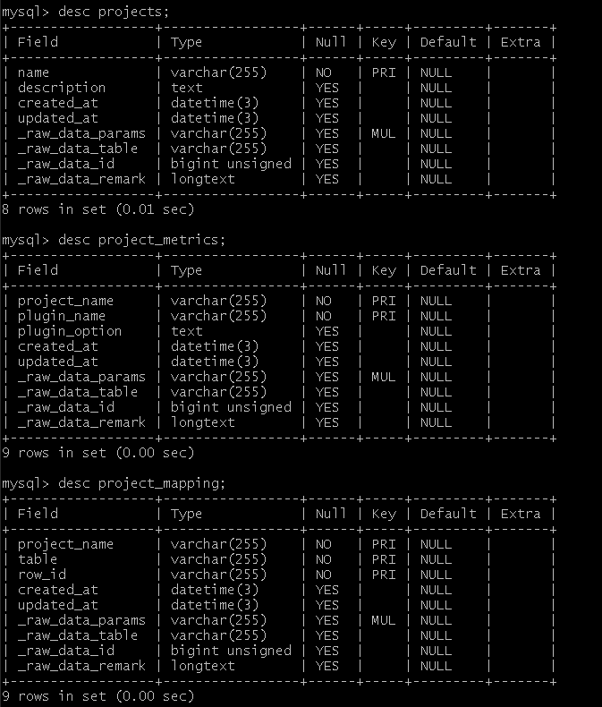

## Summary
`Project` is **a set of scopes from different domains**, a way to group different resources, and it is crucial for some metric calculation like `DORA`.

It contains the following two models:
 - `projects` describes a project object, including its name, creation and update time and other basic information
 - `project_metrics` describes what metrics a project had enabled.
 - `project_mapping` describes the mapping relationship of project and scope, including the name of the project、table and row_id.



## projects

|   **field**   | **type** | **length** | **description**               | **key** |
| ------------- | -------- | ---------- | ----------------------------- | ------- |
| `name`        | varchar  | 255        | name for project              | PK      |
| `description` | longtext |            | description of the project    |         |
| `created_at`  | datetime | 3          | created time of project       |         |
| `updated_at`  | datetime | 3          | last updated time of project  |         | 


| **name**  | **describe**                         | **created_at**          | **updated_at**          |
| --------- | ------------------------------------ | ----------------------- | ------------------------|
| project_1 | this is one of the test projects     | 2022-11-01 01:22:13.000 | 2022-11-01 02:24:15.000 |
| project_2 | this is another project test project | 2022-11-01 01:23:29.000 | 2022-11-01 02:27:24.000 |

## project_metrics

|    **field**    | **type** | **length** | **description**                                            | **key** |
| --------------- | -------- | ---------- | ---------------------------------------------------------- | ------- |
| `project_name`  | varchar  | 255        | name for project                                           | PK      |
| `plugin_name`   | varchar  | 255        | name for plugin                                            | PK      |
| `plugin_option` | longtext |            | check if metric plugins have been enabled by the project   |         |
| `enable`        | tinyint  | 1          | if the metric plugins is enabled                           |         |


| **project_name** | **plugin_name** | **plugin_option** | **enable** |
| ---------------- | --------------- | ----------------- | ---------- |
| project_1        | gitlab          | {}                | true       |
| project_2        | gitlab          | {}                | false      |
| project_2        | github          | {}                | true       |

## project_mapping

|   **field**    | **type** | **length** | **description**                                            | **key** |
| -------------- | -------- | ---------- | ---------------------------------------------------------- | ------- |
| `project_name` | varchar  | 255        | name for project                                           | PK      |
| `table`        | varchar  | 255        | the table name of scope                                    | PK      |
| `row_id`       | varchar  | 255        | the row_id in the scope table                              | PK      |


| **project_name** | **table** | **row_id**               |
| ---------------- | --------- | ------------------------ |
| project_1        | Repo      | gitlab:GithubRepo:1:lake |
| project_1        | Board     | jira:JiraBoard:1:lake    |
| project_2        | Repo      | github:GithubRepo:1:lake |


It requires each plugin to implement an interface named `PluginMetric`
# How to use Project

1. We can create a new `project` object through the `POST` `/projects` interface, which requires a `projectName` field as its name, which is unique.

After we create the `project` object:

- We can use the `GET /projects/:projectName` interface to obtain specific `project` information. In addition to the name, this information also includes the update time and creation time of the project, and will be associated with all The relevant `project_metrics` and `project_mapping` information of the current `project` will be returned after integration.
- We can use the `PATCH /projects/:projectName` interface to update the information of a specific `project`, such as updating its related `description` information.
- We can get all `project` information through the `GET /projects` interface. The returned information can be filtered by setting the parameter `search`, and the returned information can be paged by setting the parameters `page`, and `pageSize`.

2. At the same time, to specify the required indicators for the project, we can obtain basic plugin information by calling the interface `GET` `/plugins`. This will return a list consisting of `pluginName`.

3. After the above process, use the `POST /project_metrics/:projectName/:pluginName` interface to create a set of relationships between `project` and `plugins`. Use the `projectName` and `pluginName` we obtained earlier to build this relationship. At the same time configure the corresponding `option` for it.

After we create a set of `project_metrics` relations we can do further operations:

- We can get a set of `project_metrics` information through the `GET /project_metrics/:projectName/:pluginName` interface, we can set only `projectName` or only `pluginName` to filter. You can also set `project_name` and `plugin_name` at the same time. At this point, we will get specific `project_metrics` information.
- We can update a specific set of `project_metrics` information through the `PATCH /project_metrics/:projectName/:pluginName` interface. This requires us to set both `projectName` and `pluginName`.

# About Project and Blueprint

- Now in the `blueprint` table, a field `project_name` associated with `project` is now added, which indicates that the current `blueprint` only belongs to a specific `project`
- A `project` is allowed to be specified only by the `project_name` field of a `blueprint`. That is, a `project` is a one-to-one relationship with a `blueprint`

## The PluginMetric Interface

```go
type PluginMetric interface {
	// returns a list of required data entities and expected features.
	// [{ "model": "cicd_tasks", "requiredFields": {"column": "type", "execptedValue": "Deployment"}}, ...]
	RequiredDataEntities() (data []map[string]interface{}, err errors.Error)

	// returns if the metric depends on Project for calculation.
	// Currently, only dora would return true.
	IsProjectMetric() bool

	// indicates which plugins must be executed before executing this one.
	// declare a set of dependencies with this
	RunAfter() ([]string, errors.Error)

	// returns an empty pointer of the plugin setting struct.
	// (no concrete usage at this point)
	Settings() (p interface{})
}

```
