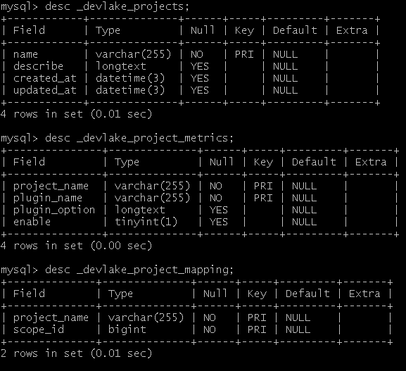

## Summary
`Project` is an object that can be used for DORA to associate `changes(commits)`, with `deployments` and `issues`.

It contains the following two models:
 - `projects` describes a project object, including its name, creation and update time and other basic information
 - `project_metrics` describes the mapping relationship enabled by a plugin, including the name of the project and plugin on both sides of the mapping, and basic information about plugin options.


 
It requires each plugin to implement an interface named `PluginMetric`

# 如何使用 Project

1. 首先我们可以通过 `GET` `/plugininfo` 接口来获取到 完整详细的 `插件` 信息，其中包括对应 `插件` 的每个表的结构信息。除此以外，我们也可以通过调用相对简单的 `GET` `/plugins` 来获取更为简洁的插件信息。简洁的插件信息仅包含插件名称，也就是`plugin_name`组成的列表，除此之外不包含其他任何信息。

2. 于此同时，我们可以通过 `POST` `/project` 接口来创建一个全新的 `project` 对象，该对象需要一个 `project_name`字段，作为其名称，该名称唯一。

当我们创建出 `project` 对象之后：

- 我们可以通过 `GET` `/project` 接口来获取具体的的某一个 `project`的信息，除了名称外，这些信息里也包含了project的更新时间和创建时间。
- 我们可以通过 `UPDATE` `/project` 接口来更新具体的某一个 `project`的信息，比如更新其相关的 `描述` 信息。
- 我们可以通过 `GET` `/projects` 接口来获取所有的`project`信息。 

3. 在上述过程之后 通过 `POST` `/project_metrics` 接口来创建一组 `project` 与 `plugins` 之间的关系。使用我们前面获取到的 `project_name` 和 `plugin_name` 来构建这种关系。同时为其配置相应的 `option`.

当我们创建出一组 `project_metrics` 的关系后我们就可以做更进一步的操作：

- 我们可以通过 `GET` `/project_metrics` 接口来获取一组 `project_metrics` 信息，我们可以只设置 `project_name` 或只设置 `plugin_name` 来进行筛选。也可以同时设置 `project_name` 和 `plugin_name` 此时我们将获取到一个特定的 `project_metrics` 信息。
- 我们可以通过 `UPDATE` `/project_metrics` 接口来更新特定的一组 `project_metrics` 信息。这要求我们必须同时设置好 `project_name` 和 `plugin_name`。


## The PluginMetric Interface


```go
type PluginMetric interface {
    // returns a list of required data entities and expected features.
    // [{ "model": "cicd_tasks", "requiredFields": {"column": "type", "execptedValue": "Deployment"}}, ...]
    RequiredDataEntities() (data map[string]interface{},err errors.Error)

    // This method returns all models of the current plugin
    GetTablesInfo() []core.Tabler
    
    // returns if the metric depends on Project for calculation. 
    // Currently, only dora would return true.
    IsProjectMetric() bool

    // indicates which plugins must be executed before executing this one. 
    // declare a set of dependencies with this
    RunAfter() (PluginsNames []string,errors.Error)

    // returns an empty pointer of the plugin setting struct.
    // (no concrete usage at this point)
    Settings() (p interface{})
}
```

## models

The following is the  table structure data of `project` related.

```go
type Projects struct {
    Name string `gorm:"primaryKey" gorm:"type:varchar(255)"`
    describe string `gorm:"type:text"`
    CreatedAt time.time
    UpdatedAt time.time
}

func (Projects) TableName() {
    return "project"
}

type ProjectMetrics struct { 
    ProjectName string `gorm:"primaryKey" gorm:"type:varchar(255)"`
    PluginName string `gorm:"primaryKey" gorm:"type:varchar(255)"`
    PluginOption string `gorm:"type:text"`
}

func (ProjectMetrics) TableName() {
    return "project_metrics"
}
```

## api

`Project` will provide the following APIs to support users to perform related operations.

```go
// Used to obtain the corresponding information of all Projects
// Request parameters: null
// response parameter: the list of project infomation,complete information including updated time and created time information of Project
// @Router /projects [get]
func GetProjects(input *core.ApiResourceInput) (*core.ApiResourceOutput, errors.Error)

// Used to obtain the corresponding information of the specified Project
// Request parameters: including project_name
// response parameter: complete information including updated time and created time information of Project
// @Router /project [get]
func GetProject(input *core.ApiResourceInput) (*core.ApiResourceOutput, errors.Error)

// Used to create a new Project data
// Request parameters: including project_name
// response parameter: if created successfully
// @Router /project [post]
func PostProject(input *core.ApiResourceInput) (*core.ApiResourceOutput,errors.Error)

// Used to update an existing Project data
// Consider merging with Project into an interface
// The advantage of separating into two interfaces is to avoid data loss caused by misoperation coverage
// Request parameters: including project_name
// response parameter: if updated successfully
// @Router /project [update]
func UpdateProject(input *core.ApiResourceInput) (*core.ApiResourceOutput,errors.Error)

// Used to obtain the corresponding information of the specified ProjectMetrics
// Request parameters: including project_name and plugin_name
// response parameter: complete information including plugin_options information of ProjectMetrics
// @Router /projectmetrics [get]
func GetProjectMetrics(input *core.ApiResourceInput) (*core.ApiResourceOutput, errors.Error)

// Used to create a new ProjectMetrics data
// Request parameters: including project_name, plugin_name and plugin_options
// response parameter: if created successfully
// @Router /projectmetrics [post]
func PostProjectMetrics(input *core.ApiResourceInput) (*core.ApiResourceOutput,errors.Error)

// Used to update an existing ProjectMetrics data
// Consider merging with PostProjectMetrics into an interface
// The advantage of separating into two interfaces is to avoid data loss caused by misoperation coverage
// Request parameters: including project_name, plugin_name and plugin_options
// response parameter: if updated successfully
// @Router /projectmetrics [update]
func UpdateProjectMetrics(input *core.ApiResourceInput) (*core.ApiResourceOutput,errors.Error)

// Used to obtain the list of all plug-ins registered in the current devlake
// Request parameters: null
// response parameter: all plugin detail data
// @Router /plugininfo [get]
func Get(c *gin.Context)

// Used to obtain the list of all plug-ins registered in the current devlake
// Request parameters: null
// response parameter: all plugin names data
// @Router /plugins [get]
func GetPluginNames(c *gin.Context)
```
