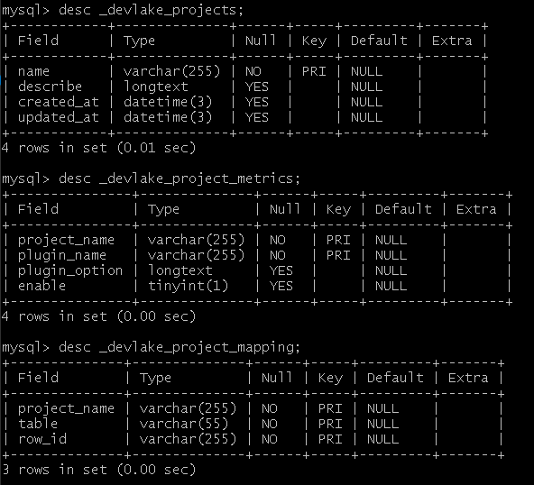

## Summary
`Project` is **a set of scopes from different domains**, a way to group different resources, and it is crucial for some metric calculation like `DORA`.

It contains the following two models:
 - `projects` describes a project object, including its name, creation and update time and other basic information
 - `project_metrics` describes what metrics a project had enabled.
 - `project_mapping` describes the mapping relationship of project and scope, including the name of the project、table and row_id.



## projects

|   **field**   | **type** | **length** | **description**               | **key** |
| ------------- | -------- | ---------- | ----------------------------- | ------- |
| `name`        | varchar  | 255        | name for project              | PK      |
| `description` | longtext |            | description of the project    |         |
| `created_at`  | datetime | 3          | created time of project       |         |
| `updated_at`  | datetime | 3          | last updated time of project  |         | 


| **name**  | **describe**                         | **created_at**          | **updated_at**          |
| --------- | ------------------------------------ | ----------------------- | ------------------------|
| project_1 | this is one of the test projects     | 2022-11-01 01:22:13.000 | 2022-11-01 02:24:15.000 |
| project_2 | this is another project test project | 2022-11-01 01:23:29.000 | 2022-11-01 02:27:24.000 |

## project_metrics

|    **field**    | **type** | **length** | **description**                                            | **key** |
| --------------- | -------- | ---------- | ---------------------------------------------------------- | ------- |
| `project_name`  | varchar  | 255        | name for project                                           | PK      |
| `plugin_name`   | varchar  | 255        | name for plugin                                            | PK      |
| `plugin_option` | longtext |            | check if metric plugins have been enabled by the project   |         |
| `enable`        | tinyint  | 1          | if the metric plugins is enabled                           |         |


| **project_name** | **plugin_name** | **plugin_option** | **enable** |
| ---------------- | --------------- | ----------------- | ---------- |
| project_1        | gitlab          | {}                | true       |
| project_2        | gitlab          | {}                | false      |
| project_2        | github          | {}                | true       |

## project_mapping

|   **field**    | **type** | **length** | **description**                                            | **key** |
| -------------- | -------- | ---------- | ---------------------------------------------------------- | ------- |
| `project_name` | varchar  | 255        | name for project                                           | PK      |
| `table`        | varchar  | 255        | the table name of scope                                    | PK      |
| `row_id`       | varchar  | 255        | the row_id in the scope table                              | PK      |


| **project_name** | **table** | **row_id**               |
| ---------------- | --------- | ------------------------ |
| project_1        | Repo      | gitlab:GithubRepo:1:lake |
| project_1        | Board     | jira:JiraBoard:1:lake    |
| project_2        | Repo      | github:GithubRepo:1:lake |


It requires each plugin to implement an interface named `PluginMetric`

# 如何使用 Project

1. 首先我们可以通过 `POST` `/projects/:projectName` 接口来创建一个全新的 `project` 对象，该对象需要一个 `projectName`字段，作为其名称，该名称唯一。

当我们创建出 `project` 对象之后：

- 我们可以通过 `GET /projects/:projectName` 接口来获取具体的的某一个 `project`的信息，除了名称外，这些信息里也包含了project的更新时间和创建时间,以及会关联所有的与当前`project`的相关的`project_metrics`和`project_mapping`信息，整合后一并返回。
- 我们可以通过 `PATCH /projects/:projectName` 接口来更新具体的某一个 `project`的信息，比如更新其相关的 `描述` 信息。
- 我们可以通过 `GET /projects` 接口来获取所有的`project`信息。 通过设置参数 `search` 可以对返回的信息进行过滤，通过设置参数`page_size`,`page_num`可以对返回的信息进行分页。

2. 与此同时，为了能给 project 指定需要的指标，我们可以通过调用接口 `GET` `/plugins` 来获取基本的插件信息。这将会返回一组包含`pluginName`组成的列表。

3. 在上述过程之后 通过 `POST /project_metrics/:projectName/:pluginName` 接口来创建一组 `project` 与 `plugins` 之间的关系。使用我们前面获取到的 `projectName` 和 `pluginName` 来构建这种关系。同时为其配置相应的 `option`.

当我们创建出一组 `project_metrics` 的关系后我们就可以做更进一步的操作：

- 我们可以通过 `GET /project_metrics/:projectName/:pluginName` 接口来获取一组 `project_metrics` 信息，我们可以只设置 `projectName` 或只设置 `pluginName` 来进行筛选。也可以同时设置 `project_name` 和 `plugin_name` 此时我们将获取到一个特定的 `project_metrics` 信息。
- 我们可以通过 `PATCH /project_metrics/:projectName/:pluginName` 接口来更新特定的一组 `project_metrics` 信息。这要求我们必须同时设置好 `projectName` 和 `pluginName`。

# 关于 Project 和 Blueprint

- 在 `blueprint` 的表中现在添加了一个与 `project` 相关联的字段 `project_name`，该字段表示 当前的 `blueprint` 唯一的属于某一张特定的 `project`
- 一个`project`允许被唯一的一个 `blueprint` 的 `project_name` 字段指定。也就是`project`对`blueprint`是一对一关系

## The PluginMetric Interface

```go
type PluginMetric interface {
    // returns a list of required data entities and expected features.
    // [{ "model": "cicd_tasks", "requiredFields": {"column": "type", "execptedValue": "Deployment"}}, ...]
    RequiredDataEntities() (data map[string]interface{},err errors.Error)

    // This method returns all models of the current plugin
    GetTablesInfo() []core.Tabler
    
    // returns if the metric depends on Project for calculation. 
    // Currently, only dora would return true.
    IsProjectMetric() bool

    // indicates which plugins must be executed before executing this one. 
    // declare a set of dependencies with this
    RunAfter() (PluginsNames []string,errors.Error)

    // returns an empty pointer of the plugin setting struct.
    // (no concrete usage at this point)
    Settings() (p interface{})
}
```
