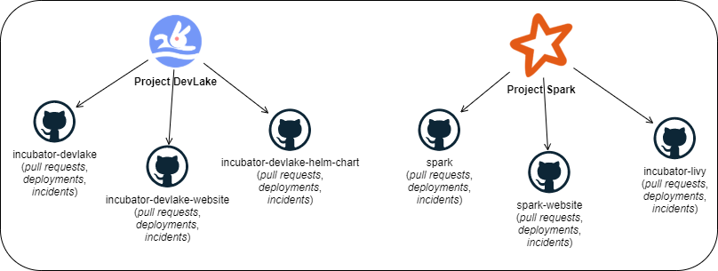
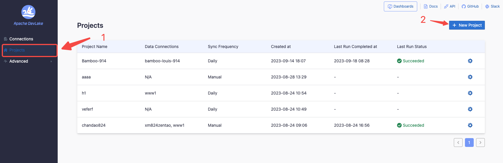
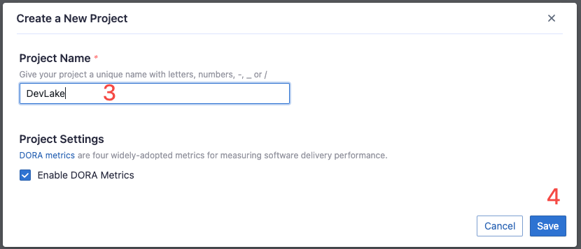
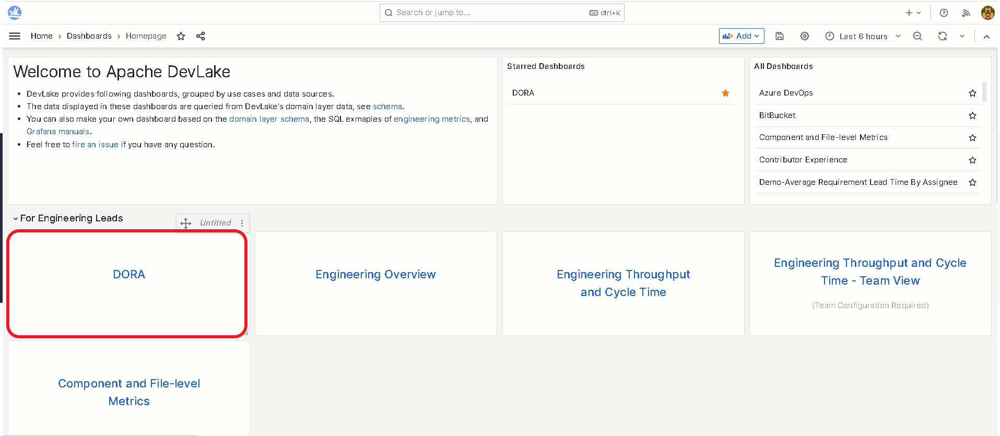
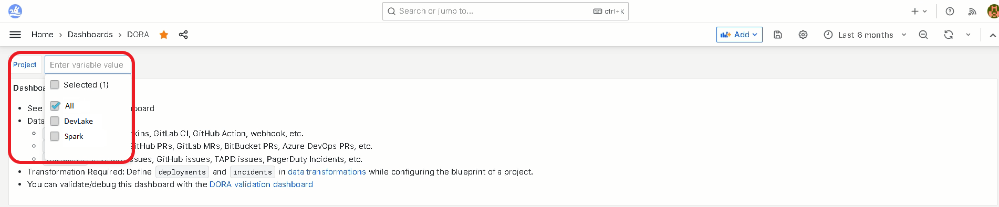
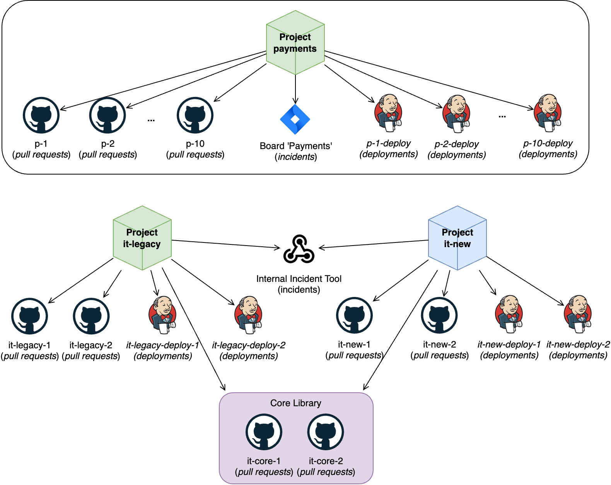

## 1. Introduction
DevLake measures DORA on the `project` level. This guide provides step-by-step instructions for organizing projects in DevLake. 
It is intended for team leads and developers who want to track DORA metrics and optimize their workflow. 

[DORA](../DORA.md) are four metrics measuring engineering velocity and stability, which include:
- Velocity:
  - [Deployment Frequency](../Metrics/DeploymentFrequency.md): How frequent does a project `deploy`?
  - [Change Lead Time](../Metrics/LeadTimeForChanges.md): How fast are the `pull requests` resolved?
- Stability:
  - [Change Failure Rate](../Metrics/CFR.md): The percentage of deployments that have caused `incidents` among all `deployments` in a project?
  - [Median Time to Restore](../Metrics/MTTR.md): How fast are these `incidents` solved?

As you can see, all four metrics are based on three core entities: `pull requests`, `deployments`, and `incidents`. Therefore, how to group these entities by DevLake project is the key to measure DORA precisely.


## 2. What is a DevLake project?
A `DevLake project` is a grouping of `pull requests`, `incidents`, or `deployments`. It can be seen as a real-world project or product line. DevLake measures DORA metrics for each project.


DevLake uses data scope such as `repos`, `boards`, `cicd_scopes` as the high-level entities to group `pull requests`, `incidents`, or `deployments`.

If you have a project like "project A" in the picture, create a DevLake project and configure those data scopes would get things done. However, things can be more complicated in real world because:

```
A repo, board, cicd_scope can be managed by multiple `projects`
```

For example:
- A Jira board may contain incidents from multiple teams or projects
- A GitLab repository is managed by multiple projects, e.g. a monorepo
- A Jenkins pipeline can trigger deployments in multiple repos

This article will illustrate how to deal with these use cases.

Note: _It does not matter if a project works on a particular repository more than another.
The metrics are calculated over the entire set of repos, and the values are accumulated.
More on that: [Debugging DORA Issue Metrics](../Troubleshooting/Dashboard.md#debugging-dora-issue-metrics)._

## 3. How many DevLake projects do you need?

In general, if you have 3 projects in your real life and you want to measure DORA metrics for all of them, create 3 DevLake projects.

If your team is contributing to multiple projects and you want to track DORA from the team perspective, please create a DevLake project for each project instead of for each team.

## 4. Use Cases
This section demonstrates real-life situations and how they get reflected in DevLake.

Disclaimer: _To keep this guide shorter, some technical details are only mentioned in
[Use Case 1](HowToOrganizeDevlakeProjects.md#41-use-case-1-apache-projects),
so if you read this page for the first time, make sure to go through them in order._

Note: _If you use webhooks, check the [quick note](HowToOrganizeDevlakeProjects.md#5-about-webhooks) about them below._

### 4.1. Use Case 1: Apache Projects
Apache Software Foundation (ASF) has and is developing many
[projects](https://en.wikipedia.org/wiki/List_of_Apache_Software_Foundation_projects).

To take an example, assume that ASF wants to check the health of the development of these projects with DORA. And they need to analyze 2 `projects`: DevLake and [Spark](https://spark.apache.org/).

DevLake manages 3 `repos`: [incubator-devlake](https://github.com/apache/incubator-devlake), [incubator-devlake-website](https://github.com/apache/incubator-devlake-website), and [incubator-devlake-helm-chart](https://github.com/apache/incubator-devlake-helm-chart).

There are many repos related to _Spark_ in one way or another. To keep it simple, they will also pick 3 `repos`: [spark](https://github.com/apache/spark), [spark-website](https://github.com/apache/spark-website), and [incubator-livy](https://github.com/apache/incubator-livy).



Both projects use GitHub for storing code (including `pull requests`, `deployments` from GitHub Actions, and `incidents` from GitHub issues).

Note: _To avoid the confusion between DevLake as a `project` in this use case and DevLake as a platform, the following sections will use complete names, i.e. `project DevLake` and `platform DevLake` respectively._

#### 4.1.1. Organize Projects
First, create two projects on the DevLake platform, one for DevLake and one for Spark. 
These will represent real-world projects.




Once these are created, the connections created in the following steps will be bound to them.

#### 4.1.2. Add Connections to Projects

Since all data (`pull requests`, `deployments`, and `incidents`) is on GitHub in this case, they only need to create ONE GitHub connection, and [add the project's repos to this connection](/docs/Configuration/GitHub.md).

> If you store `incidents` on Jira, for example, you will need to create a separate connection just for them.
The same applies to `deployments`, a separate connection is needed in case they are stored in Jenkins (or any other host for `deployments`).

After a connection is created, add/bind the connection to the project following the [Tutorial](/docs/Configuration/Tutorial.md).

#### 4.1.3. Collect Data

Click `Collect All Data` in the project's blueprint to trigger the data collection and DORA calculation.

#### 4.1.4. Check Metrics

After the pipeline is finished, go to the DORA Dashboard to check if the metrics:




If everything goes well, you should see all 4 charts.
If something is wrong, and you are puzzled as to why, check out the
[Debugging Dora Issue Metrics](../Troubleshooting/Dashboard.md#debugging-dora-issue-metrics) page.

#### 4.1.5. How to observe metrics by project?
In the same DORA dashboard check out this menu point:


The metrics should change when you select or deselect projects, representing the projects you selected.

### 4.2. Use Case 2: Multiple teams work on different projects but share the same data scopes

Consider a scenario where a company operates with several teams, each managing one or more projects. For illustration, let us take two teams: the `Payments team` and the `Internal Tools team` to simplify the use case.

#### Quick Overview:
- The Payments team works on a single project: “payments”. They use GitHub to manage `pull_requests`, Jenkins to manage `deployments`, and Jira to manage `incidents`.
- The Internal Tools team manages two projects: “it-legacy” and “it-new”. They use GitHub to manage `pull_requests`, Jenkins to manage `deployments`, and the team's own tool to manage `incidents`, so they use webhooks to push incidents to DevLake.
- Both teams use different sets of tools and boards.



#### 4.2.1. Organize Projects

✅ Create three projects: _payments_, _it-legacy_, and _it-new_.

❌ Create two projects: _payments_ and _internal-tools_.

The second approach is not recommended for data accuracy. For example, the _Change Failure Rate_ relies on the association between _incidents_ and _deployments_ under the same project in a chronological order. If a DevLake project _"internal-tools"_ is created to measure DORA on a team level, the incidents in project A may be asscociated to a deployment in project B when calculating CFR; while the deployment in project B may have not caused any incidents. This will turn out to an inaccurate CFR.

#### 4.2.2. Create Connections

Create just one connection and reuse it across projects by adding data scopes.
This method optimizes data collection, minimizing redundancy and ensuring more efficient use of resources.

> It is NOT recommended to create multiple connections, for instance, GitHub repos, as it will increase the time to collect the data due to the storage of multiple copies of shared repos in the database.<br/>
> The only exception is the webhooks: **users need to create 1 webhook per project**, 
as this is the precise way to assign `incidents` to the corresponding `project`.

So, in total they will have to create following connections:
- 1 connection to GitHub with all projects' repos added to collect `pull requests`.
- 1 connection to Jenkins with all projects' deployment jobs added to collect `deployments`.
- 1 connection to Jira with all projects' incident boards added to collect `incidents`.
- 2 webhooks to push `incidents` from each project: _it-legacy_ and _it-new_.

The step-by-step [Configuration Guide](/docs/Configuration) shows how to add connections and data scopes.

#### 4.2.3. Add Connections to Projects
Now, add the connections to each project with selected data scopes:

For project _**payments**_: 
- Add the GitHub connection, and select repos _**p-1...p-10**_ to collect pull_requests.
- Add the Jenkins connection, and select Jenkins jobs _**p-1-deploy...p-10-deploy**_ to collect deployments.
- Add the Jira connection, and select the Jira board _**Payments**_ to collect incidents.

For project _**it-legacy**_:
- Add the GitHub connection, and select repos _**it-legacy-1**_, _**it-legacy-2**_, _**it-core-1**_ and _**it-core-2**_ to collect pull_requests.
- Add the Jenkins connection, and select Jenkins jobs _**it-legacy-deploy-1**_, _**it-legacy-deploy-2**_ to collect deployments.
- Add the _**it-legacy**_ webhook to push incidents.

For project _**it-new**_:
- Add the GitHub connection, and select repos _**it-new-1**_, _**it-new-2**_, _**it-core-1**_ and _**it-core-2**_ to collect pull_requests.
- Add the Jenkins connection, and select Jenkins jobs _**it-new-deploy-1**_, _**it-new-deploy-2**_ to collect deployments.
- Add the _**it-new**_ webhook to push incidents.

#### 4.2.4. Collect Data

Click `Collect All Data` in the project's blueprint to trigger the data collection and DORA calculation.

#### 4.2.5. Check Metrics

After the pipeline is finished, go to the DORA Dashboard to check if the metrics:


If everything goes well, you should see all 4 charts.
If something is wrong, and you are puzzled as to why, check out the
[Debugging Dora Issue Metrics](../Troubleshooting/Dashboard.md#debugging-dora-issue-metrics) page.

## 5. About Webhooks
**Assigning a UNIQUE webhook to each project is critical.** This ensures that the DevLake platform correctly associates the incoming data with the corresponding project through the webhook.

If you use the same webhook across multiple projects, the data sent by it **will be replicated per each project that uses that webhook**. More information available on the [Webhook](/docs/Plugins/webhook.md) page.

## 6. Troubleshooting

If you run into any problem, please check the [Troubleshooting](/docs/Troubleshooting/Configuration.md) or [create an issue](https://github.com/apache/incubator-devlake/issues)