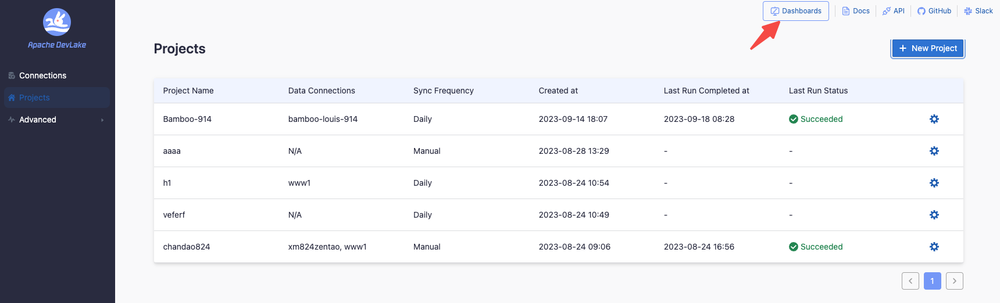

## 1. Introduction
This guide provides step-by-step instructions for organizing projects in DevLake. 
It is intended for team leads and developers who want to optimize their workflow. 
Herein, we will explore various use cases to demonstrate the practical application of these instructions.

Development teams typically manage `pull requests`, `deployments`, and `incidents` using various boards.

Based on such, we want to measure their productivity and stability. This is how [DORA](../DORA.md) does that:
- Productivity:
  - How many times does the team `deploy`? (a.k.a. [Deployment Frequency](../Metrics/DeploymentFrequency.md))
  - How fast are the `pull requests` resolved? (a.k.a. [Lead Time](../Metrics/LeadTimeForChanges.md))
- Stability:
  - How many `incidents` per `deploys` does the team have? (a.k.a. [Change Failure Rate](../Metrics/CFR.md))
  - How fast are these `incidents` solved? (a.k.a. [Median Time to Restore](../Metrics/MTTR.md))

All these questions/metrics are based on either `pull requests`, `deployments`, or `incidents`.

Note: _All three are completely separate entities and are associated only with their project._

#### General advice

There are 3 red lines when it comes to structuring your DevLake `projects`:

But when we scale this up, a few problems arise:
- A team usually works with multiple `repos`
- A team also might work on different projects, and we want to measure these projects separately (e.g. it is not the same to work on a big old legacy as on a greenfield)
- There may be multiple teams
- A `board` contains incidents of multiple teams or projects
- A `repository` is managed by multiple teams or projects, e.g. a monorepo
- A `pipeline` can trigger deployments in multiple repos
- Some organizations want to measure DORA based on projects, and some want to measure it by teams

This is where the `project` concept comes into play.

## 2. What is a DevLake project?
In practical terms, a project usually involves building or researching solutions to address specific problems 
or explore new opportunities. A DevLake project is a grouping of `pull requests`, `deployments`, or `incidents`. 
It can be seen as a real-world project or product line. DevLake measures DORA metrics for each project.

Note: _It does not matter if a team works on a particular repository more than another.
The metrics are calculated over the entire set of repos, and the values are accumulated.
More on that: [Debugging DORA Issue Metrics](../Troubleshooting/Dashboard.md#debugging-dora-issue-metrics)._

## 3. As a team lead, how many DevLake projects do I need?

DevLake's flexible structure enables you to organize `pull requests`, `deployments`, and `incidents` 
in a manner tailored to your specific projects, teams, or technologies.

The examples below show the patterns of how to organize your projects.
To keep things simple we assume that we work with **GitHub** repos, **Jira** boards, 
and **Jenkins CI/CD** deploys in each GitHub repo.

The same would apply to other repos (e.g. GitLab or BitBucket), boards (e.g. TAPD), 
or CI/CD (e.g. GitLab CI, Azure DevOps).

## 4. Use Cases
This section demonstrates real-life situations and how they get reflected in DevLake.

Disclaimer: _To keep this guide shorter, some technical details are only mentioned in
[Use Case 1](HowToOrganizeDevlakeProjects.md#41-use-case-1-apache-projects),
so if you read this page for the first time, make sure to go through them in order._

Note: _If you use webhooks, check the [quick note](HowToOrganizeDevlakeProjects.md#5-about-webhooks) about them below._

### 4.1. Use Case 1: Apache Projects
Apache Software Foundation (ASF) has and is developing many
[projects](https://en.wikipedia.org/wiki/List_of_Apache_Software_Foundation_projects).

To take an example we will analyze 2 `projects`: DevLake and [Spark](https://spark.apache.org/).
Both are independent of each other. Assume that ASF wants to check the health of the development
and maintenance of these projects with DORA.

DevLake manages 3 `repos`: [incubator-devlake](https://github.com/apache/incubator-devlake), 
[incubator-devlake-website](https://github.com/apache/incubator-devlake-website), 
and [incubator-devlake-helm-chart](https://github.com/apache/incubator-devlake-helm-chart).
There are many repos related to _Spark_ in one way or another. To keep it simple, 
we will also pick 3 `repos`: [spark](https://github.com/apache/spark),
[spark-website](https://github.com/apache/spark-website), and [incubator-livy](https://github.com/apache/incubator-livy).

Both projects use GitHub for storing code (including `pull requests`), `deployments` on GitHub Actions, and `incidents`.

Note: _To avoid confusion between DevLake as a `project` in this use case and DevLake as a platform,
we will use complete names i.e. `project DevLake` and `platform DevLake` respectively._

#### 4.1.1. Organizing Projects
First, create two projects on the DevLake platform, one for DevLake and one for Spark. 
These will represent real-world projects.

Once these are created, the connections created in the following steps will be bound to them.

#### 4.1.2. Creating Connections

Since all is on GitHub in this case, we can use just 1 connection with the following properties:
- it includes all the project's `repos`
- its scope includes everything we work with (i.e. `pull requests`, `deployments`, and `incidents`)

If you store `incidents` on Jira, for example, you will need to create a separate connection just for them.
The same applies to `deployments`, a separate connection is needed in case they are stored in Jenkins (or any other host for `deployments`).

#### 4.1.3. Configuring Connections
This part is described in [GitHub](../Configuration/GitHub.md) connection configuration. Please check the [configuration guide](../Configuration/Tutorial.md) for configuring other data sources.

#### 4.1.4. Using Connections

At this point, we have projects and connections created on the platform DevLake. 
It is time to bind those connections to the projects. To do so, follow the steps described in the [Tutorial](../Configuration/Tutorial.md).

#### 4.1.5. Resulting Metrics

To know if the data of a project is successfully collected to your DORA Dashboard:

If everything goes well, you should see all the 4 charts.
If something is wrong, and you are puzzled as to why, check out the
[Debugging Dora Issue Metrics](../Troubleshooting/Dashboard.md#debugging-dora-issue-metrics) page.

#### 4.1.6. How can I observe metrics by project?
In the same DORA dashboard check out this menu point:

The metrics should change when you select or deselect projects, representing the projects you selected.

### 4.2. Use Case 2: Multiple Teams with Distinct Projects

Consider a scenario where a company operates with several teams, each managing one or more projects. 
For illustration, we will explore two such teams: the Payments team and the Internal Tools team. 
Here's a simplified representation of this scenario:

#### Quick Overview:
- The Payments team works on a single project: “payments”.
- The Internal Tools team manages two projects: “it-legacy” and “it-new”.
- Both teams use different sets of tools and boards.

#### Step-by-Step Simplification:
1. **Define the Teams and Projects:**
   - **Payments Team**:
     - One project: "payments". 
   - **Internal Tools Team**:
     - Two projects: "it-legacy" and "it-new". 
2. **Understand the Tools**:
   - Assume both teams utilize GitHub for `repos` and Jenkins for CI/CD.
   - The _Payments_ team uses Jira boards.
   - The _Internal Tools_ team uses webhooks for reporting incidents.

#### 4.2.1. Organizing Projects

DORA is effective for observing the impacts of methodology changes within a team.
From DORA’s standpoint, the concept of distinct `teams` is not recognized; only `projects` exist. 
Adding a `team` concept introduces unnecessary complexity without providing any substantial benefit. 

In DevLake, we create three `projects`: _payments_, _it-legacy_, and _it-new_.

It is crucial to maintain **atomic** `projects`, representing the smallest, independent units, 
to prevent complexity and ensure precise data representation. **Atomic** `projects` allow for a more flexible 
and accurate data comparison and combination between `projects`.

#### 4.2.2. Adding Connections

Create just one connection and reuse it across projects by adding data scopes.
This method optimizes data collection, minimizing redundancy and ensuring more efficient use of resources.

It is NOT recommended to create multiple connections, for instance, GitHub repos, as it  
will increase the time to collect the data due to the storage of multiple copies of shared repos in the database.

The only exception is the webhooks: **we must have 1 connection per project**, 
as this is the only way DevLake can accurately assign `incidents` to the corresponding `project`.

So, in total we will have only these connections:
- 1 connection for all GitHub `repos` to collect `pull requests`
- 1 connection to Jenkins to collect all `deployments`
- 1 connection to Jira to collect `incidents`
- 2 webhook connections to collect `incidents`: 1 per each `project` that uses webhooks (_it-legacy_ and _it-new_)

The step-by-step [Configuration Guide](../Configuration/Tutorial.md) shows how to both add connections and set scopes as described in the next chapter.

#### 4.2.3. Setting Scopes
Now, add the connections to our projects and set the scope to them:

For payments `project`: 
- add 1 scope to GitHub connection for _p1...p10_ `repos` to collect their `pull requests`
- add 1 scope to Jenkins for `deployments` of _p1...p10_ `repos`
- add 1 scope to Jira to collect `incidents`

For it-legacy `project`:
- add 1 scope to GitHub for `repos` _it-legacy-1_, _it-legacy-2_, _it-core-1_ and _it-core-2_ to collect their `pull requests`
- add 1 scope to Jenkins for `deployments` of _it-legacy-1_, _it-legacy-2_, _it-core-1_ and _it-core-2_ `repos`
- include the _it-legacy_ webhook for collecting `incidents`

For it-new `project`:
- add 1 scope to GitHub for `repos` _it-new-1_, _it-new-2_, _it-core-1_ and _it-core-2_ to collect their `pull requests`
- add 1 scope to Jenkins for `deployments` of _it-new-1_, _it-new-2_, _it-core-1_ and _it-core-2_ `repos`
- include the _it-new_ webhook for collecting `incidents`

#### 4.2.4. Resulting Metrics
See [4.1.5 Resulting Metrics](HowToOrganizeDevlakeProjects.md#415-resulting-metrics)

## 5. About Webhooks
**Assigning a UNIQUE webhook to each project is critical.** This ensures that the DevLake platform 
correctly associates the incoming data with the corresponding project through the webhook.

If you use the same webhook across multiple projects, the data sent by it **will be replicated per each
project that uses that webhook**. More information available on the [Webhook](/docs/Plugins/webhook.md) page

## 6. Troubleshooting

If you run into any problem, please check the [Troubleshooting](/docs/Troubleshooting/Configuration.md) or [create an issue](https://github.com/apache/incubator-devlake/issues)