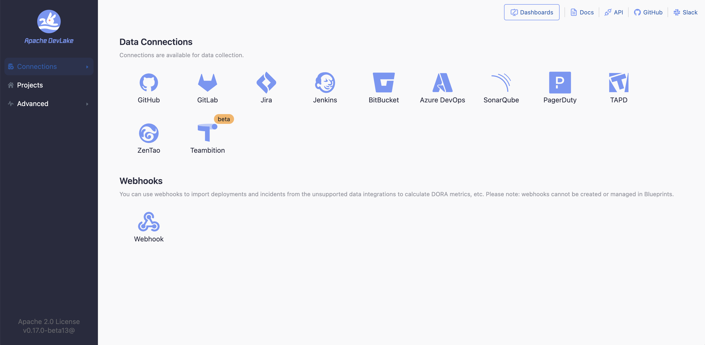
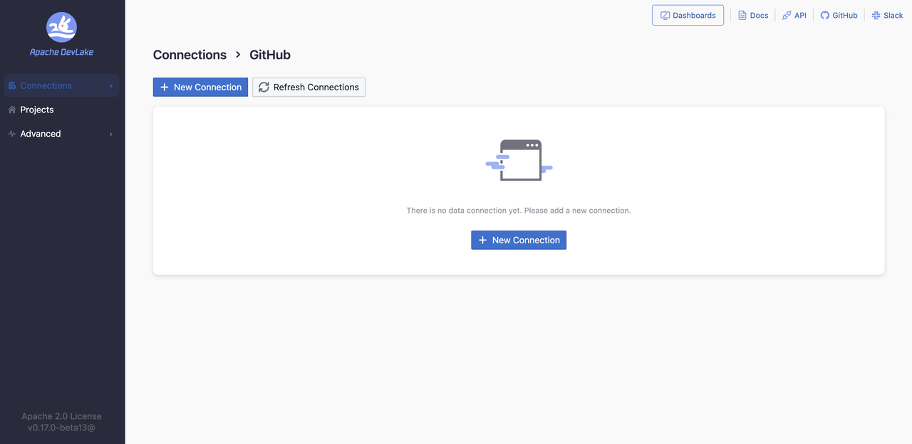
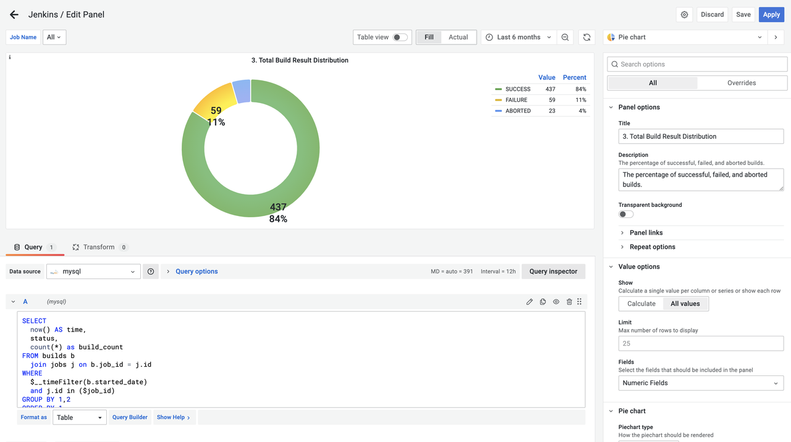

<head>
    <title>Introduction to Apache DevLake and Implementing DORA Metrics</title>
    <meta name='description' content={'Discover how to implement DORA metrics for your software development process. Improve your engineering performance with our open-source platform.'}/>
    <meta name='keywords' content={'DORA Metrics, Open-Source DORA, DORA Metrics DevOps, Implement DORA Metrics, DevOps DORA Metrics'}/>
</head>

## What is Apache DevLake?

Apache DevLake (Incubating) is an open-source dev data platform that ingests, analyzes, and visualizes the fragmented data from DevOps tools to extract insights for engineering excellence, developer experience, and community growth.

Apache DevLake is designed for developer teams looking to make better sense of their development process and to bring a more data-driven approach to their own practices. You can ask Apache DevLake many questions regarding your development process. Just connect and query.

## What can be accomplished with DevLake?
- Unified data integration: Bring together DevOps data from across the Software Development Life Cycle (SDLC) with our [standard data model](https://devlake.apache.org/docs/DataModels/DevLakeDomainLayerSchema/).
- Out-of-the-box insights: Access key engineering metrics through intuitive, use-case driven dashboards.
- Customizable: Extend DevLake to align with your unique needs, adding [data sources](https://devlake.apache.org/docs/Overview/SupportedDataSources/), [metrics](https://devlake.apache.org/docs/Metrics/), and [dashboards](https://devlake.apache.org/livedemo/EngineeringLeads/DORA/) as required.
- Industry standards implementation: Use DevLake to apply recognized [DORA metrics](https://devlake.apache.org/docs/DORA/) to optimize DevOps performance.
- Create a thriving culture: DevLake is centred on healthy practises that may help teams adopt and build a practical data-driven culture.

## How do I use DevLake?
### 1. Setting-up DevLake
- Create the proof of concept of Apache DevLake for your use-case by installing in your local machines via Docker Compose: [Docker Compose setup](../GettingStarted/DockerComposeSetup.md)
- Alternatively, if you're powered by Kuberenetes, then check out the [Helm setup](../GettingStarted/HelmSetup.md).

### 2. Configuring Data Source
- Once Installed, you can start configuring DevLake with supported [data sources](https://devlake.apache.org/docs/Overview/SupportedDataSources) like GitHub, GitLab, Jira, Jenkins, BitBucket, Azure DevOps, SonarQube, PagerDuty, TAPD, ZenTao, Teambition, and we're extending our support to many other tools, feel free to check out the official roadmap.
- If your CI / CD tool is not supported yet, then you may use the [Webhooks](https://devlake.apache.org/docs/Plugins/webhook/) feature.

### 3. Creating your Project
- After connecting the data-source, a "Project" makes sure that you're all set for execution. A four-step process allows you to play DevLake and visualize pre-built dashboards

### 4. Checking the results (Validation & Customization)
- After configuring the project, you can take a look at our pre-built dashboards in Grafana.

- Dashboards can be tweaked according to the goal and intent of [metrics](https://devlake.apache.org/docs/Metrics/) or create your own using SQL. You can also check out [Domain Layer Schema](https://devlake.apache.org/docs/Metrics/) - DevLake's standard data model.

