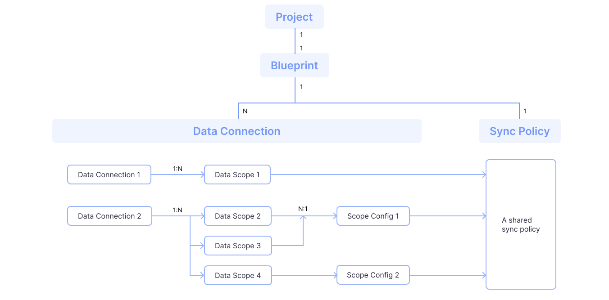

*Last updated: Nov 9, 2023*

## In Config UI

The following terms are arranged in the order of their appearance in the actual user workflow in the config UI.

### Data Source
**A data source is a specific DevOps tool from which you wish to sync your data, such as GitHub, GitLab, Jira and Jenkins.**

Typically, DevLake uses one [data plugin](#data-plugins) to pull data for a single data source. For example, the [jira](/docs/Plugins/jira.md) plugin is used to fetch data from Jira.

However, there are cases where DevLake may use multiple data plugins for a single data source. This approach is employed to enhance the synchronization speed and provide other advantages. For instance, when retrieving data from GitHub or GitLab, aside from the [github](/docs/Plugins/github.md) and [gitlab](/docs/Plugins/gitlab.md) plugins, the [gitextractor](/docs/Plugins/gitextractor.md) is also used to fetch data. In these cases, DevLake still recognizes GitHub or GitLab as a single data source.

### Data Connection
**A data connection is a specific instance of a [data source](#data-source).** It stores the necessary access information, such as the endpoint URL and authentication token, to establish a connection to that data source.

A single data source can have one or more data connections associated with it. This allows you to connect to and retrieve data from different instances or installations of the same data source.

To set up a new data connection, it is recommended to use the 'Data Connections' page in DevLake. This page provides a convenient interface for adding and configuring data connections. Once a data connection is set up, you can later associate it with a DevLake project.

### Data Scope
**A data scope is the top-level 'container' in a data source**. For example, a data scope for Jira is a Jira board, for TAPD is a TAPD workspace, for GitHub/GitLab/BitBucket is a repo, for Jenkins is a Jenkins job, etc.

You can add multiple data scopes to a data connection to determine which data to collect. Data scopes vary for different data sources.

### Scope Config
**A scope config refers to the configuration of a data scope.** It defines the specific data entities to be collected and the transformations to be applied to that data.

Each data scope can have at most one scope config associated with it; while a scope config can be shared among multiple data scopes under the same data connection.

A scope config consists of two parts: [Data Entities](#data-entities) and [Transformations](#transformations).

#### Data Entities
Data entities refer to the specific data fields that are collected from different data domains. Check the [supported data entities](/docs/Overview/SupportedDataSources.md#data-collection-scope-by-each-plugin) of each data source.

Data entities are categorized into [six data domains](/docs/DataModels/DevLakeDomainLayerSchema.md#data-models) in DevLake: Issue Tracking, Source Code Management, Code Review, CI/CD, Code Quality, and Cross-Domain.

When setting up the scope config of a GitHub data connection, you have the flexibility to choose which specific data entities you want to collect. if you only want to collect 'repos', 'commits', and 'pull requests' while excluding 'issues' and 'workflow runs', you need to check the 'Source Code Management' and 'Code Review' domains, and uncheck 'Issue Tracking' or 'CI/CD' domains.

#### Transformations
Transformations are configurations for users to customize how DevLake transforms raw API responses to the domain layer data.

Although configuring transformation rules is not mandatory, certain pre-built dashboards, such as [DORA](/livedemo/EngineeringLeads/DORA) and [Weekly Bug Retro](/livedemo/QAEngineers/WeeklyBugRetro) require them to display the metrics accurately. If you leave the rules blank or have not configured them correctly, only a few [data source dashboards](/livedemo/DataSources/GitHub) will be displayed as expected.

You can find the required transformations in the 'Dashboard Introduction' panel in each pre-built dashboard.

### Project
**On a high level, a DevLake project can be viewed as a real-world project or product line.** It represents a specific initiative or endeavor within the software development domain.

**On a lower level, a DevLake project is a way of organizing and grouping data from different domains.** DevLake uses various [data scopes](#data-scope), such as repos, boards, cicd_scopes, and cq_projects as the 'container' to associate different types of data to a specific project.

- A project has a [blueprint](#Bluepirnts) for data collection and metric computation.
- DevLake measures DORA metrics at the project level. Each project has a set of DORA metrics. For example, if a user associates 'Jenkins Job A' and 'Jira board B' with project M, only the 'deployments' from 'Jenkins Job A' and the 'incidents' from 'Jira board B' will be considered when calculating the Change Failure Rate metric for project M.
   

### Blueprint
**A blueprint serves as the plan to synchronize data from data sources into the DevLake platform.** Creating a blueprint consists of four steps:
1. Adding [data connections](#data-connections): You can add one or more data connections to a blueprint, depending on the data sources you want to sync with DevLake. Each data connection represents a specific data source, such as GitHub or Jira.
2. Setting up the [data scope](#data-scope): When adding a data connection, you can choose to collect all or part of the configured data scopes of the data connection.
3. Setting up the sync policy: You can specify the sync frequency and the time range for data collection.

The relationship between 'Blueprint', 'Project' and 'Data Connection' is explained as follows:

- A blueprint will be automatically created by along the creation with a DevLake project.
- Each blueprint can have multiple data connections.
- Each data connection can have multiple data scopes.
- Each set of data scope only consists of one GitHub/GitLab project or Jira board, along with their corresponding data entities.
- Each set of data scope can only have one set of scope config.

## APIs and Config UI Advanced Mode

Typically, the following terms do not appear in the regular mode of the Config UI, but can be very useful if you use [DevLake's APIs](References.md) or the advanced mode of Config UI.

### Data Plugins
**A data plugin is a specific module that syncs or transforms data.** There are two types of data plugins: Data Collection Plugins and Data Transformation Plugins.

Data Collection Plugins pull data from one or more data sources. DevLake supports 8 data plugins in this category: `ae`, `feishu`, `gitextractor`, `github`, `gitlab`, `jenkins`, `jira` and `tapd`.

Data Transformation Plugins transform the data pulled by other Data Collection Plugins. `refdiff` is currently the only plugin in this category.

Although the names of the data plugins are not displayed in the regular mode of DevLake Configuration UI, they can be used directly in JSON in the Advanced Mode.

For detailed information about the relationship between data sources and data plugins, please refer to [Supported Data Sources](SupportedDataSources.md).

### Pipelines
**A pipeline is an orchestration of [tasks](#tasks) of data `collection`, `extraction`, `conversion` and `enrichment`, defined in the DevLake API.** A pipeline is composed of one or multiple [stages](#stages) that are executed in a sequential order. Any error occurring during the execution of any stage, task or subtask will cause the immediate fail of the pipeline.

The composition of a pipeline is explained as follows:

Notice: **You can manually orchestrate the pipeline in Configuration UI Advanced Mode and the DevLake API; whereas in Configuration UI regular mode, an optimized pipeline orchestration will be automatically generated for you.**

### Stages
**A stages is a collection of tasks performed by data plugins.** Stages are executed in a sequential order in a pipeline.

### Tasks
**A task is a collection of [subtasks](#subtasks) that perform any of the `collection`, `extraction`, `conversion` and `enrichment` jobs of a particular data plugin.** Tasks are executed in a parallel order in any stages.

### Subtasks
**A subtask is the minimal work unit in a pipeline that performs in any of the four roles: `Collectors`, `Extractors`, `Converters` and `Enrichers`.** Subtasks are executed in sequential orders.
- `Collectors`: Collect raw data from data sources, normally via DevLake API and stored into `raw data table`
- `Extractors`: Extract data from `raw data tables` to `tool layer tables`
- `Converters`: Convert data from `tool layer tables` into `domain layer tables`
- `Enrichers`: Enrich data from one domain to other domains. For instance, the Fourier Transformation can examine `issue_changelog` to show time distribution of an issue on every assignee.
