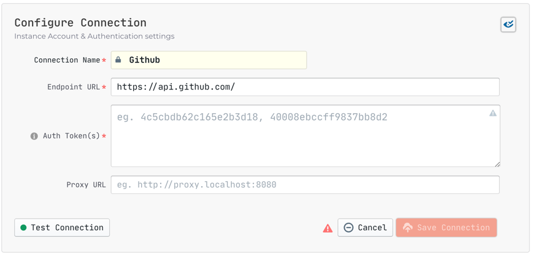

## Summary

This plugin gathers data from `GitHub` to display information to the user in `Grafana`. We can help tech leaders answer such questions as:

- Is this month more productive than last?
- How fast do we respond to customer requirements?
- Was our quality improved or not?

## Metrics

Here are some examples metrics using `GitHub` data:
- Avg Requirement Lead Time By Assignee
- Bug Count per 1k Lines of Code
- Commit Count over Time

## Screenshot


## Configuration

### Provider (Datasource) Connection
The connection section of the configuration screen requires the following key fields to connect to the **GitHub API**.



- **Connection Name** [`READONLY`]
  - ⚠️ Defaults to "**Github**" and may not be changed. As GitHub is a _single-source data provider_ at the moment, the connection name is read-only as there is only one instance to manage. As we advance on our development roadmap we may enable _multi-source_ connections for GitHub in the future.
- **Endpoint URL** (REST URL, starts with `https://` or `http://`)
  - This should be a valid REST API Endpoint eg. `https://api.github.com/`
  - ⚠️ URL should end with`/`
- **Auth Token(s)** (Personal Access Token)
  - For help on **Creating a personal access token**, please see official [GitHub Docs on Personal Tokens](https://docs.github.com/en/authentication/keeping-your-account-and-data-secure/creating-a-personal-access-token)
  - Provide at least one token for Authentication.
  - This field accepts a comma-separated list of values for multiple tokens. The data collection will take longer for GitHub since they have a **rate limit of [5,000 requests](https://docs.github.com/en/rest/overview/resources-in-the-rest-api#rate-limiting) per hour** (15,000 requests/hour if you pay for `GitHub` enterprise). You can accelerate the process by configuring _multiple_ personal access tokens.
  - In order to collect data from your Private Repositories, the token must be granted with `repo` scope
    

Click **Save Connection** to update connection settings.


### Provider (Datasource) Settings
Manage additional settings and options for the GitHub Datasource Provider. Currently there is only one **optional** setting, *Proxy URL*. If you are behind a corporate firewall or VPN you may need to utilize a proxy server.

- **GitHub Proxy URL [`Optional`]**
Enter a valid proxy server address on your Network, e.g. `http://your-proxy-server.com:1080`

Click **Save Settings** to update additional settings.

### Regular Expression Configuration
Define regex pattern in .env
- GITHUB_PR_BODY_CLOSE_PATTERN: Define key word to associate issue in PR body, please check the example in .env.example

## Sample Request
To collect data, select `Advanced Mode` on the `Create Pipeline Run` page and paste a JSON config like the following:

```json
[
  [
    {
      "plugin": "github",
      "options": {
        "repo": "lake",
        "owner": "merico-dev"
      }
    }
  ]
]
```

You can also trigger data collection by making a POST request to `/pipelines`.
```
curl --location --request POST 'localhost:8080/pipelines' \
--header 'Content-Type: application/json' \
--data-raw '
{
    "name": "github 20211126",
    "tasks": [[{
        "plugin": "github",
        "options": {
            "repo": "lake",
            "owner": "merico-dev"
        }
    }]]
}
'
```
<br/><br/><br/>
