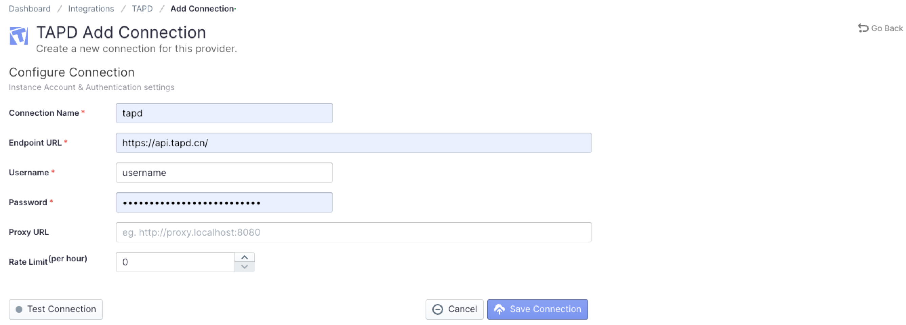
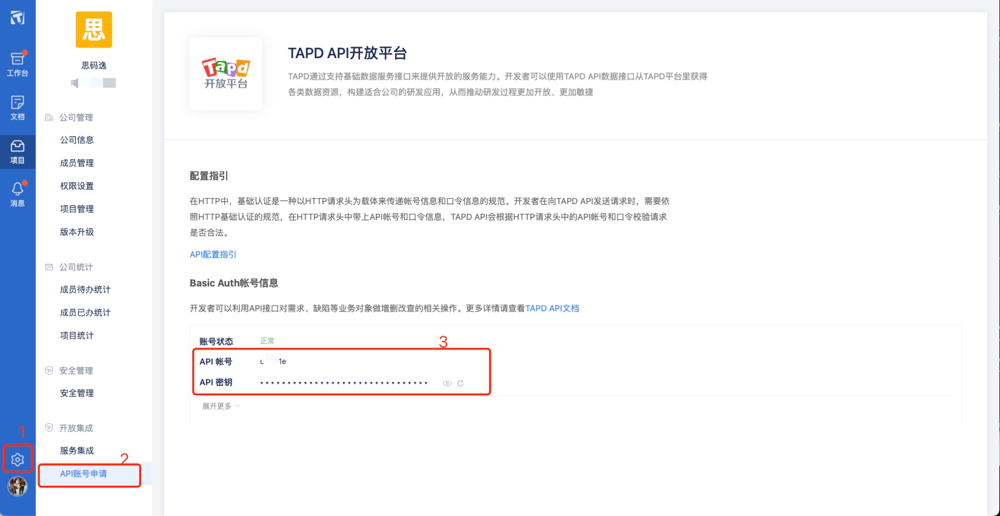

Visit config-ui: `http://localhost:4000`.
### Step 1 - Add Data Connections

#### Connection Name
Name your connection.

#### Endpoint URL
This should be a valid REST API endpoint
   - `https://api.tapd.cn/`
The endpoint url should end with `/`.

#### Username / Password
Input the username and password of your Tapd account, you can follow the steps as below.

#### Proxy URL (Optional)
If you are behind a corporate firewall or VPN you may need to utilize a proxy server. Enter a valid proxy server address on your network, e.g. `http://your-proxy-server.com:1080`

#### Ralte Limit (Optional)
For tapd, we suggest you to set rate limit to 3500

#### Test and Save Connection
Click `Test Connection`, if the connection is successful, click `Save Connection` to add the connection.

###