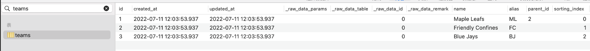
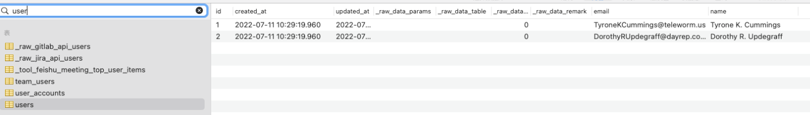
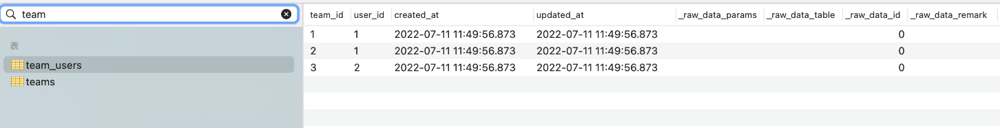
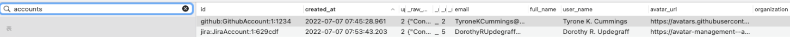
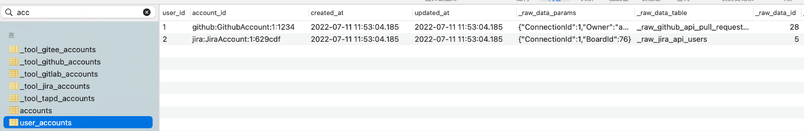
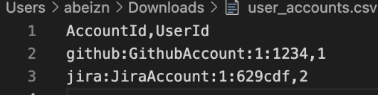
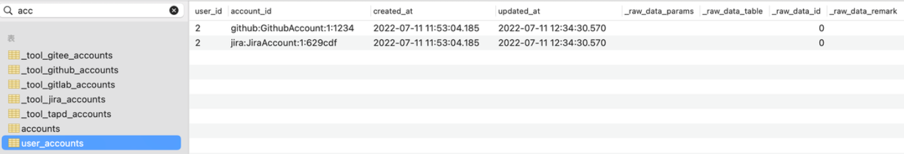

## Summary
This is a brief step-by-step guide to using the team feature.

Notes: 
1. Please convert /xxxpath/*.csv to the absolute path of the csv file you want to upload. 
2 Please replace the 127.0.0.1:8080 in the text with the actual ip and port. 

## Step 1 - Construct the teams table.
a. Api request example, you can generate sample data.

    i. GET request: http://127.0.0.1:8080/plugins/org/teams.csv?fake_data=true (put into the browser can download the corresponding csv file)

    ii. The corresponding curl command.
```
curl --location --request GET 'http://127.0.0.1:8080/plugins/org/teams.csv?fake_data=true'
```

b. The actual api request.

    i. Create the corresponding teams file: teams.csv (Notes: the table header is in capital letters).

    ii. The corresponding curl command.（Quick copy folder path for macOS, Shortcut option + command + c）

```
curl --location --request PUT 'http://127.0.0.1:8080/plugins/org/teams.csv' --form 'file=@"/xxxpath/teams.csv"'
```

    iii. After successful execution, the teams table is generated and the data can be seen in the database table teams.

<p align="center"></p>

## Step 2 - Construct user tables (roster)
a. Api request example, you can generate sample data.

    i. Get request: http://127.0.0.1:8080/plugins/org/users.csv?fake_data=true (put into the browser can download the corresponding csv file).

    ii. The corresponding curl command.
```
curl --location --request GET 'http://127.0.0.1:8080/plugins/org/users.csv?fake_data=true'
```

b. The actual api request.

    i. Create the csv file (roster) (Notes: the table header is in capital letters: Id,Email,Name).
  
    ii. The corresponding curl command.
```
curl --location --request PUT 'http://127.0.0.1:8080/plugins/org/users.csv' --form 'file=@"/xxxpath/users.csv"'
```

    iii. After successful execution, the users table is generated and the data can be seen in the database table users.

<p align="center"></p>
    
    iv. Generated the team_users table, you can see the data in the team_users table.

<p align="center"></p>

## Step 3 - Update users if you need  
If there is a problem with team_users association or data in users, just re-put users api interface, i.e. (b in step 2 above)

## Step 4 - Collect accounts 
accounts table is collected by users through devlake. You can see the accounts table information in the database.

<p align="center"></p>

## Step 5 - Bind accounts and users table relationship

a. api request:  the name of the plugin is "org", connctionId is order to keep same with other plugins.

```
curl --location --request POST '127.0.0.1:8080/pipelines' \
--header 'Content-Type: application/json' \
--data-raw '{
    "name": "test",
    "plan":[
        [
            {
                "plugin": "org",
                "subtasks":["connectUserAccountsExact"],
                "options":{
                    "connectionId":1
                }
            }
        ]
    ]
}'
```

b. After successful execution, the user_accounts table is generated, and you can see the data in table user_accounts.

<p align="center"></p>

## Step 6 - Get user_accountsr relationship
After generating the user_accounts relationship, the user needs to confirm whether the data user and accounts match correctly by the GET method that can get the associated data. The main purpose is to check whether the Id in the accounts table is associated with the UserId relationship.

a. http://127.0.0.1:8080/plugins/org/user_accounts.csv (put into the browser to download the file directly)

b. The corresponding curl command.
```
curl --location --request GET 'http://127.0.0.1:8080/plugins/org/user_accounts.csv'
```

<p align="center"></p>

## Step 7 - Update user_accounts if you need
If the relationship in the accounts table is not as expected, you can change the relationship in the accounts table. For example, change the UserId in the line Id=github:GithubAccount:1:1234 to 2 in my accounts here, upload the user_accounts.csv file through the api user_account.csv file.

a. The corresponding curl command.
```
curl --location --request PUT 'http://127.0.0.1:8080/plugins/org/user_accounts.csv' --form 'file=@"/xxxpath/user_accounts.csv"'
```

b. You can see that the data in the user_accounts table has been updated.

<p align="center"></p>


**The above is the flow of user usage for the whole team feature.**
