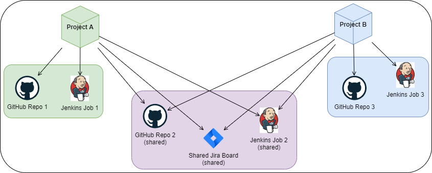

## 1. Introduction
A typical team of developers works with `pull requests`, `deployments`, and `incidents` inside boards.

Based on such, we want to measure their productivity and stability. This is how [DORA](docs/DORA.md) does that:
- Productivity:
  - How many times does the team `deploy`? (a.k.a. [Deployment Frequency](docs/Metrics/DeploymentFrequency.md))
  - How fast are the `pull requests` resolved? (a.k.a. [Lead Time](docs/Metrics/LeadTimeForChanges.md))
- Stability:
  - How many `incidents` per `deploys` does the team have? (a.k.a. [Change Failure Rate](docs/Metrics/CFR.md))
  - How fast are these `incidents` solved? (a.k.a. [Median Time to Restore](docs/Metrics/MTTR.md))

All these questions/metrics are based on either `pull requests`, `deployments`, or `incidents`.
Note: all three are completely separate entities and associated only to their project.

#### General advice

There are 3 red lines when it comes to structuring your DevLake `projects`:

But when we scale this up, a few problems arise:
- A team usually works with multiple `repositories`
- A team also might work on different projects, and we want to measure these projects separately (e.g. it is not the same to work on a big old legacy than on a greenfield)
- There may be multiple teams
- A `board` contains incidents of multiple teams or projects
- A `repository` is managed by multiple teams or projects, e.g. a monorepo
- A `pipeline` can trigger deployments in multiple repositories
- Some organizations want to measure DORA based on projects, and some want to measure it by teams

This is where the `project` concept comes to play.

## 2. What is a DevLake project?
In the real world, a project is something being built and/or researched to solve some problem or to open new grounds.
A DevLake project is a grouping of `pull requests`, `deployments`, or `incidents`. It can be seen as a real-world project or product line. DevLake measures DORA metrics for each project.

_Note: It does not matter if a team works on a particular repository more than another.
The metrics are calculated over the entire set of repos, and the values are accumulated.
More on that: [Debugging DORA Issue Metrics](docs/Troubleshooting/Dashboard.md#debugging-dora-issue-metrics)_

## 3. As a team lead, how many DevLake projects do I need?

Because of its simplicity, the concept is flexible: you decide how to arrange `pull requests`, `deployments`, and `incidents`
either by your specific projects, by teams, technology, or any other way.

The examples below show the patterns of how to organize your projects.
To keep things simple we assume that we work with **GitHub** repos, **Jira** boards, 
and **Jenkins CI/CD** deploys in each GitHub repo.

The same would apply to other repos (e.g. GitLab or BitBucket), boards (e.g. TAPD), 
or CI/CD (e.g. GitLab CI, Azure DevOps).

## 4. Use Cases
This section demonstrates real-life situations and how they get reflected in DevLake.

Quick note: to keep this guide shorter and more concise, some technical details are only mentioned in the use case 1,
so if you read this page for the first time, make sure to go through them in order.

Quick note 2: if you use webhooks, check the [quick note](HowToOrganizeDevlakeProjects.md#7-note-about-webhooks) about them below.

### 4.1. Use Case 1: Projects DevLake and DevStream
DevLake and [DevStream](https://github.com/devstream-io/devstream) are both Apache `projects`.
DevLake manages 3 `repos`: [incubator-devlake](https://github.com/apache/incubator-devlake), 
[incubator-devlake-website](https://github.com/apache/incubator-devlake-website), 
and [incubator-devlake-helm-chart](https://github.com/apache/incubator-devlake-helm-chart).
DevStream also manages 3 `repos`: [devstream](https://github.com/devstream-io/devstream),
[website](https://github.com/devstream-io/website), and [blog](https://github.com/devstream-io/blog).

Both projects use GitHub for storing code (including `pull requests`), `deployments` on GitHub Actions, and `incidents`.

_Note: to avoid confusion between DevLake as a `project` in this use case and DevLake as a platform,
we will use complete names i.e. `project DevLake` and `platform DevLake` respectively._

#### 4.1.1. Organizing Projects
First, we create 2 `projects` on DevLake platform, representing both project DevLake and DevStream.
These steps will suffice for now:

Later, we will bind connections that we create in the following steps. We just need to create them first.

#### 4.1.2. Creating Connections

Since all is on GitHub in this case, we can use just 1 connection with following properties:
- it includes all the `project's repositories`
- its scope includes everything we work with (i.e. `pull requests`, `deployments`, and `incidents`)

If you store `incidents` on Jira, for example, you will need to create a separate connection just for them.
Same applies to `deployments`, a separate connection is needed in case they are stored in Jenkins (or any other host for `deployments`).

#### 4.1.3. Configuring Connections
This part is described in [GitHub](/docs/Configuration/GitHub.md) connection configuration.
For other platforms check the [Configuration Guide](/docs/Configuration)

### 4.1.4 Using connections

At this point, we have projects and connections created on platform DevLake. 
It is time to bind those connections to the projects. To do so, follow the steps
described in the [Tutorial](/docs/Configuration/Tutorial.md).

### 4.1.5 Resulting Metrics

To know if the data of a project is successfully collected go to your DORA Dashboard:

If everything goes well, you should see all the 4 charts.
If something is wrong, and you are puzzled why, check out the
[Debugging Dora Issue Metrics](docs/Troubleshooting/Dashboard.md#debugging-dora-issue-metrics) page.

#### 4.1.6. How can I observe metrics by project?
In the same DORA dashboard check out this menu point:

The metrics should change when you select or deselect projects, representing the projects you selected.

### 4.2. Use Case 2

Each community or company have their own flavor on how they work. In this example let's assume a company that has
multiple teams, each working on one or more projects.

To keep it succinct, let's have a look at 2 teams: one works with one `project`, while another deals with 2.
Each `project` consists of 2 `repos`, and 2 `cicd pipelines`.
Also, there are `2 boards`, one for each team. 
 
One of the repos is shared between both projects.

Let's build this example.

#### 4.2.1. Organizing Projects
DORA is good for seeing the effects of the new changes in team's methodology.
However, for DORA itself **there are no teams**, only projects. 
The `team` concept is redundant and only introduces noise and complexity, for no benefit.
So we will create 2 `projects` on platform DevLake to reflect those we are working with.

#### 4.2.2. Creating Connections

For GitHub `repos` we will create:
- 1 connection for Project A
- 1 connection for Project B
- 1 connection for shared repository

So we can simply combine work in the `shared repo` with each of the `projects`.
The connections to retrieve the `deployments` of Jenkins will be arranged the same way.

For JIRA `incident boards` we will just create 1 connection per each board.

#### 4.2.3. Configuring Connections
Check the [Configuration Guide](/docs/Configuration) section to configure the connection of your interest.

### 4.2.5. Results

This is how the projects should look like after performing all the steps

TODO: Screenshot: project list view
TODO: Screenshot: project 1 detail view
TODO: Screenshot: project 2 detail view

### 4.3. Use Case 3: Board Intersection

Some `projects` may have shared `JIRA boards`. Assume the Use Case 2 but with this difference:

TODO

## 7. Note About Webhooks
Use a separate webhook for each project! This is how platform DevLake then knows to which project belong the data passed
via the webhook. If you use the same webhook across multiple projects, the data sent by it **will be replicated per each
project that uses that webhook**. More information available on the [Webhook](/docs/Plugins/webhook.md) page
