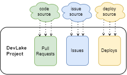
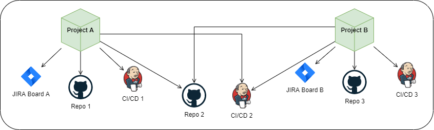
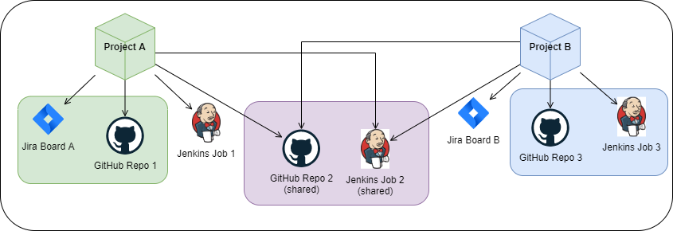

## 1. Introduction
A typical team of developers works with `pull requests`, `deployments`, and `incidents` inside boards.

Based on such, we want to measure their productivity and stability. This is how [DORA](docs/DORA.md) does that:
- Productivity:
  - How many times does the team `deploy`? (a.k.a. [Deployment Frequency](docs/Metrics/DeploymentFrequency.md))
  - How fast are the `pull requests` resolved? (a.k.a. [Lead Time](docs/Metrics/LeadTimeForChanges.md))
- Stability:
  - How many `incidents` per `deploys` does the team have? (a.k.a. [Change Failure Rate](docs/Metrics/CFR.md))
  - How fast are these `incidents` solved? (a.k.a. [Median Time to Restore](docs/Metrics/MTTR.md))

All these questions/metrics are based on either `pull requests`, `deployments`, or `incidents`.

But when we scale this up, a few problems arise:
- A team usually works with multiple `repositories`
- A team also might work on different projects, and we want to measure these projects separately (e.g. it is not the same to work on a big old legacy than on a greenfield)
- There may be multiple teams
- A `board` contains incidents of multiple teams or projects
- A `repository` is managed by multiple teams or projects, e.g. a monorepo
- A `pipeline` can trigger deployments in multiple repositories
- Some organizations want to measure DORA based on projects, and some want to measure it by teams

This is where the `project` concept comes to play.

## 2. What is a DevLake project?
In the real world, a project is something being built and/or researched to solve some problem or to open new grounds.
In software development, a project is just a grouping of something. In DevLake, a `project` is a grouping of `pull requests`, `deployments`, or `incidents`.

## 3. As a team lead, how many DevLake projects do I need?

Because of its simplicity, the concept is flexible: you decide how to arrange `pull requests`, `deployments`, and `incidents`
either by your specific projects, by teams, technology, or any other way.

The examples below show the patterns of how to organize your projects.  

### 3.1. Use case 1: One `board` and multiple `repos` per team

Imagine a team that develops 2 `projects` with one `board` and multiple `repositories`.
The first `project` consists of 3 `repositories` with one of them worked most of the time
The second `project` only has 2 `repositories` worked equal time among them. 
The structure will look like the following:

Note that:
- The same pattern applies for more teams and projects
- If instead there were 2 teams working on 1 project, the structure remains the same (besides renaming the DevLake project)
- It does not matter if a particular repository it touched more than the others. Here is why: [Debugging DORA Issue Metrics](docs/Troubleshooting/Dashboard.md#debugging-dora-issue-metrics)

TODO:
- connections
- transformations
- screenshots on how that should look on DevLake

### 3.2. Use case 2: Multiple `boards`, shared `repos`

We have:
- 2 teams developing a main app
- Each team uses `X boards` for requirements, but also shares `Y boards` for bugs and incidents.
- Each team maintains `X repos` for main app, but also shares some `Y repos` for libraries
- Each team has their own `deployments` for main app

Let's start by translating this to the main concepts, the `pull requests`, `deployments`, 
and `incidents`. Looking at them separately, one by one, we find out that for our teams there are:
- Shared `boards` for `incidents`
- Individual and shared `repos`
- Individual `deployments`

Then the structure would look like the following:

Extending the case:
- TODO: assume we have a third team

### 3.1. What am I looking for with DORA?
TODO: explain right and wrong ways to use DORA

## 4. How do we organize projects when there is data from multiple connection(s)?
TODO

### 4.1. Webhooks
TODO

## 5. How do I know if the data of a project is successfully collected?
TODO

## 6. How can I observe metrics by project?
TODO
