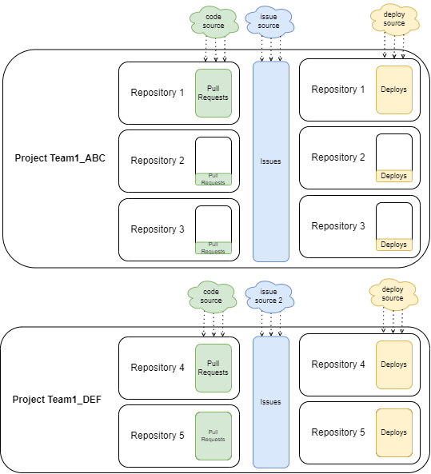

## 1. Introduction
A typical team of developers works with `pull requests`, `deployments`, and `incidents` (a.k.a. Bugs for deployment).

Based on such, we want to measure their productivity and stability. This is how [DORA](docs/DORA.md) does that:
- Productivity:
  - How many times does the team `deploy`? (a.k.a. [Deployment Frequency](docs/Metrics/DeploymentFrequency.md))
  - How fast are the `pull requests` resolved? (a.k.a. [Lead Time](docs/Metrics/LeadTimeForChanges.md))
- Stability:
  - How many `incidents` per `deploys` does the team have? (a.k.a. [Change Failure Rate](docs/Metrics/CFR.md))
  - How fast are these `incidents` solved? (a.k.a. [Median Time to Restore](docs/Metrics/MTTR.md))

All these questions/metrics are based on either `pull requests`, `deployments`, or `incidents`.

But when we scale this up, few problems arise:
- A team usually works with multiple repositories
- A team also might work on different projects, and we want to measure these projects separately (e.g. it is not the same to work on a big old legacy than on a greenfield)
- There may be multiple teams

This is where the `project` concept comes to play.

## 2. What is a DevLake project?
In the real world, a project is something being built and/or researched to solve some problem or to open new grounds.
In software development, a project is just a grouping of something. In DevLake, a `project` is a grouping of `pull requests`, `deployments`, or `incidents`.

## 3. As a team lead, how many DevLake projects do I need?

Because of its simplicity, the concept is flexible: you decide how to arrange `pull requests`, `deployments`, and `incidents`
either by your specific projects, by teams, technology, or any other way.

Let's consider an example:
- There is 1 team working on 2 projects
- The first project consists of 3 repositories with one of them worked most of the time
- The second project only has 2 repos worked equal time among them

Note that:
- If instead there were 2 separate teams, the structure would remain the same. The only thing to consider changing is the name of the project
- The same applies to any other way of arranging the projects
- It does not matter if a particular repository it touched more than the others. Why? The answer is in the section below

### 3.1. What am I looking for with DORA?
TODO: explain right and wrong ways to use DORA

## 4. How do we organize projects when there is data from multiple connection(s)?
TODO

### 4.1. Webhooks
TODO

## 5. How do I know if the data of a project is successfully collected?
TODO

## 6. How can I observe metrics by project?
TODO
