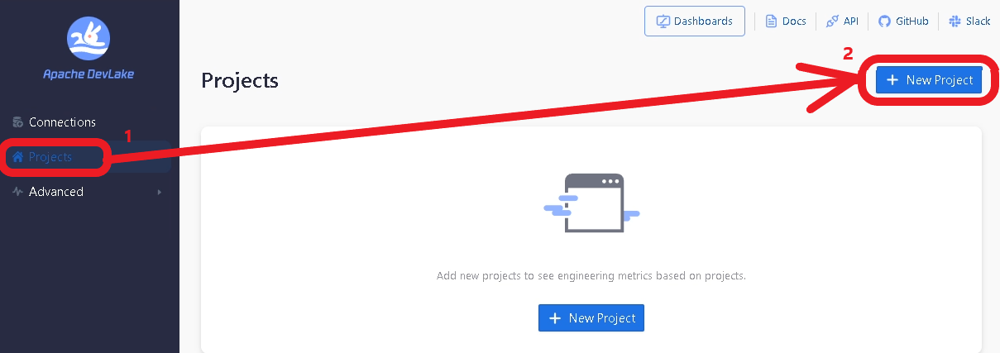
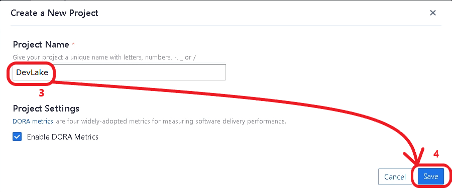
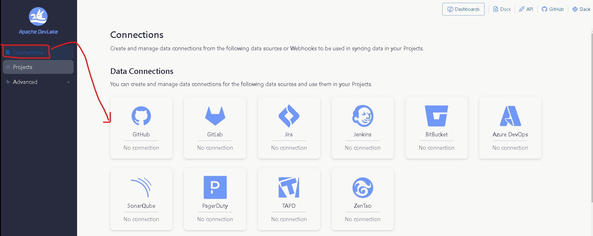
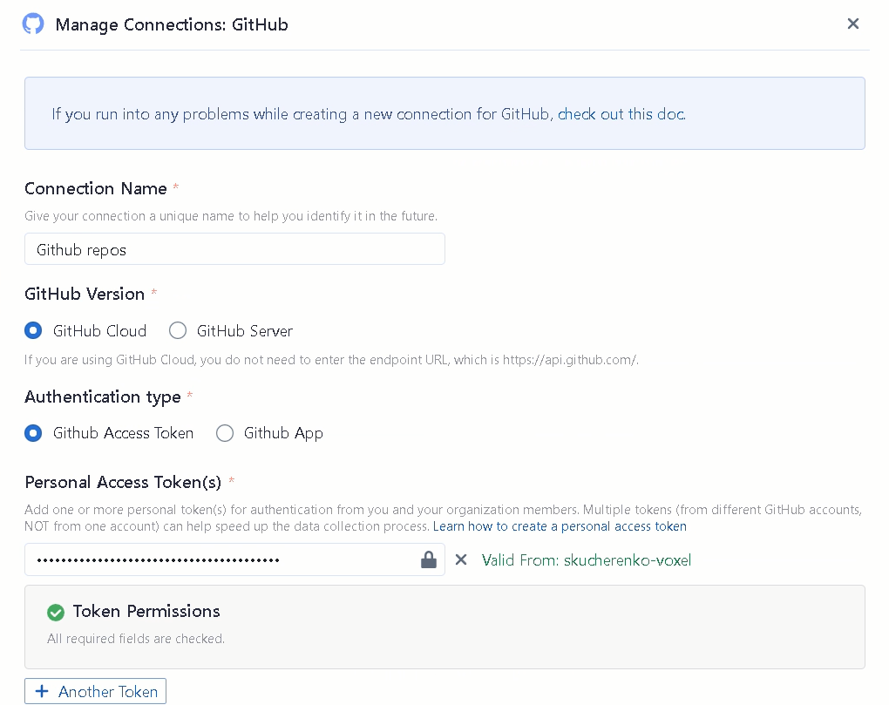
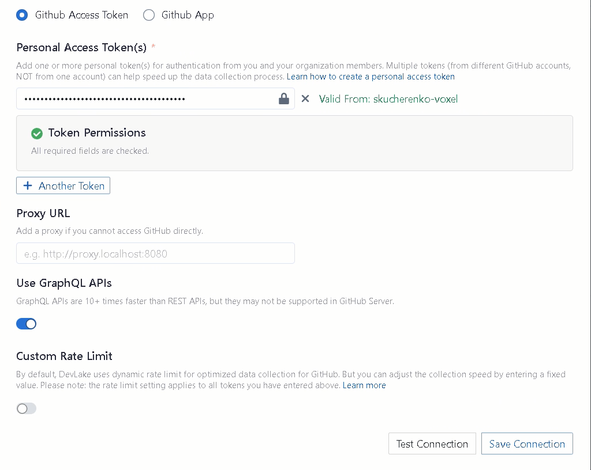
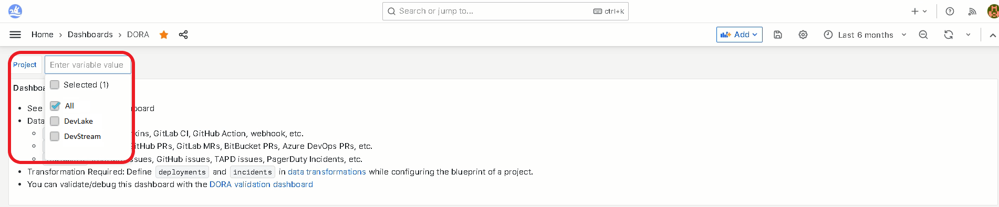

## 1. Introduction
A typical team of developers works with `pull requests`, `deployments`, and `incidents` inside boards.

Based on such, we want to measure their productivity and stability. This is how [DORA](docs/DORA.md) does that:
- Productivity:
  - How many times does the team `deploy`? (a.k.a. [Deployment Frequency](docs/Metrics/DeploymentFrequency.md))
  - How fast are the `pull requests` resolved? (a.k.a. [Lead Time](docs/Metrics/LeadTimeForChanges.md))
- Stability:
  - How many `incidents` per `deploys` does the team have? (a.k.a. [Change Failure Rate](docs/Metrics/CFR.md))
  - How fast are these `incidents` solved? (a.k.a. [Median Time to Restore](docs/Metrics/MTTR.md))

All these questions/metrics are based on either `pull requests`, `deployments`, or `incidents`.
Note: all three are completely separate entities and associated only to their project.

#### General advice

There are 3 red lines when it comes to structuring your DevLake `projects`:

But when we scale this up, a few problems arise:
- A team usually works with multiple `repositories`
- A team also might work on different projects, and we want to measure these projects separately (e.g. it is not the same to work on a big old legacy than on a greenfield)
- There may be multiple teams
- A `board` contains incidents of multiple teams or projects
- A `repository` is managed by multiple teams or projects, e.g. a monorepo
- A `pipeline` can trigger deployments in multiple repositories
- Some organizations want to measure DORA based on projects, and some want to measure it by teams

This is where the `project` concept comes to play.

## 2. What is a DevLake project?
In the real world, a project is something being built and/or researched to solve some problem or to open new grounds.
A DevLake project is a grouping of `pull requests`, `deployments`, or `incidents`. It can be seen as a real-world project or product line. DevLake measures DORA metrics for each project.

_Note: It does not matter if a team works on a particular repository more than another.
The metrics are calculated over the entire set of repos, and the values are accumulated.
More on that: [Debugging DORA Issue Metrics](docs/Troubleshooting/Dashboard.md#debugging-dora-issue-metrics)_

## 3. As a team lead, how many DevLake projects do I need?

Because of its simplicity, the concept is flexible: you decide how to arrange `pull requests`, `deployments`, and `incidents`
either by your specific projects, by teams, technology, or any other way.

The examples below show the patterns of how to organize your projects.
To keep things simple we assume that we work with **GitHub** repos, **Jira** boards, 
and **Jenkins CI/CD** deploys in each GitHub repo.

The same would apply to other repos (e.g. GitLab or BitBucket), boards (e.g. TAPD), 
or CI/CD (e.g. GitLab CI, Azure DevOps).

## 4. Use Cases
This section demonstrates real-life situations and how they get reflected in DevLake.

### 4.1. Use Case 1

There are `2 projects` with `2 boards`, 3 `repos`, and 3 `cicd pipelines`. 
One of the repos is shared between both projects.

Let's build this example.

#### 4.1.1. Organizing Projects
DORA is good for seeing the effects of the new changes in team's methodology.
However, for DORA itself **there are no teams**, only projects. 
The `team` concept is redundant and only introduces noise and complexity, for no benefit.
So we will create 2 `projects` on DevLake to reflect those we are working with.

#### 4.1.2. Creating Connections

For GitHub `repos` we will create:
- 1 connection for Team A
- 1 connection for Team B
- 1 connection for shared repository

TODO: or just 1 connection per team with all necessary repos?

So we can simply combine work in the `shared repo` with each of the teams.
The connections to retrieve the `deployments` of Jenkins will be arranged the same way.

For JIRA `incident boards` we will create 1 connection per each board.

#### 4.1.3. Configuring GitHub Connection
1. Create a GitHub access token specified in the [official GitHub Guide](https://docs.github.com/en/authentication/keeping-your-account-and-data-secure/managing-your-personal-access-tokens#creating-a-personal-access-token-classic)
2. Navigate to the "Connections" view

3. Click "Create New Connection" and fill the form similar as specified in the following screenshots.

4. ⚠️ Warning: Make sure the token has the fields repo:status, repo_deployment, read:user, read:org. 
   - If collecting private repositories, also include the repo field.
5. Click "Test Connection". If no error appears, click "Save Connection".

#### 4.1.4. Configuring GitHub Connection Scope
TODO

#### 4.1.5. JIRA
TODO: screenshots

#### 4.1.6. Jenkins
TODO: screenshots

### 4.1.7 Using connections

TODO: How we use the `connections` for projects, defining their `cicd_scopes`. More screenshots

### 4.1.8. Building the project

TODO: final screenshots for collecting data

### 4.2. Building use case 2

Some teams may have shared `JIRA boards`. Assume the Use Case 1 but with this difference:

## 5. How do I know if the data of a project is successfully collected?

Navigate to your DORA Dashboard:

If everything goes well, you should see all the 4 charts.
If something is wrong, and you are puzzled why, check out the 
[Debugging Dora Issue Metrics](docs/Troubleshooting/Dashboard.md#debugging-dora-issue-metrics) page.

## 6. How can I observe metrics by project?
In the same DORA dashboard check out this menu point:

The metrics should change when you select or deselect projects.

## 7. Webhooks
TODO
