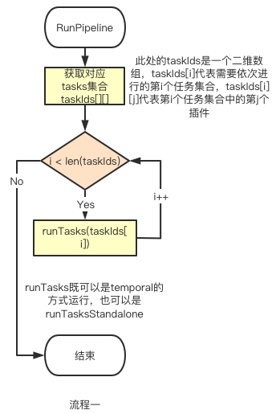
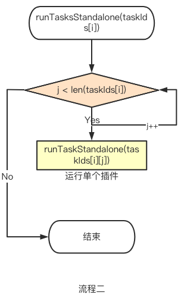
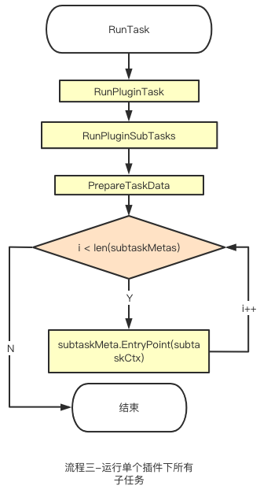


# DevLake是怎么跑起来的

[DevLake](https://github.com/merico-dev/lake) 是一个DevOps数据收集和整合工具，通过 Grafana 为开发团队呈现出不同阶段的数据，让团队能够以数据为驱动改进开发流程。

### DevLake 架构概述
- 左边是[可集成的DevOps数据插件](https://www.devlake.io/docs/DataModels/DataSupport)，目前已有的插件包括 Github，Gitlab，JIRA，Jenkins，Tapd，Feishu 以及思码逸主打的代码分析引擎
- 中间是主体框架，通过主体框架运行插件中的子任务，完成数据的收集，扩展，并转换到领域层，用户可以通过 config-ui 或者 api 调用的形式来触发任务
- RMDBS 目前支持 Mysql 和 PostgreSQL，后期还会继续支持更多的数据库
- Grafana 可以通过sql语句生成团队需要的各种数据


> 接下来我们就详细聊一聊系统是怎么跑起来的。

### 系统启动

在我们的 golang 程序启动之前，首先会自动调用各个 package 的 init() 方法，我们主要看看services 包的载入，下面的代码有详细注释：

```go
func init() {
var err error
// 获取配置信息
cfg = config.GetConfig()
// 获取到数据库
db, err = runner.NewGormDb(cfg, logger.Global.Nested("db"))
// 配置时区
location := cron.WithLocation(time.UTC)
// 创建定时任务管理器
cronManager = cron.New(location)
if err != nil {
panic(err)
}
// 初始化数据迁移
migration.Init(db)
// 注册框架的数据迁移脚本
migrationscripts.RegisterAll()
// 载入插件，从cfg.GetString("PLUGIN_DIR")获取到的文件夹中载入所有.so文件，在LoadPlugins方法中，具体来讲，通过调用runner.LoadPlugins将pluginName:PluginMeta键值对存入到core.plugins中
err = runner.LoadPlugins(
cfg.GetString("PLUGIN_DIR"),
cfg,
logger.Global.Nested("plugin"),
db,
)
if err != nil {
panic(err)
}
// 执行数据迁移脚本，完成数据库框架层各个表的初始化
err = migration.Execute(context.Background())
if err != nil {
panic(err)
}

// call service init
pipelineServiceInit()
}

```
### DevLake的任务执行原理

**Pipeline的运行流程**

在讲解Pipeline流程之前，我们需要先解释一下[Blueprint](https://www.devlake.io/docs/glossary/#blueprints)。

Blueprint是一个定时任务，包含了需要执行的子任务以及执行计划。Blueprint 的每一次执行记录是一条Historical Run（也称为 Pipeline），代表 DevLake 一次触发，通过一个或多个插件，完成了一个或多个数据收集转换的任务。


以下是 Pipeline 运行流程图：



一个pipeline包含一个二维数组tasks，主要是为了保证一系列任务按预设顺序执行。如果下图中的 Stage3 的插件需要依赖其他插件准备数据（例如 refdiff 的运行需要依赖 gitextractor 和 github，数据源与插件的更多信息请看[文档](https://www.devlake.io/docs/DataModels/DataSupport)），那么 Stage 3 开始执行时，需要保证其依赖项已在 Stage1 和 Stage2 执行完成：


**Task的运行流程**

在stage1，stage2，stage3中的各插件任务都是并行执行：



**接下来就是顺序执行插件中的子任务**



1. RunTask 之前的工作都是在准备 RunTask 方法需要的参数，比如 logger，db，context 等等。
2. RunTask 方法中主要是对数据库中的tasks进行状态更新，同时，准备运行插件任务的 options（把从 config-ui 传过来的 json 转成 map 传到 RunPluginTask 中）
3. RunPluginTask 首先通过 core.GetPlugin(pluginName) 获取到对应 [PluginMeta](#pm)，然后通过 PluginMeta 获取到 [PluginTask](#pt)，再执行 RunPluginSubTasks

**每一个插件子任务的运行流程（涉及到的 interface 及 func 会在[下一节](#DevLake中的重要接口)详细阐述）**


1. 通过调用SubTaskMetas()获取到所有插件所有的可用子任务[subtaskMeta](#stm)
2. 通过`options["tasks"]`以及subtaskMeta组建需要执行的子任务集合subtaskMetas
3. 计算总共多少个子任务
4. 通过`helper.NewDefaultTaskContext`构建[taskCtx](#tc)
5. 调用`pluginTask.PrepareTaskData`构建[taskData](#td)，
6. 接下来迭代subtaskMetas里面的所有子任务
    1. 通过`taskCtx.SubTaskContext(subtaskMeta.Name)`获取到子任务的[subtaskCtx](#sc)
    2. 执行[`subtaskMeta.EntryPoint(subtaskCtx)`](#step)
### DevLake中的重要接口
1. <a id="pm">PluginMeta</a>: 包含了插件最基本的两个方法，所有插件都需要实现，系统启动的时候存在core.plugins中，在执行插件任务的时候通过core.GetPlugin获取

```go
type PluginMeta interface {
   Description() string
   //PkgPath information will be lost when compiled as plugin(.so), this func will return that info
   RootPkgPath() string
}

```
2. <a id="pt">PluginTask</a>: 通过PluginMeta获取，插件实现这个方法之后，Framework就能直接运行子任务，而不是扔给插件自己去执行，最大的好处就是插件的子任务实现更加简单，在插件运行当中，我们也可以更容易的去干涉（比如增加日志等等）

```go
type PluginTask interface {
   // return all available subtasks, framework will run them for you in order
   SubTaskMetas() []SubTaskMeta
   // based on task context and user input options, return data that shared among all subtasks
   PrepareTaskData(taskCtx TaskContext, options map[string]interface{}) (interface{}, error)
}
```
3. 每个插件还有一个<a id="td">taskData</a>，里面包含了配置选项，apiClient以及一些插件其它属性（比如github有Repo信息）
4. <a id="stm">SubTaskMeta</a>: 一个子任务的元数据，每个子任务都会定义一个SubTaskMeta


```go
var CollectMeetingTopUserItemMeta = core.SubTaskMeta{
   Name: "collectMeetingTopUserItem",
   EntryPoint: CollectMeetingTopUserItem,
   EnabledByDefault: true,
   Description: "Collect top user meeting data from Feishu api",
}
```
5. <a id="ec">ExecContext</a>: 定义了执行(子)任务需要的所有资源
6. <a id="stc">SubTaskContext</a>: 定义了执行子任务所需要的资源（包含了ExecContext）
7. <a id="tc">TaskContext</a>: 定义了执行插件任务所需要的资源（包含了ExecContext）。与SubTaskContext的区别在于SubTaskContext中的TaskContext()方法可以返回TaskContext，而TaskContext中的方法SubTaskContext(subtask string)方法可以返回SubTaskContext，子任务隶属于插件任务，所以把这两个Context进行了区分
8. <a id="step">SubTaskEntryPoint</a>: 所有的插件子任务都需要实现这个函数，这样才能由框架层统一协调安排

### 后续

这篇文章介绍了 DevLake 的架构以及运行流程，还有三个核心 api\_collector、api\_extractor 和 data\_convertor 将会在下一篇文章进行剖析。


