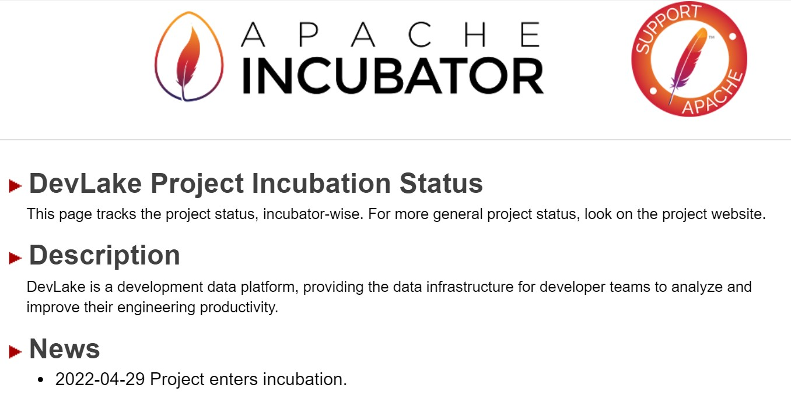
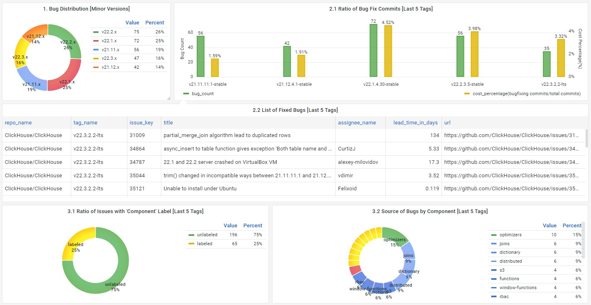
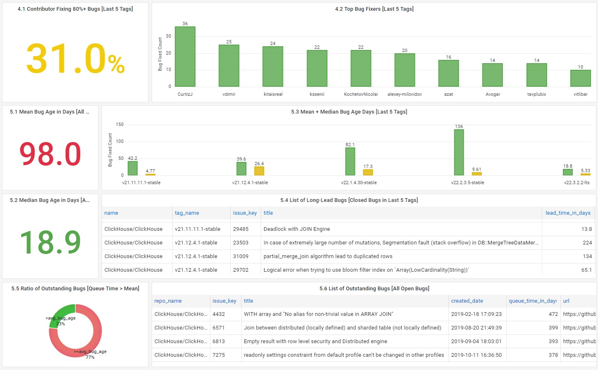
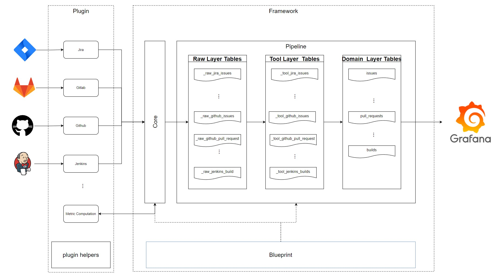

4 月 29 日，开源研发数据平台 DevLake 通过投票决议，正式成为 Apache 软件基金会 (ASF) 的孵化项目。

进入孵化器后，DevLake 将遵循 [The Apache Way](https://www.apache.org/theapacheway/index.html)，在导师们的引导下，坚持以人为本、社区高于代码的理念，持续建设包容、多元、崇尚知识的社区。

<!--truncate-->

## DevLake 主要特性

作为开源的研发数据平台，DevLake 向软件研发团队提供自动化、一站式的数据收集、分析以及可视化能力，帮助研发团队借助数据更好地理解开发过程，挖掘关键瓶颈与提效机会。 

### 归集 DevOps 全流程效能数据，连接数据孤岛

针对 DevOps 工具链复杂、数据收集难的痛点，DevLake 将需求-设计-开发-测试-交付-运营全流程、不同工具的效能数据汇集于一个平台，避免用户重复造轮子。

这些数据可以互相关联分析，进而更加准确、全面地刻画研发过程。举个例子，在了解项目 bug 修复的近况时，不仅可以了解已修复 bug 的个数，还可以了解这些 bug 的分布、bug 修复相关的代码工作量、所占总工作量比例等信息。

当前 DevLake 已支持主流项目管理工具 [JIRA cloud](https://github.com/apache/incubator-devlake/tree/main/plugins/jira)、[JIRA server](https://github.com/apache/incubator-devlake/tree/main/plugins/jira)、[TAPD](https://github.com/apache/incubator-devlake/tree/main/plugins/tapd)，代码托管工具 [Git](https://github.com/apache/incubator-devlake/tree/main/plugins/gitextractor)、[GitHub](https://github.com/apache/incubator-devlake/tree/main/plugins/github)、[GitLab](https://github.com/apache/incubator-devlake/tree/main/plugins/gitlab)，CI/CD 工具 [Jenkins](https://github.com/apache/incubator-devlake/tree/main/plugins/jenkins)，日历工具[飞书日历](https://github.com/apache/incubator-devlake/tree/main/plugins/feishu)。

数据源列表正在快速拓展中，您可以查看 DevLake 已支持数据的[详细文档](https://devlake.apache.org/docs/DataModels/DataSupport)，同时非常欢迎[参与贡献新的数据源插件](https://github.com/apache/incubator-devlake/blob/main/plugins/README.md)！

### 标准化研发数据模型和开箱即用的效能指标

研发过程数据的标准化程度低，用户难以直接使用这些数据进一步分析；而效能指标定义与计算方法模糊，又给研发数据的应用带来了额外的成本。

DevLake 提供了便捷的数据转化能力，将收集来的数据清洗转换为为[标准数据模型](https://www.devlake.io/docs/DataModels/DevLakeDomainLayerSchema)，并基于标准模型生成一系列[研发效能指标](https://www.devlake.io/docs/EngineeringMetrics)，对用户来说简单易懂、开箱即用。一方面节省了治理数据和定义指标的成本，另一方面使效能指标更加透明，便于研发数据的应用落地。

目前 DevLake 已支持 20+常见研发效能指标，可应用于交付效率、质量、成本、能力等不同认知域。

结合用户使用研发数据的具体场景，DevLake 基于 Grafana 搭建数据看板，支持趋势分析、按照成员/阶段下钻等分析能力，帮助用户快速定位研发效能提升的关键环节。您可以查看[预设数据看板](https://www.devlake.io/docs/LiveDemo)，后续我们将在 blog 中介绍每一个数据看板及其背后的真实用户场景。

### 灵活的数据源插件系统及数据处理框架，支持自定义

DevLake 将数据加工、关联与转换的底层能力开放出来，提供可拓展的数据底座。
用户可以根据实际需求，实现以下自定义：

- 数据源自定义：DevLake 基于 Golang plugin 系统设计了灵活的插件系统，支持用户独立开发接入任意 DevOps 工具
- 数据实体自定义：基于 dbt 插件，支持用户自定义数据转换模型
- 效能指标自定义：支持用户基于数据模型自定义指标，或调整指标计算方式
- 数据看板自定义：SQL 查询，在 Grafana 中拖拽搭建数据看板

以下是 [DevLake 架构图](https://github.com/apache/incubator-devlake/blob/main/ARCHITECTURE.md)：

## 未来规划

### 技术与产品方面

- 增强系统可伸缩性, 提升大规模数据场景下的系统性能
- 集成更多数据源，覆盖整个软件开发生命周期 (SDLC)
- 数据存储层支持 OLAP 数据库，为用户提供更多选择
- 与用户共建场景化研发数据分析 Dashboard，实现更进一步的开箱即用

### 社区建设方面

- 组织多种多样的社区活动，积极进行线上和线下技术布道，吸引更多用户、开发者和开源爱好者参与到 DevLake 的社区中来
- 打造开放、友好的交流环境，完善和丰富 DevLake 相关内容体系，完善用户文档和贡献指南，降低用户使用和参与门槛，向社区提供更及时的响应，积极与用户互动，解决用户问题并进一步促进项目迭代
- 积极与其他开源项目和社区展开合作，让更多生态合作伙伴了解和参与到 DevLake 社区，共建繁荣生态

## 为什么加入 ASF 孵化器

首先，Devlake 相信 The Apache way 是社区成功之道，以人为本开放、社区高于代码等理念将帮助 DevLake 健康、持续地成长。

进入孵化后，DevLake 期待在导师们的指引下，更加深入理解 The Apache Way 并予以实践，持续建设包容、多元、崇尚知识的社区。

其次，DevLake 和数据基建相关，与 Apache 基金会的关注点高度契合。DevLake 期待与 Apache 生态的其他大数据开源项目共同发展，共建生态。

## 导师介绍

- [姜宁](https://github.com/WillemJiang)：DevLake Champion，ASF Member，同时也今年当选的 Apache 董事
- [张亮](https://github.com/terrymanu)：SphereEx 公司创始人 & CEO，ASF Member，Apache ShardingSphere 创始人 & PMC Chair
- [代立冬](https://github.com/dailidong)：白鲸开源联合创始人，ASF Member，Apache DolphinScheduler PMC Chair
- [郭斯杰](https://github.com/sijie)：ASF Member, PMC Member on Apache Pulsar，StreamNative 创始人 & CEO
- [Felix Cheung](https://github.com/felixcheung)： ASF Member，Apache Zeppelin、Spark、SuperSet、YuniKorn、Pinot 等项目 PMC，SafeGraph 技术高级副总裁
- [Jean-Baptiste Onofré](https://github.com/jbonofre)：ASF Member，Karaf PMC Chair，ActiveMQ、Archiva、Aries、Beam、Brooklyn、Camel、Carbondata、Felix 等项目 PMC

## 导师寄语

- 姜宁：非常高兴能够成为 DevLake 的开源孵化领路人，帮助 DevLake 加入的 ASF 孵化器。 DevLake 着力于解决软件研发领域数据收集，以及研发瓶颈分析的痛点问题。欢迎对提升软件研发效率感兴趣的小伙伴参与到 DevLake 的使用和开发中来，一同构建繁荣发展的社区生态。 

- 张亮：欢迎 Apache 孵化器的新成员 DevLake。它将使工程效能领域的发展更加开放和繁荣，进而推动整个领域的标准化进程。欢迎更多的贡献者参与 ASF 社区，望 DevLake 早日毕业！

- 代立冬：很高兴看到 DevLake 加入到 Apache 孵化器，DevLake 是一个专为开发团队分析和提高工程生产力的平台，欢迎广大的开发伙伴们一起参与让 DevLake 社区更加繁荣、早日成为顶级项目！

- 郭斯杰：祝贺 DevLake 进入 Apache 软件基金会孵化器，这是 DevLake 走向世界的一大步，期待有更多技术爱好者和用户加入，共建繁荣。祝社区快速成长成为顶级项目，成为研发数据平台的中流砥柱。

## 如何参与 DevLake 社区？

DevLake 的发展离不开社区用户的支持，欢迎所有人参与社区建设，让 DevLake 越来越有生命力🥳

- 加入社群：点击加入 Slack 或点击下方代码仓库地址 > Readme > 扫描微信群二维码
- Devlake 代码仓库：https://github.com/apache/incubator-devlake/
- DevLake 官网：https://devlake.apache.org/
- DevLake Podling Website：https://incubator.apache.org/projects/devlake.html
- 如何参与贡献：https://github.com/apache/incubator-devlake#how-to-contribute
- 订阅邮件列表了解动态：dev@devlake.incubator.apache.org