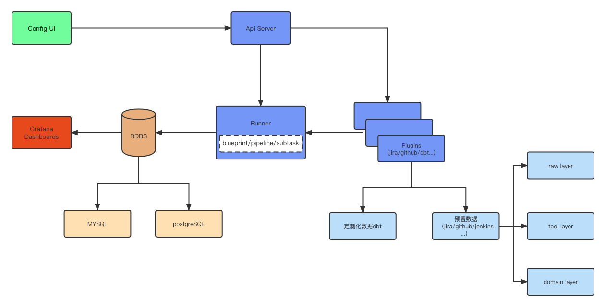

# Apache DevLake 代码库导览
### Apache DevLake是什么？
研发数据散落在软件研发生命周期的不同阶段、不同工作流、不同DevOps工具中，且标准化程度低，导致效能数据难以留存、汇集并转化为有效洞见。为了解决这一痛点，[Apache DevLake](https://github.com/apache/incubator-devlake) 应运而生。Apache DevLake是一款开源的研发数据平台，它通过提供自动化、一站式的数据收集、分析以及可视化能力，帮助研发团队更好地理解开发过程，挖掘关键瓶颈与提效机会。


### Apache DevLake架构概述

<center>Apache DevLake 架构图</center>

- Config UI: 人如其名，配置的可视化，其主要承载Apache DevLake的配置工作。通过Config UI，用户可以建立数据源连接，并实现数据的收集范围，部分数据的转换规则，以及收集频率等任务。
- Api Sever：Apache DevLake的Api接口，是前端调用后端数据的通道。
- Runner：Apache DevLake运行的底层支撑机制。
- Plugins：具体执行的插件业务，主要承载Apache DevLake的后端数据收集、扩展和转换的工作。除dbt插件外的插件产出Apache DevLake的预置数据，预置数据主要包括三层；
    - raw layer：负责储存最原始的api response json。
    - tool layer：根据raw layer提取出此插件所需的数据。
    - domain layer：根据tool layer层抽象出共性的数据，这些数据会被使用在Grafana图表中，用于多种研发指标的展示。
- RDBS: 关系型数据库。目前Apache DavLake支持MySQL和PostgreSQL，后期还会继续支持更多的数据库。
- Grafana Dashboards: 其主要承载Apache DevLake的前端展示工作。根据Apache DevLake收集的数据，通过sql语句来生成团队需要的交付效率、质量、成本、能力等各种研发效能指标。

### 目录结构Tree
```
├── api
│   ├── blueprints
│   ├── docs
│   ├── domainlayer
│   ├── ping
│   ├── pipelines
│   ├── push
│   ├── shared
│   ├── task
│   └── version
├── config
├── config-ui
├── devops
│   └── lake-builder
├── e2e
├── errors
├── grafana
│   ├── _archive
│   ├── dashboards
│   ├── img
│   └── provisioning
│       ├── dashboards
│       └── datasources
├── img
├── logger
├── logs
├── migration
├── models
│   ├── common
│   ├── domainlayer
│   │   ├── code
│   │   ├── crossdomain
│   │   ├── devops
│   │   ├── didgen
│   │   ├── ticket
│   │   └── user
│   └── migrationscripts
│       └── archived
├── plugins
│   ├── ae
│   │   ├── api
│   │   ├── models
│   │   │   └── migrationscripts
│   │   │       └── archived
│   │   └── tasks
│   ├── core
│   ├── dbt
│   │   └── tasks
│   ├── feishu
│   │   ├── apimodels
│   │   ├── models
│   │   │   └── migrationscripts
│   │   │       └── archived
│   │   └── tasks
│   ├── gitextractor
│   │   ├── models
│   │   ├── parser
│   │   ├── store
│   │   └── tasks
│   ├── github
│   │   ├── api
│   │   ├── models
│   │   │   └── migrationscripts
│   │   │       └── archived
│   │   ├── tasks
│   │   └── utils
│   ├── gitlab
│   │   ├── api
│   │   ├── e2e
│   │   │   └── tables
│   │   ├── impl
│   │   ├── models
│   │   │   └── migrationscripts
│   │   │       └── archived
│   │   └── tasks
│   ├── helper
│   ├── jenkins
│   │   ├── api
│   │   ├── models
│   │   │   └── migrationscripts
│   │   │       └── archived
│   │   └── tasks
│   ├── jira
│   │   ├── api
│   │   ├── models
│   │   │   └── migrationscripts
│   │   │       └── archived
│   │   └── tasks
│   │       └── apiv2models
│   ├── refdiff
│   │   ├── tasks
│   │   └── utils
│   └── tapd
│       ├── api
│       ├── models
│       │   └── migrationscripts
│       │       └── archived
│       └── tasks
├── releases
│   ├── lake-v0.10.0
│   ├── lake-v0.10.0-beta1
│   ├── lake-v0.10.1
│   ├── lake-v0.7.0
│   ├── lake-v0.8.0
│   └── lake-v0.9.0
├── runner
├── scripts
├── services
├── test
│   ├── api
│   │   └── task
│   └── example
├── testhelper
├── utils
├── version
├── worker
├── Dockerfile
├── docker-compose.yml
├── docker-compose-temporal.yml
├── k8s-deploy.yaml
├── Makefile
└── .env.exemple
   

```

### 目录导览
- 后端部分：
  - config：对.env配置文件的读、写以及修改的操作。
  - logger：log日志的level、format等设置。
  - errors：Error的定义。
  - utils：工具包，它包含一些基础通用的函数。
  - runner：提供基础执行服务，包括数据库，cmd，pipelines，tasks以及加载编译后的插件等基础服务。
  - models：定义框架级别的实体。
    - common：基础struct定义。
    - [domainlayer](https://devlake.apache.org/docs/DataModels/DevLakeDomainLayerSchema)：领域层是来自不同工具数据的通用抽象。
      - ticket：Issue Tracking，即问题跟踪领域。
      - code：包括Source Code源代码关联领域。以及Code Review代码审查领域。
      - devops：CI/CD，即持续集成、持续交付和持续部署领域。
      - crossdomain：跨域实体，这些实体用于关联不同领域之间的实体，这是建立全方面分析的基础。
      - user：对用户的抽象领域，user也属于crossdomain范畴。
    - migrationscripts：初始化并更新数据库。
  - plugins：
    - core：插件通用接口的定义以及管理。
    - helper：插件通用工具的集合，提供插件所需要的辅助类，如api收集，数据ETL，时间处理等。
      - 网络请求Api Client工具。
      - 收集数据Collector辅助类，我们基于api相同的处理模式，统一了并发，限速以及重试等功能，最终实现了一套通用的框架，极大地减少了开发和维护成本。
      - 提取数据Extractor辅助类，同时也内建了批量处理机制。
      - 转换数据Convertor辅助类。
      - 数据库处理工具。
      - 时间处理工具。
      - 函数工具。
    - ae：分析引擎，用于导入merico ae分析引擎的数据。
    - feishu：收集飞书数据，目前主要是获取一段时间内组织内会议使用的top用户列表的数据。
    - github：收集Github数据并计算相关指标。（其他的大部分插件的目录结构和实现功能和github大同小异，这里以github为例来介绍）。
      - github.go：github启动入口。
      - tasks：具体执行的4类任务。
        - *_collector.go：收集数据到raw layer层。
        - *_extractor.go：提取所需的数据到tool layer层。
        - *_convertor.go：转换所需的数据到domain layer层。
        - *_enricher.go：domain layer层更进一步的数据计算转换。
      - models：定义github对应实体entity。
      - api：api接口。
      - utils：github提取的一些基本通用函数。
    - gitextractor：git数据提取工具，该插件可以从远端或本地git仓库提取commit和reference信息，并保存到数据库或csv文件。用来代替github插件收集commit信息以减少api请求的数量，提高收集速度。
    - refdiff：在分析开发工作产生代码量时，经常需要知道两个版本之间的diff。本插件基于数据库中存储的commits父子关系信息，提供了计算ref(branch/tag)之间相差commits列表的能力。
    - gitlab：收集Gitlab数据并计算相关指标。
    - jenkins：收集jenkins的build和job相关指标。
    - jira：收集jira数据并计算相关指标。
    - tapd：收集tapd数据并计算相关指标。
    - dbt：(data build tool)是一款流行的开源数据转换工具，能够通过SQL实现数据转化，将命令转化为表或者视图，提升数据分析师的工作效率。Apache DevLake增加了dbt插件，用于数据定制的需要。
  - services：创建、管理Apache DevLake各种服务，包含notifications、blueprints、pipelines、tasks、plugins等。
  - api：使用Gin框架搭建的一个通用Apache DevLake API服务。
- 前端部分：
  - congfig-ui：主要是Apache DevLake的插件配置信息的可视化。[一些术语的解释](https://devlake.apache.org/docs/Glossary)
    - 常规模式 
      - blueprints的配置。
      - data connections的配置。
      - transformation rules的配置。
    - 高级模式：主要是通过json的方式来请求api，可选择对应的插件，对应的subtasks，以及插件所需要的其他信息。
  - Grafana：其主要承载Apache DevLake的前端展示工作。根据收集的数据，通过sql语句来生成团队需要的各种数据。目前sql主要用domain layer层的表来实现通用数据展示需求。
- migration：数据库迁移工具。
  - migration：数据库迁移工具migration的具体实现。
  - models/migrationscripts：domian layer层的数据库迁移脚本。
  - plugins/xxx/models/migrationscripts：插件的数据库迁移脚本。主要是_raw_和_tool_开头的数据库的迁移。
- 测试部分：
  - testhelper和plugins下的*_test.go文件：即单元测试，属于白盒测试范畴。针对目标对象自身的逻辑，执行路径的正确性进行测试，如果目标对象有依赖其它资源或对够用，采用注入或者 mock 等方式进行模拟，可以比较方便地制造一些难以复现的极端情况。
  - test：集成测试，灰盒测试范畴。在单元测试的基础上，将所有模块按照设计要求（如根据结构图）组装成为子系统或系统，进行集成测试。
  - e2e： 端到端测试，属于黑盒测试范畴。相对于单元测试更注重于目标自身，e2e更重视目标与系统其它部分互动的整体正确性，相对于单元测试着重逻辑测试，e2e侧重于输出结果的正确性。
- 编译，发布部分：
  - devops/lake-builder： mericodev/lake-builder的docker构建。
  - Dockerfile：主要用于构建devlake镜像。
  - docker-compose.yml：是用于定义和运行多容器Docker应用程序的工具，用户可以使用YML文件来配置Apache DevLake所需要的服务组件。
  - docker-compose-temporal.yml：Temporal是一个微服务编排平台，以分布式的模式来部署Apache DevLake，目前处于试验阶段，仅供参考。
  - worker：Temporal分布式部署形式中的worker实现，目前处于试验阶段，仅供参考。
  - k8s-deploy.yaml：Kubernetes是一个可移植、可扩展的开源平台，用于管理容器化的工作负载和服务，可促进声明式配置和自动化。目前Apache DevLake已支持在k8s集群上部署。
  - Makefile：是一个工程文件的编译规则，描述了整个工程的编译和链接等规则。
  - releases：Apache DevLake历史release版本的配置文件，包括docker-compose.yml和env.example。
  - scripts：shell脚本，包括编译plugins脚本。
- 其他：
  - img：logo、社区微信二维码等图像信息。
  - version：实现版本显示的支持，在正式的镜像中会显示对应release的版本。
  - .env.exemple：配置文件实例，包括DB URL, LOG以及各插件的配置示例信息。

### 如何联系我们
- Github地址：https://github.com/apache/incubator-devlake
- 官网地址：https://devlake.apache.org/
- <a href="https://join.slack.com/t/devlake-io/shared_invite/zt-18uayb6ut-cHOjiYcBwERQ8VVPZ9cQQw" target="_blank">Slack</a>: 通过Slack联系
- 微信联系:
  
  