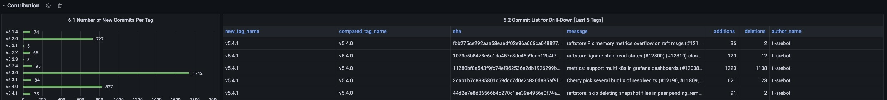
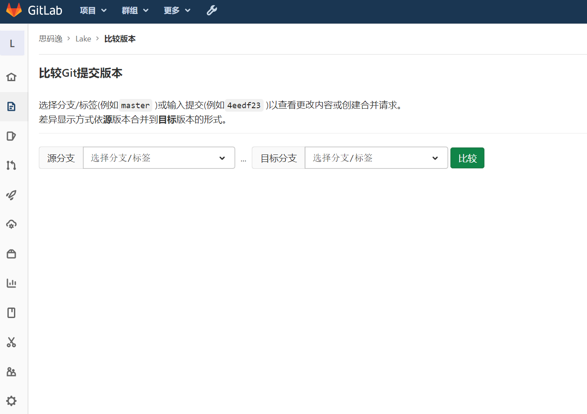
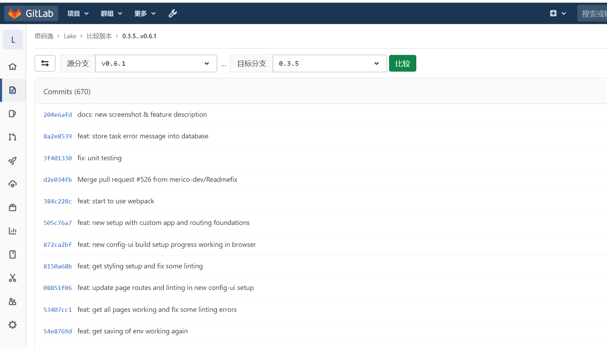
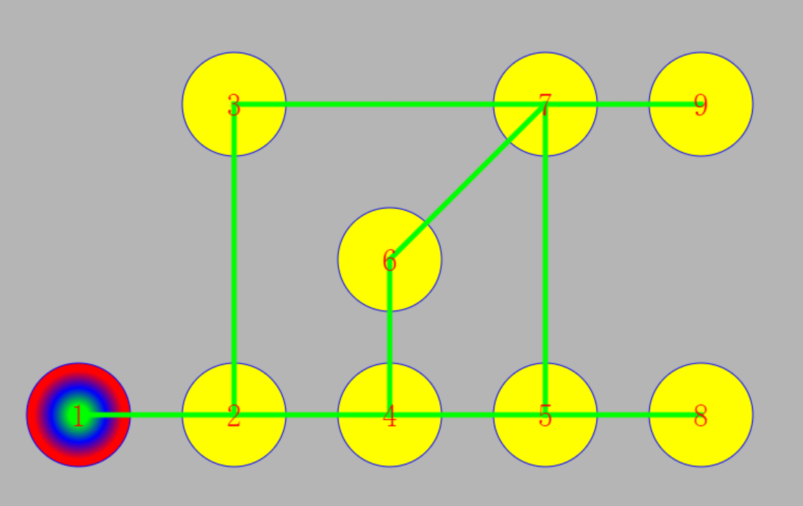

# refdiff插件的`计算提交版本差异`算法

## 什么是 `计算提交版本差异`（CalculateCommitsDiff）？
我们常常需要计算两个`提交版本`之间的差异。具体的说，就是需要知道两个不同的`分支/标签`之间相差了哪些`提交版本`。

对于一般用户来说，通过`计算提交版本差异`，用户能迅速的判断两个不同的`分支/标签`之间在功能、BUG修复等等方面的区别。以帮助用户选择不同的`分支/标签`来使用。

而如果只是使用`diff`命令来查看这两个不同的`分支/标签`的话，大量庞杂冗余的代码修改信息就会毫无组织的混杂在其中，要从中提取出具体的功能变更之类的信息，等同于大海捞针。

对于一款致力于提升研发效能的产品来说，通过`计算提交版本差异`，就能查看一组组不同的`分支/标签`的变迁状况，这一数据的获取，有助于我们做进一步的效能分析。

例如，当一个项目的管理者，想要看看为什么最近的几个版本发版越来越慢了的时候。就可以对最近的几组`分支/标签`来计算`计算提交版本差异`。此时有些`分支/标签`组之间有着大量的`提交版本`，而有些`分支/标签`组之间有着较少的提交版本。项目管理者可以更进一步的计算这些提交版本各自的代码当量，把这些数据以图表的形式展示出来，最终得到一组很直观的`分支/标签`的图像。此时他或许就能发现，原来是因为最近的几次发版涉及到的变更越来越复杂了。通过这样的直观的信息，开发者和管理者们都能做出相应的调整，以便提升研发效能。



## 已有的解决方案

当我们在`GitLab`上打开一个代码仓库的时候，我们可以通过在url末尾追加 compare 的方式来进入到仓库的比对页面。




在该页面，我们可以通过设置`源分支/标签` 和`目标分支/标签`让`GitLab`向我们展示 目标分支落后于源分支哪些版本，以及落后了多少个版本

设置完毕后，`GitLab`会展示如下



在这里，我们能看到我们选择的`目标分支/标签`比`源分支/标签`少了如图所示的`提交版本`（Commits）

然而遗憾的是，像`GitLab`这类解决方案，都没有做批量化，自动化的处理。也更没有对后续的计算出来的结果进行相应的数据汇总处理。用户面对海量的分支提交的时候，既不可能手动的一个一个去比较，也不可能手动的去把数据结果自己复制粘贴后再分析。

因此`DevLake`就必须要解决这个问题。

## 所谓的`计算提交版本差异`具体是在计算什么？

以`GitLab`的计算过程为例来说的话，所谓的`计算提交版本差异`也就是当一个`提交版本`在`源分支/标签`中`存在`，但是在`目标分支/标签`中**不存在**的时候，这个提交版本就会被`GitLab`给逮出来。


那么，或许有人会问，假如一个`提交版本`在`源分支/标签`中**不存在**，相反的，在`目标分支/标签`中`存在`，那是不是也会被抓起来呢？

答案是，**不会**。

也就是说，当我们计算`提交版本`的差异的时候，我们只关心`目标分支/标签`缺少了什么，而并不关心`目标分支/标签`多出来了什么东西。

这就好像以前有一位算法竞赛的学生，在NOI比赛结束后被相关学校面试的时候，一个劲的自我介绍自己担任过什么广播站青协学生会，什么会长副会长之类的经历。结果很快就惹得面试官老师们忍无可忍的告诫道：

> 我们只想知道你信息学方面的自我介绍，其余的我都不感兴趣！！！

在计算`提交版本`差异时，`GitLab`是这样。`GitHub`也是这样。事实上，在使用git命令 `git log branch1...branch2` 的时候，git也是这样的。

它们都只关心`目标分支/标签`相对于`源分支/标签`缺少的部分。

计算`提交版本`差异实际上就是

- 计算待计算的`目标分支/标签`相对于`源分支/标签`缺少了哪些`提交版本`

## 对`提交版本`进行数学建模

想要做计算，那么首先，我们需要把一个抽象的现实问题，转换成一个数学问题。

这里我们就需要进行数学建模了。

我们需要把像`目标分支/标签`、`源分支/标签`、`提交版本` 这样一系列的概念变成数学模型中的对象。

如此我们才能为其设计算法。

想当然的，我们就想到了使用图的方式来进行数学建模。

我们将每一个`提交版本`都看作是图上的一个节点，把`提交版本`合并之前的一组`提交版本`与当前`提交版本`之间的父子关系，看作成是一条`有向边`

由于`目标分支`和`源分支`事实上也各自与一个特定的`提交版本`相绑定，因此也能将它们看作是图上的特别节点。

- 将`目标分支/标签`所对应的节点，命名为`旧节点`
- 将`源分支/标签`所对应的节点，命名为`新节点`

当然，这里我们还有一个需要特别关注的节点，就是初始的`提交版本`所代表的节点

- 将初始`提交版本`所对应的节点，命名为`根节点`


上述的描述或许显得有点儿抽象。

我们现在来实际举一个例子。来看看如何对一个仓库进行上述数学建模

假设现在有基于如下描述而产生的一个仓库

1. 创建空仓库
1. 在`main`分支上创建`提交版本` `1`作为初始提交
1. 在`main`分支上创建`提交版本` `2`
1. 在`main`分支上创建新分支`nd`
1. 在`nd`分支上创建`提交版本` `3`
1. 在`main`分支上创建`提交版本` `4`
1. 在`main`分支上创建新分支`dtf`
1. 在`main`分支上创建`提交版本` `5`
1. 在`dtf`分支上创建`提交版本` `6`
1. 在`main`分支上创建新分支`nddtf`
1. 在`nddtf`分支上创建`提交版本` `7`
1. 把`nd`分支合并到`nddtf`分支
1. 把`dtf`分支合并到`nddtf`分支
1. 在`main`分支上创建`提交版本` `8`
1. 在`nddtf`分支上创建`提交版本` `9`

我们对上述的仓库进行构图之后，最终会得到如下图所示的一个有向图：




- 此时彩色节点`1`为`根节点`
- `main`分支为`1` `2` `4` `5` `8`
- `nd`分支为`1` `2` `3` 随后合并入 `nddtf` 分支
- `dtf`分支为`1` `2` `4` `6` 随后合并入 `nddtf` 分支
- `nddtf` 分支为 `1` `2` `3` `4` `5` `6` `7` `9`


可以看到，每一个`提交版本`在图中都相对应的有一个节点

此时我们把`提交版本` `1`所代表的节点，作为`根节点`

当然这里可能会有同学提问了：

- 假如我这个仓库有**一万个**`根节点`怎么破？

相信一些经常做图的建模的同学应该都知道破法。

- 创建一个名叫为`一万个根节点`的虚拟节点，把它设为这些个虚假的`根节点`的父节点，来当作真正的`根节点`即可。

在这个有向图中，我们并没有实际的去指定具体的`目标分支/标签`或者`源分支/标签`

在实际使用中，我们可以把任意的两个`提交版本`作为一对`目标分支/标签`和`源分支/标签`
当然，有的同学在这里可能又会产生一个问题：

- `目标分支/标签`和`源分支/标签` 虽然都能映射到其最后的`提交版本`上，但是实际上来说`提交版本`与`分支/标签`本质上就是两种不同的概念。

`分支/标签`的实质，是包含一系列的`提交版本`的集合。而特定的`提交版本`仅仅是这个集合中的最后一个元素罢了。

当我们把一个仓库通过上述数学建模抽象成一个有向图之后，这个集合的信息，会因此而丢失掉吗？

对于一个合法的仓库来说，答案显然是，`不会`

实际上，这也就是为什么我们一定要在该有向图中强调`根节点`的原因。

我们这里这里，先给出结论：

**`分支/标签`所对应的节点，到`根节点`的全部路径中途径的`所有节点`的集合，即为该`分支/标签`所包含的`提交版本`集合。**

## 简单证明 上述结论
- 设`根节点`为节点`A`
- 设要求的`分支/标签`所代表的节点为节点`B`
- ------------------------
- 当 节点`C`是属于要求的`分支/标签`
- 因为 节点`C`是属于要求的`分支/标签`
- 所以 必然存在一组提交或者合并 使得 节点`C` 可以一直提交到节点 `B`
- 又因为 每一个新增的提交 或者 合并操作，均会切实的建立一条从新增的提交/合并到当前提交的边
- 所以，反过来说，每一个提交或者合并后的节点，均可以抵达节点`C`
- 所以 节点`B`存在至少一条路径 可以 抵达节点`C`
- 同理可证，节点`C`存在至少一条路径抵达`根节点` 也就是节点`A`
- 综上，存在一条从节点`B`到节点`A`的路径，经过节点`C`
- -----------------------
- 当 节点`C`不属于要求的`分支/标签`
- 假设 存在一条从节点`B`到节点`A`的路径，经过节点`C`
- 因为 每一条边都是由新增的提交或者合并操作建立的
- 所以 必然存在一系列的新增提交或者合并操作，使得节点`C`成为节点`B`
- 又因为 每一个提交在抽象逻辑上都是独一无二的
- 因此，如果缺失了节点`C`则必然导致在构建节点`B`所代表的`分支/标签`的过程中，至少存在一个提交或者合并操作无法执行。
- 这将导致分支非法
- 因此 假设不成立
- 因此 其逆否命题 对任意一条从节点`B`到节点`A`的路径，都不会经过节点`C` 成立
- ------------------------
- 根据 
- 当 节点`C`是属于要求的`分支/标签`，存在一条从节点`B`到节点`A`的路径，经过节点`C` （必要性）
- 当 节点`C`不属于要求的`分支/标签`，对任意一条从节点`B`到节点`A`的路径，都不会经过节点`C` （充分性）
- 可得 `分支/标签`所对应的节点，到`根节点`的全部路径中途径的`所有节点`的集合，即为该`分支/标签`所包含的`提交版本`集合。

## 算法选择

我们现在已经完成了数学建模，并且已经为数学建模做了基本的证明。现在，我们终于可以开始在这个数学模型的基础上来设计并实现我们的算法了。

如果没有做上述基本论证的同学，这里可能会犯一个小错误：那就是它们会误以为，只要计算两个节点之间的最短路径即可。若真是如此的话，`SPFA`，`迪杰斯特拉`（Dijkstra），甚至头铁一点儿，来个`弗洛伊德`（Floyd）都是很容易想到的。当然由于该有向图的所有边长都是1，所以更简单的方法是直接使用`广/宽度优先搜索算法（BFS）`来计算最短路。

上述的一系列耳熟能详的算法，或多或少都有成熟的库可以直接使用。但是遗憾的是，如果真的是去算最短路的话，那最终结果恐怕会不尽如人意。

在`DevLake`的早期不成熟的版本中，曾经使用过最短路的算法来计算。尽管对于比较简单线性的仓库来说，可以歪打正着的算出结果。但是当仓库的分支和合并变得复杂的时候，最短路所计算的结果往往都会遗漏大量的`提交版本`。

因为在刚才我们已经论证过了，这个`分支/标签`所包含的`提交版本`集合，是必须要全部路径才行的。只有全部路径，才能满足充分且必要条件。

也就是说，中间只要漏了一条路径，那就会漏掉一系列的`提交版本`

要计算这个有向图上的`旧节点`所代表的`分支/标签`比`新节点`所代表的`分支/标签`缺少了哪些`提交版本`

实质上就是在计算`旧节点`到`根节点`的全部路径所经节点，对比`新节点`到`根节点`的全部路径所经节点，缺少了哪些节点。

如果我们数学建模的时候，把这个有向图建立成一棵树的话

那么熟悉算法的同学，就可以很自然的使用最近公共祖先（LCA）算法，求出其并集，然后再来计算其对应的缺失的部分。

但是作为一个有向图来说，树结构的算法是没法直接使用的。所幸的是，我们的这个图，在由合法仓库生成的情况下，必然是一个有向无环图。

一个有向无环图，也是有自己的最近公共祖先（LCA）算法的。

只是，这里有两个问题
- 我们真的对 最近公共祖先 这个特定的节点感兴趣吗？
- 在有多个不同路径的公共祖先的情况下，只求一个最近公共祖先有什么意义呢？

首先，我们需要明确我们的需求

我们只是为了计算 
- `旧节点`到`根节点`的全部路径所经节点，对比`新节点`到`根节点`的全部路径所经节点，缺少了哪些节点。

除此之外的，我们不感兴趣。

换句话说，我们想知道其公共祖先，但是，不关心它是不是最近的。

它是近的也好，它是远的也罢，只要是公共祖先，都得抓起来。去求最近公共祖先，在树结构下，可以近似等价于求其全部祖先。因此可以使用该算法。

但是在有向无环图下，最近公共祖先就是个废物。求出来了又能如何？

根本上，还是应该去求全部的公共祖先。

所以我们别无选择，只能用最直接的算法。

- 计算出`旧节点`到`根节点`的全部路径所经节点
- 计算出`新节点`到`根节点`的全部路径所经节点
- 检查`新节点`的全部路径所经节点缺少了哪些节点

如何计算任意节点到`根节点`的全部路径所经节点？

在OI上熟练于骗分导论的同学们，应该很自然的就意识到了

`深度优先搜索（DFS）`

当然，这里补充一下，由于`根节点`的性质，事实上，无论是从哪个方向出发，无论走那条边，只要是能走的边，最终都会抵达`根节点`

因此，在上述条件成立的基础上，没有记录路径状态的`广/宽度优先搜索（BFS）`也是可以使用的。因为在必然能抵达`根节点`的前提下，可以忽略路径状态，不做路径的可行性判断。

当然，这一前提，也有利于我们`深度优先搜索（DFS）`进行优化。

在我们执行`深度优先搜索（DFS）`的时候，我们可以将所有访问到的节点，均添加到集合中，而无需等待确认该节点能确实抵达`根节点`后再进行添加。

实际上这里在一个问题上我们又会出现了两种分歧。
问题是，如何将一个节点添加到集合中。方案有如下两种。

染色法：添加到集合中的节点进行染色，未添加到集合中的节点不进行染色。
集合法：使用平衡树算法建立一个集合，将节点添加到该集合中。

这两种算法各有优劣。

- 染色法的优势在于，染色法添加一个元素的时间复杂度是O(1)的，快准狠。相比较而言，集合法添加一个元素的时间复杂度是O(log(n))。
- 集合法的优势在于，集合法遍历所有元素的时间复杂度是O(n)的，而染色法下，要遍历所有元素时间复杂度会是O(m)，同时集合法可以通过设计一个优秀的hash算法代替平衡树，来将时间复杂度优化到接近O(1).（这里n表示集合大小，m表示整个图的大小）

我们这里选择使用集合法。实际上这两种算法都差不多。


## 算法实现

- 根据提交建图
- 我们对`旧节点`使用`深度优先搜索（DFS）`计算出其到`根节点`的全部路径所经节点，添加到`集合A`中
- 接着，我们对`新节点`使用`深度优先搜索（DFS）`计算出其到`根节点`的全部路径所经节点，添加到`集合B`
- 注意，这里有一个优化，这个优化是建立在我们的需求上
- 重复一遍我们的需求
- 我们只关心`目标分支/标签`缺少了什么，而并不关心`目标分支/标签`多出来了什么东西。
- 因此当对`新节点`使用`深度优先搜索（DFS）`搜索到已经在`集合A`中的节点时，可以认为该节点已搜索过，无需再次搜索。
- 此时的`集合B`，可以恰好的避开`集合A`中已有的所有节点，因此，恰好就是我们所需的结果。

核心的计算代码如下所示：
```golang
oldGroup := make(map[string]*CommitNode)
var dfs func(*CommitNode)
// put all commit sha which can be depth-first-searched by old commit
dfs = func(now *CommitNode) {
    if _, ok = oldGroup[now.Sha]; ok {
        return
    }
    oldGroup[now.Sha] = now
    for _, node := range now.Parent {
        dfs(node)
    }
}
dfs(oldCommitNode)

var newGroup = make(map[string]*CommitNode)
// put all commit sha which can be depth-first-searched by new commit, will stop when find any in either group
dfs = func(now *CommitNode) {
    if _, ok = oldGroup[now.Sha]; ok {
        return
    }
    if _, ok = newGroup[now.Sha]; ok {
        return
    }
    newGroup[now.Sha] = now
    lostSha = append(lostSha, now.Sha)
    for _, node := range now.Parent {
        dfs(node)
    }
}
dfs(newCommitNode)
```

这里的lostSha即为我们最终求得的缺失的部分

## 算法执行的演示动画

我们用一个简陋的动画来简单的演示一下，上述算法在逻辑上执行的情况。

- `旧节点`为节点`8`
- `新节点`为节点`9`


如上述动画所演示的一般
从节点`8`开始执行`深度优先搜索（DFS）`到`根节点`中止
从节点`9`开始执行`深度优先搜索（DFS）`到已经在节点`8`的集合中的节点为止
此时，在节点`9`执行`深度优先搜索（DFS）`过程中被访问到的所有非节点`8`的节点

- 节点`3`
- 节点`6`
- 节点`7`
- 节点`9` 

它们所对应的`提交版本`就是我们要求的差集

> 此时最短路为 `9` -> `7` -> `5` -> `8`
> 此时最近公共父节点为 `5`，到该节点的路径为 `9` -> `7` -> `5`
> 从上图中也可以直观的看到如果使用最短路算法，或者最近公共父节点算法的情况下，我们是无法得到正确答案的。

## 时空复杂度

设`提交版本`的总大小为m，每一组`源分支/标签`和`目标分支/标签`的平均大小为n,一共有k组数据

DFS每访问一个节点，需要执行一次加入集合操作。我们按照我们实际实现中使用的 平衡树算法来计算 时间复杂度为 O(log(n))

此时我们可以计算得出

- 建图的时间复杂度：O(m)
- 计算一组`源分支/标签`和`目标分支/标签`时间复杂度：O(n\*log(n))
- 计算所有`源分支/标签`和`目标分支/标签`时间复杂度：O(k\*n\*log(n))
- 读取、统计结果时间复杂度：O(k\*n)
- 总体时间复杂度:O(m + k\*n\*log(n))
- ----------------------------
- 图的空间复杂度：O(m)
- 每组`源分支/标签`和`目标分支/标签`集合的空间复杂度：O(n) （非并发情况下，k组数据可共用）
- 总体空间复杂度：O(m+n)

## 关键词
- `DevLake`
- `CalculateCommitsDiff`
- `算法`
- `数学建模`
- `证明逻辑`
- `充分条件`
- `必要条件`
- `图论`
- `深度优先搜索（DFS）`
- `广/宽度优先搜索（BFS）`
- `时间复杂度`
- `空间复杂度`
- `时空复杂度`
