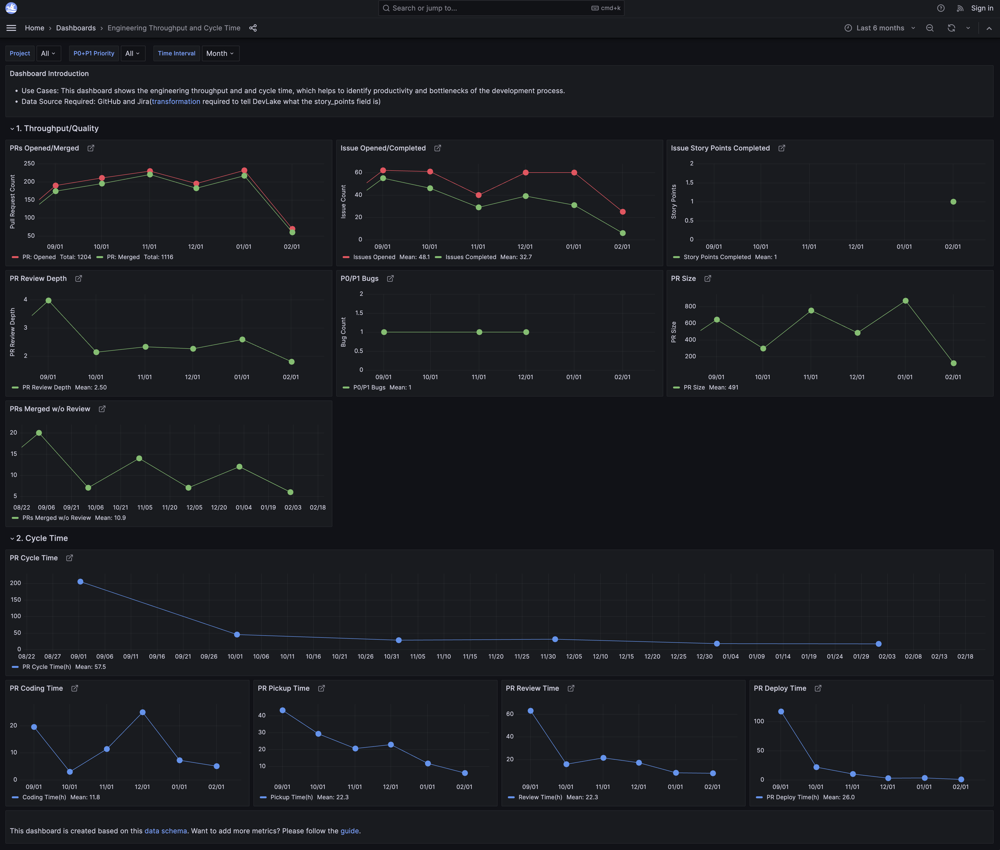

# Engineering Throughput and Cycle Time

  <h5>
     For best viewing experience, please view the dashboard on a desktop
  </h5>

**View live metrics on [🔗 Grafana](https://grafana-lake.demo.devlake.io/grafana/d/Jaaimc67k/engineering-throughput-and-cycle-time?orgId=1)**

<!-- <iframe src="https://grafana-lake.demo.devlake.io/grafana/d/Jaaimc67k/engineering-throughput-and-cycle-time?orgId=1" width="135%" height="1740px"></iframe> -->
