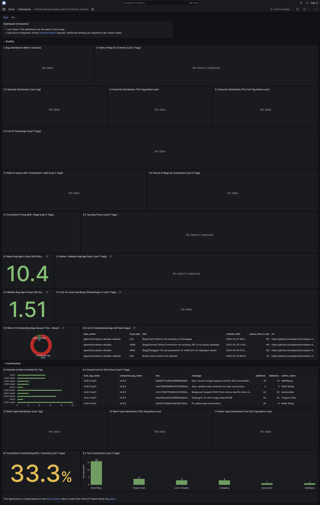

# GitHub Release Quality and Contribution Analysis

  <h5>
     For best viewing experience, please view the dashboard on a desktop
  </h5>

** Preview metrics on [🔗 Grafana](https://grafana-lake.demo.devlake.io/grafana/d/2xuOaQUnk4/github_release_quality_and_contribution_analysis?orgId=1&from=now-6M&to=now)**

<!-- <iframe src="https://grafana-lake.demo.devlake.io/grafana/d/2xuOaQUnk4/github_release_quality_and_contribution_analysis?orgId=1&from=now-6M&to=now" width="135%" height="3240px"></iframe> -->
