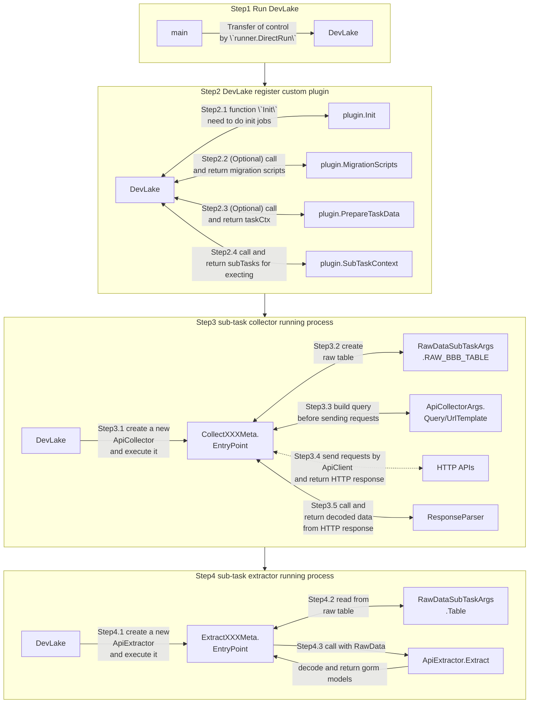

If your favorite DevOps tool is not yet supported by DevLake, don't worry. It's not difficult to implement a DevLake plugin. In this post, we'll go through the basics of DevLake plugins and build an example plugin from scratch together.

## What is a plugin?

A DevLake plugin is a shared library built with Go's `plugin` package that hooks up to DevLake core at run-time.

A plugin may extend DevLake's capability in three ways:

1. Integrating with new data sources
2. Transforming/enriching existing data
3. Exporting DevLake data to other data systems

## Types of plugins

There are, as of now, support for two types of plugins:

1. __*Conventional plugins*__: These are the primary type of plugins used by Devlake, and require the developer to write the most amount of code starting from fetching (collecting) data from data sources to converting them into our normalized data models and storing them.
2. __*Singer-spec plugins*__: These plugins utilize [Singer-taps](https://www.singer.io/) to retrieve data from data-sources thereby eliminating the developer's burden of writing the collection logic. More on them [here](#how-do-singer-spec-plugins-work).


## How do conventional plugins work?

A plugin mainly consists of a collection of subtasks that can be executed by DevLake core. For data source plugins, a subtask may be collecting a single entity from the data source (e.g., issues from Jira). Besides the subtasks, there're hooks that a plugin can implement to customize its initialization, migration, and more. See below for a list of the most important interfaces:

1. [PluginMeta](https://github.com/apache/incubator-devlake/blob/main/plugins/core/plugin_meta.go) contains the minimal interface that a plugin should implement, with only two functions 
   - Description() returns the description of a plugin
   - RootPkgPath() returns the root package path of a plugin
2. [PluginInit](https://github.com/apache/incubator-devlake/blob/main/plugins/core/plugin_init.go) allows a plugin to customize its initialization
3. [PluginTask](https://github.com/apache/incubator-devlake/blob/main/plugins/core/plugin_task.go) enables a plugin to prepare data prior to subtask execution
4. [PluginApi](https://github.com/apache/incubator-devlake/blob/main/plugins/core/plugin_api.go) lets a plugin exposes some self-defined APIs
5. [PluginMigration](https://github.com/apache/incubator-devlake/blob/main/plugins/core/plugin_migration.go) is where a plugin manages its database migrations 
6. [PluginModel](https://github.com/apache/incubator-devlake/blob/main/plugins/core/plugin_model.go) allows other plugins to get the model information of all database tables of the current plugin through the GetTablesInfo() method. If you need to access Domain Layer Models, please visit [DomainLayerSchema](https://devlake.apache.org/docs/DataModels/DevLakeDomainLayerSchema/)
7. [PluginBlueprint](https://github.com/apache/incubator-devlake/blob/main/plugins/core/plugin_blueprint.go) is the foundation for Blueprint and Plugin to collaborate and generate a reasonable Pipeline Plan based on User Settings. For example, a user may declare that he/she wants to collect data from a GitHub Repo, which implies that not only the issues and PRs, but also the git-meta-data including commits history, branches, tags, etc. need to be collected. To do it and do it faster, leveraging [GitExtractor](../Plugins/gitextractor) is the best and recommended way. So, naturally, The GitHub/GitLab/BitBucket plugins will generate 2 concurrent `tasks`, one for itself to collect issues and PRs, and one for `gitextractor` to collect git-meta-data. For more detail, please read the [source file](https://github.com/apache/incubator-devlake/blob/main/plugins/core/plugin_blueprint.go)

The diagram below shows the control flow of executing a plugin:


There's a lot of information in the diagram, but we don't expect you to digest it right away. You can simply use it as a reference when you go through the example below.

## A step-by-step guide toward your first conventional plugin

In this section, we will describe how to create a data collection plugin from scratch. The data to be collected is the information about all Committers and Contributors of the Apache project, in order to check whether they have signed the CLA. We are going to

* request `https://people.apache.org/public/icla-info.json` to get the Committers' information
* request the `mailing list` to get the Contributors' information

We will focus on demonstrating how to request and cache information about all Committers through the Apache API and extract structured data from it. The collection of Contributors will only be briefly described.

### Step 1: Bootstrap the new plugin

**Note:** Please make sure you have DevLake up and running before proceeding.

> More info about plugin:
> Generally, we need these folders in plugin folders: `api`, `models` and `tasks`
> `api` interacts with `config-ui` for test/get/save connection of data source
>       - connection [example](https://github.com/apache/incubator-devlake/blob/main/plugins/gitlab/api/connection.go)
>       - connection model [example](https://github.com/apache/incubator-devlake/blob/main/plugins/gitlab/models/connection.go)
> `models` stores all `data entities` and `data migration scripts`. 
>       - entity 
>       - data migrations [template](https://github.com/apache/incubator-devlake/tree/main/generator/template/migrationscripts)
> `tasks` contains all of our `sub tasks` for a plugin
>       - task data [template](https://github.com/apache/incubator-devlake/blob/main/generator/template/plugin/tasks/task_data.go-template)
>       - api client [template](https://github.com/apache/incubator-devlake/blob/main/generator/template/plugin/tasks/task_data_with_api_client.go-template)

Don't worry if you cannot figure out what these concepts mean immediately. We'll explain them one by one later.

Apache DevLake provides a generator to create a plugin conveniently. Let's scaffold our new plugin by running `go run generator/main.go create-plugin icla`, which would ask for `with_api_client` and `Endpoint`.

* `with_api_client` is used for choosing if we need to request HTTP APIs by api_client. 
* `Endpoint` use in which site we will request, in our case, it should be `https://people.apache.org/`.


Now we have three files in our plugin. `api_client.go` and `task_data.go` are in the subfolder `tasks/`.


Have a try to run this plugin by function `main` in `plugin_main.go`. When you see results like this:
```
$go run plugins/icla/plugin_main.go
[2022-06-02 18:07:30]  INFO failed to create dir logs: mkdir logs: file exists
press `c` to send cancel signal
[2022-06-02 18:07:30]  INFO  [icla] start plugin
invalid ICLA_TOKEN, but ignore this error now
[2022-06-02 18:07:30]  INFO  [icla] scheduler for api https://people.apache.org/ worker: 25, request: 18000, duration: 1h0m0s
[2022-06-02 18:07:30]  INFO  [icla] total step: 0
```
It works! Plugin 'icla' is defined and initiated. This plugin ONLY contains `plugin_main.go` and `task_data.go`, which is the simplest form of a plugin in Apache DevLake. In the next step, we'll show you how to request HTTP APIs by `api_client.go`.

### Step 2: Create a sub-task for data collection
Before we start, it is helpful to know how a collection task is executed: 
1. First, Apache DevLake would call `plugin_main.PrepareTaskData()` to prepare needed data before any sub-tasks. We need to create an API client here.
2. Then Apache DevLake will call the sub-tasks returned by `plugin_main.SubTaskMetas()`. Sub-task is an independent task to do some job, like requesting API, processing data, etc.

> Each sub-task must be defined as a SubTaskMeta, and implement SubTaskEntryPoint of SubTaskMeta. SubTaskEntryPoint is defined as 
> ```go
> type SubTaskEntryPoint func(c SubTaskContext) error
> ```
> More info at: https://devlake.apache.org/blog/how-apache-devlake-runs/

#### Step 2.1: Create a sub-task(Collector) for data collection

Let's run `go run generator/main.go create-collector icla committer` and confirm it. This sub-task is activated by registering in `plugin_main.go/SubTaskMetas` automatically.


> - Collector will collect data from HTTP or other data sources, and save the data into the raw layer. 
> - Inside the func `SubTaskEntryPoint` of `Collector`, we use `helper.NewApiCollector` to create an object of [ApiCollector](https://github.com/apache/incubator-devlake/blob/main/generator/template/plugin/tasks/api_collector.go-template), then call `execute()` to do the job. 

Now you can notice `data.ApiClient` is initiated in `plugin_main.go/PrepareTaskData.ApiClient`. `PrepareTaskData` creates a new `ApiClient`, which is a tool Apache DevLake suggests to request data from HTTP Apis. This tool support some valuable features for HttpApi, like rateLimit, proxy and retry. Of course, if you like, you may use the lib `http` instead, but it will be more tedious.

Let's move forward to use it.

1. To collect data from `https://people.apache.org/public/icla-info.json`,
we have filled `https://people.apache.org/` into `tasks/api_client.go/ENDPOINT` in Step 1.


2. Fill `public/icla-info.json` into `UrlTemplate`, delete the unnecessary iterator and add `println("receive data:", res)` in `ResponseParser` to see if collection was successful.


Ok, now the collector sub-task has been added to the plugin, and we can kick it off by running `main` again. If everything goes smoothly, the output should look like this:
```bash
[2022-06-06 12:24:52]  INFO  [icla] start plugin
invalid ICLA_TOKEN, but ignore this error now
[2022-06-06 12:24:52]  INFO  [icla] scheduler for api https://people.apache.org/ worker: 25, request: 18000, duration: 1h0m0s
[2022-06-06 12:24:52]  INFO  [icla] total step: 1
[2022-06-06 12:24:52]  INFO  [icla] executing subtask CollectCommitter
[2022-06-06 12:24:52]  INFO  [icla] [CollectCommitter] start api collection
receive data: 0x140005763f0
[2022-06-06 12:24:55]  INFO  [icla] [CollectCommitter] finished records: 1
[2022-06-06 12:24:55]  INFO  [icla] [CollectCommitter] end api collection
[2022-06-06 12:24:55]  INFO  [icla] finished step: 1 / 1
```

Great! Now we can see data pulled from the server without any problem. The last step is to decode the response body in `ResponseParser` and return it to the framework, so it can be stored in the database.
```go
ResponseParser: func(res *http.Response) ([]json.RawMessage, error) {
    body := &struct {
        LastUpdated string          `json:"last_updated"`
        Committers  json.RawMessage `json:"committers"`
    }{}
    err := helper.UnmarshalResponse(res, body)
    if err != nil {
        return nil, err
    }
    println("receive data:", len(body.Committers))
    return []json.RawMessage{body.Committers}, nil
},

```
Ok, run the function `main` once again, then it turned out like this, and we should be able to see some records show up in the table `_raw_icla_committer`.
```bash
……
receive data: 272956 /* <- the number means 272956 models received */
[2022-06-06 13:46:57]  INFO  [icla] [CollectCommitter] finished records: 1
[2022-06-06 13:46:57]  INFO  [icla] [CollectCommitter] end api collection
[2022-06-06 13:46:57]  INFO  [icla] finished step: 1 / 1
```


#### Step 2.2: Create a sub-task(Extractor) to extract data from the raw layer

> - Extractor will extract data from raw layer and save it into tool db table.
> - Except for some pre-processing, the main flow is similar to the collector.

We have already collected data from HTTP API and saved them into the DB table `_raw_XXXX`. In this step, we will extract the names of committers from the raw data. As you may infer from the name, raw tables are temporary and not easy to use directly.

Now Apache DevLake suggests saving data by [gorm](https://gorm.io/docs/index.html), so we will create a model by gorm and add it into `plugin_main.go/AutoMigrate()`.

plugins/icla/models/committer.go
```go
package models

import (
	"github.com/apache/incubator-devlake/models/common"
)

type IclaCommitter struct {
	UserName     string `gorm:"primaryKey;type:varchar(255)"`
	Name         string `gorm:"primaryKey;type:varchar(255)"`
	common.NoPKModel
}

func (IclaCommitter) TableName() string {
	return "_tool_icla_committer"
}
```

plugins/icla/plugin_main.go


Ok, run the plugin, and table `_tool_icla_committer` will be created automatically just like the snapshot below:


Next, let's run `go run generator/main.go create-extractor icla committer` and type in what the command prompt asks for to create a new sub-task.


Let's look at the function `extract` in `committer_extractor.go` created just now, and the code that needs to be written here. It's obvious that `resData.data` is the raw data, so we could json-decode each row add a new `IclaCommitter` for each and save them.
```go
Extract: func(resData *helper.RawData) ([]interface{}, error) {
    names := &map[string]string{}
    err := json.Unmarshal(resData.Data, names)
    if err != nil {
        return nil, err
    }
    extractedModels := make([]interface{}, 0)
    for userName, name := range *names {
        extractedModels = append(extractedModels, &models.IclaCommitter{
            UserName: userName,
            Name:     name,
        })fco
    }
    return extractedModels, nil
},
```

Ok, run it then we get:
```
[2022-06-06 15:39:40]  INFO  [icla] start plugin
invalid ICLA_TOKEN, but ignore this error now
[2022-06-06 15:39:40]  INFO  [icla] scheduler for api https://people.apache.org/ worker: 25, request: 18000, duration: 1h0m0s
[2022-06-06 15:39:40]  INFO  [icla] total step: 2
[2022-06-06 15:39:40]  INFO  [icla] executing subtask CollectCommitter
[2022-06-06 15:39:40]  INFO  [icla] [CollectCommitter] start api collection
receive data: 272956
[2022-06-06 15:39:44]  INFO  [icla] [CollectCommitter] finished records: 1
[2022-06-06 15:39:44]  INFO  [icla] [CollectCommitter] end api collection
[2022-06-06 15:39:44]  INFO  [icla] finished step: 1 / 2
[2022-06-06 15:39:44]  INFO  [icla] executing subtask ExtractCommitter
[2022-06-06 15:39:46]  INFO  [icla] [ExtractCommitter] finished records: 1
[2022-06-06 15:39:46]  INFO  [icla] finished step: 2 / 2
```
Now committer data have been saved in _tool_icla_committer.


#### Step 2.3: Convertor

Notes: The goal of Converters is to create a vendor-agnostic model out of the vendor-dependent ones created by the Extractors. 
They are not necessary to have per se, but we encourage it because converters and the domain layer will significantly help with building dashboards. More info about the domain layer [here](https://devlake.apache.org/docs/DataModels/DevLakeDomainLayerSchema/).

In short:

> - Convertor will convert data from the tool layer and save it into the domain layer.
> - We use `helper.NewDataConverter` to create an object of DataConvertor, then call `execute()`. 

#### Step 2.4: Let's try it
Sometimes OpenApi will be protected by token or other auth types, and we need to log in to gain a token to visit it. For example, only after logging in `private@apahce.com` could we gather the data about contributors signing ICLA. Here we briefly introduce how to authorize DevLake to collect data.

Let's look at `api_client.go`. `NewIclaApiClient` load config `ICLA_TOKEN` by `.env`, so we can add `ICLA_TOKEN=XXXXXX` in `.env` and use it in `apiClient.SetHeaders()` to mock the login status. Code as below:


Of course, we can use `username/password` to get a token after login mockery. Just try and adjust according to the actual situation.

Look for more related details at https://github.com/apache/incubator-devlake

#### Step 2.5: Implement the GetTablesInfo() method of the PluginModel interface

As shown in the following gitlab plugin example,
add all models that need to be accessed by external plugins to the return value.

```go
var _ core.PluginModel = (*Gitlab)(nil)

func (plugin Gitlab) GetTablesInfo() []core.Tabler {
	return []core.Tabler{
		&models.GitlabConnection{},
		&models.GitlabAccount{},
		&models.GitlabCommit{},
		&models.GitlabIssue{},
		&models.GitlabIssueLabel{},
		&models.GitlabJob{},
		&models.GitlabMergeRequest{},
		&models.GitlabMrComment{},
		&models.GitlabMrCommit{},
		&models.GitlabMrLabel{},
		&models.GitlabMrNote{},
		&models.GitlabPipeline{},
		&models.GitlabProject{},
		&models.GitlabProjectCommit{},
		&models.GitlabReviewer{},
		&models.GitlabTag{},
	}
}
```

You can use it as follows:

```go
if pm, ok := plugin.(core.PluginModel); ok {
    tables := pm.GetTablesInfo()
    for _, table := range tables {
        // do something
    }
}

```

#### Final step: Submit the code as open source code
We encourage ideas and contributions ~ Let's use migration scripts, domain layers and other discussed concepts to write normative and platform-neutral code. More info at [here](https://devlake.apache.org/docs/DataModels/DevLakeDomainLayerSchema) or contact us for ebullient help.


### Done!

Congratulations! The first plugin has been created! 🎖 

## How do Singer-spec plugins work?

These plugins share a lot in common with [conventional plugins](#how-do-conventional-plugins-work), except the collector stage uses the `Tap` abstraction. You will additionally need to configure JSON files for the [singer-tap] that
you are intending to use. These configuration files will tell the tap what APIs are available and what schema of data is expected to be returned by each of them.

## A step-by-step guide towards your first Singer-spec plugin

For this demo, we will create a simple GitHub plugin using the Singer-spec. Make sure you have familiarized yourself, at a high-level at least, with the concepts of [conventional plugins](#a-step-by-step-guide-towards-your-first-conventional-plugin) before proceeding.

### Step 1: Singer tap setup

Consult the documentation of the specific tap before getting started. Usually the steps go like this:

*1.1*. Make sure you have Python 3+ with `pip` installed.

*1.2*. Add the python module for the singer tap to the `requirements.txt` in the root Devlake directory.

*1.3*. Run `make dep` to get the tap as well other dependencies, if missing, installed.

*1.4*. You now have the tap binary installed and available on your $PATH.

### Step 2: Setting up Singer tap config

*2.1*. You will need to determine the structure of the `config.json` required to communicate with the tap. This should be in the documentation of the tap. This file will contain the config
needed to have the tap make the API calls (e.g. authentication info, endpoint, etc)

*2.2*. In some temp directory, create such a `config.json` file, and then run `<tap-name> -c config.json --discover > properties.json`. This will create a `properties.json` file that contains all the
discovered "streams" of that tap. Each stream corresponds to a unique API call, and contains multiple fields including the JSON schema of the expected response for that stream.

*2.3*. Place this `properties.json` file under `config/singer` and name it to something more specific, for instance, `github.json`, following our example.

### Step 3: Writing and generating the plugin code

As of now, the generator does not support scaffolding code for these plugins. As a workaround, use the generator to create a regular REST plugin and make the following modifications. We'll assume
the plugin created for this example is called `github_singer`.

*3.1*. Under `github_singer/models` create a `config.go` file that captures the structure of the `config.json` you used earlier. For this example, it'd look like this:
```go
// GithubConfig models corresponds to docs here https://github.com/singer-io/tap-github
type GithubConfig struct {
    AccessToken    string    `json:"access_token"`
    Repository     string    `json:"repository"`
    StartDate      time.Time `json:"start_date"`
    RequestTimeout int       `json:"request_timeout"`
    BaseUrl        string    `json:"base_url"`
}
```

*3.2*. Modify `github_singer/tasks/task_data.go` to have the options and task-data appropriate for the subtasks. It is important that the `TaskData` struct contains a reference to the config struct,
the connection-ID, and a function pointer that returns a Tap client. In our example, we could have:
```go
type GithubSingerOptions struct {
    ConnectionId uint64   `json:"connectionId"`
    Owner        string   `json:"owner"`
    Tasks        []string `json:"tasks,omitempty"`
}

type GithubSingerTaskData struct {
    Options   *GithubSingerOptions `json:"-"`
    TapConfig *models.GithubConfig
    TapClient *tap.SingerTap
}

type GithubApiParams struct {
    Repo         string
    Owner        string
    ConnectionId uint64
}

func DecodeAndValidateTaskOptions(options map[string]interface{}) (*GithubSingerOptions, errors.Error) {
    var op GithubSingerOptions
    if err := helper.Decode(options, &op, nil); err != nil {
        return nil, err
    }
    if op.ConnectionId == 0 {
        return nil, errors.Default.New("connectionId is invalid")
    }
    return &op, nil
}
```
*3.3*. Modify `github_singer/impl/impl.go` so that `PrepareTaskData` creates the TaskData struct from the Options. In our case:
```go
func (plugin GithubSinger) PrepareTaskData(taskCtx core.TaskContext, options map[string]interface{}) (interface{}, errors.Error) {
    op, err := tasks.DecodeAndValidateTaskOptions(options)
    if err != nil {
        return nil, err
    }
    connectionHelper := helper.NewConnectionHelper(
        taskCtx,
        nil,
    )
    connection := &models.GithubConnection{}
    err = connectionHelper.FirstById(connection, op.ConnectionId)
    if err != nil {
        return nil, errors.Default.Wrap(err, "unable to get GithubSinger connection by the given connection ID")
    }
    endpoint := strings.TrimSuffix(connection.Endpoint, "/")
    tapClient, err := tap.NewSingerTap(&tap.SingerTapConfig{
        TapExecutable:        "tap-github",
        StreamPropertiesFile: "github_keon.json",
        IsLegacy:             true,
    })
    if err != nil {
        return nil, err
    }
    return &tasks.GithubSingerTaskData{
        Options:   op,
        TapClient: tapClient,
        TapConfig: &models.GithubConfig{
            AccessToken:    connection.Token,
            Repository:     options["repo"].(string),
            StartDate:      options["start_date"].(time.Time),
            RequestTimeout: 300,
            BaseUrl:        endpoint,
        },
    }, nil
}
```

Note that the TapExecutable variable here was set to `"tap-github"`, which is the name of the python executable for the tap.
The `StreamPropertiesFile` is the name of the properties file of interest, and is expected to reside in the directory referenced by the environment variable `"TAP_PROPERTIES_DIR"`. This directory is
expected to be shared for all these JSON files. In our example, this directory is `<devlake-root>/config/tap`.
Furthermore, observe how we created the `GithubConfig` object: The raw options needed two variables "repo" and "start_date", and the remaining fields were derivable from the connection instance.
These details will vary from tap to tap, but the gist will be the same.

*3.4*. Since this is a Singer plugin, the collector will have to be modified to look like this:

```go
package tasks

import (
	"github.com/apache/incubator-devlake/errors"
	"github.com/apache/incubator-devlake/helpers/pluginhelper/tap"
	"github.com/apache/incubator-devlake/plugins/core"
	"github.com/apache/incubator-devlake/plugins/helper"
)

var _ core.SubTaskEntryPoint = CollectIssues

func CollectIssues(taskCtx core.SubTaskContext) errors.Error {
	data := taskCtx.GetData().(*GithubSingerTaskData)
	collector, err := tap.NewTapCollector(
		&tap.CollectorArgs[tap.SingerTapStream]{
			RawDataSubTaskArgs: helper.RawDataSubTaskArgs{
				Ctx:   taskCtx,
				Table: "singer_github_issue",
				Params: GithubApiParams{
					Repo:         data.TapConfig.Repository,
					Owner:        data.Options.Owner,
					ConnectionId: data.Options.ConnectionId,
				},
			},
			TapClient:    data.TapClient,
			TapConfig:    data.TapConfig,
			ConnectionId: data.Options.ConnectionId,
			StreamName:   "issues",
		},
	)
	if err != nil {
		return err
	}
	return collector.Execute()
}

var CollectIssuesMeta = core.SubTaskMeta{
	Name:             "CollectIssues",
	EntryPoint:       CollectIssues,
	EnabledByDefault: true,
	Description:      "Collect singer-tap Github issues",
}
```


*3.5*. Generate the data models corresponding to the JSON schemas of the streams of interest. These make life easy at the Extractor stage as we will not need to write "Response" structs by hand.
We have a custom script that gets this job done. See `scripts/singer-model-generator.sh`. For our example, if we care about
writing an extractor for GitHub Issues, we'll have to refer to the properties.json (or github.json) file to identify the stream name associated with it. In this case, it is called "issues". Next, we run the following
command: ```sh ./scripts/singer-model-generator.sh "./config/tap/github.json" "./plugins/github_singer" "issues"```. (Make sure the script has execution permissions - ```sh chmod +x ./scripts/singer-model-generator.sh```.
For the sake of convenience, the script supports an `--all` flag in place of the stream. This will generate source files for all stream. Also, see the `tap-models` target in the Makefile for references, and add your invocations
there.

This will generate Go (raw) data models and place them under `github_singer/models/generated`. Do not modify these files manually.

*3.5.1*. Note: Occasionally, the tap properties will not expose all the supported fields in the JSON schema - you can go and manually add them there in the JSON file. Additionally, you might run into type-problems (for instance IDs coming back as strings but declared as integers). In general, these would be rare scenarios, and technically bugs for the tap that you would experimentally run into while testing.
Either way, if you need to modify these data-types, do it in the JSON file.

*3.6*. The remaining steps are just like what you would do for conventional plugins (e.g. the REST APIs, migrations, etc). Again, the generated source files from step *3.5* can be used in the
extractor for row-data deserialization.

**Final step:** [Submit the code as open source code](#final-step-submit-the-code-as-open-source-code)

### Done!

Congratulations! You have created a Singer-spec plugin!
