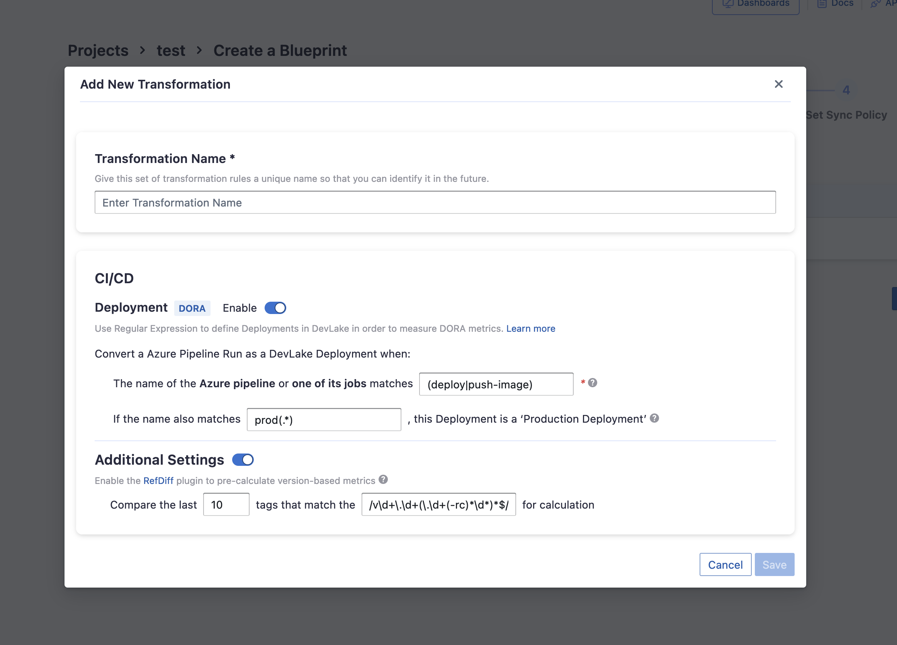

Visit Config UI at: `http://localhost:4000`.

## Step 1 - Add Data Connections

### Connection Name

Give your connection a unique name to help you identify it in the future.

### Token

Paste your Azure DevOps personal access token (PAT) here. You can click on "Learn about how to create a PAT" to get instructions on how to create a PAT.
Make sure that the Organization field is set to "All accessible organizations" when creating the PAT.

### Test and Save Connection

Click `Test Connection`, if the connection is successful, click `Save Connection` to add the connection.

## Step 2 - Setting Data Scope

### Select repositories

Select the repositories you want to collect data from.

### Data Entities

Azure DevOps supports the following data entities.

- CI/CD: builds and jobs.
- Source Code Management: repositories and their commits.
- Code Review: pull requests and their commits.

## Step 3 - Adding Transformation Rules (Optional)

This set of configurations is used for calculating [DORA metrics](../DORA.md).

If you'd like to define `deployments` with Azure DevOps, you can set the following options:
- Deployment regex: Azure DevOps builds or jobs whose names match this regex will be registered as deployments
- Production: Azure DevOps builds or jobs whose names match this regex will be assigned environment 'PRODUCTION'

### Additional Settings (Optional)

The additional settings are RefDiff options:
- Tags Limit: the number of tags to compare.
- Tags Pattern: Only tags that match the given regex are taken into account.

## Troubleshooting

If you run into any problem, please check the [Troubleshooting](/Troubleshooting/Configuration.md) or [create an issue](https://github.com/apache/incubator-devlake/issues)
