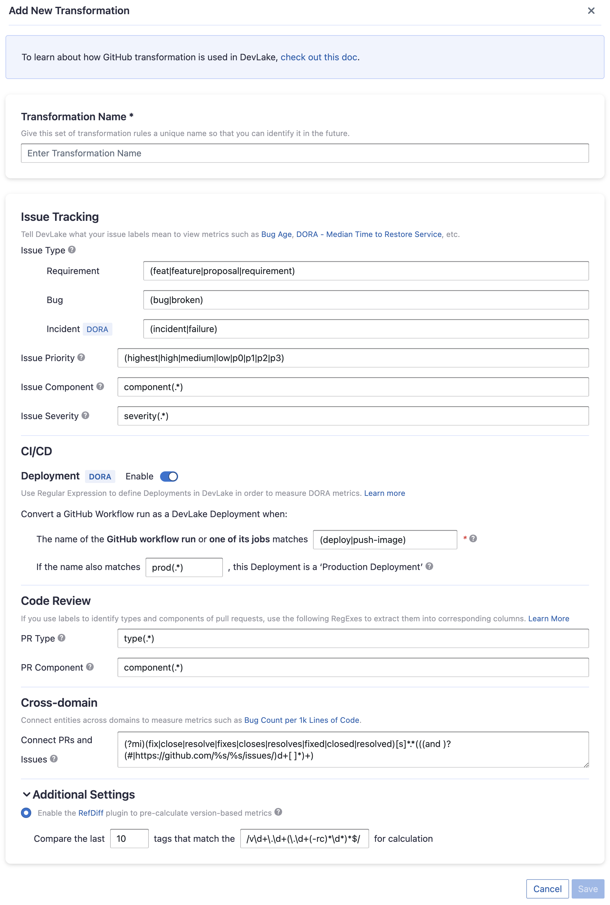

## Overview
The Apache DevLake Config UI allows you to configure the data you wish to collect through a graphical user interface. Visit config-ui at `http://localhost:4000`.

## Create a Project
Starting from v0.15, DevLake has introduced the Project feature to alllow viewing project-based metrics, such as DORA. To create a project, simply go to Project on the main navigation, click on the "+ New Project" button and fill out the info on the dialog below.

## Create a Blueprint

### Introduction
A Blueprint is a plan that covers all the work to get your raw data ready for query and metric computation in the dashboards. Blueprints can either be used to collect data for a Project or be used alone without being dependent on any Project. To use the Blueprint within a Project, you can create the Blueprint once a Project is created; to use it alone, you can create the Blueprint from the Blueprint page from the main navigation. 

For either usage of the Blueprint, creating it consists of four steps:

1. Adding Data Connections: Add new or select from existing data connections for the data you wish to collect
2. Setting Data Scope: Select the scope of data (e.g. GitHub projects or Jira boards) for your data connections
3. Adding Transformations (Optional): Add transformation rules for the data scope you have selected in order to view corresponding metrics
4. Setting the Sync Policies: Set the sync frequency, time range and the skip-on-fail option for your data

For detailed instructions of each data source, please go to their individual configuration docs from the sidebar.

### Step 1 - Add Data Connections
There are two ways to add data connections to your Blueprint: adding them during the creation of a Blueprint and adding them separately on the Data Integrations page. There is no difference between these two ways.

When adding data connections from the Blueprint, you can either create a new or select from existing data connections. 

### Step 2 - Set Data Scope
After adding data connections, click on "Next Step" and you will be prompted to select the data scope of each data connection. For instance, for a GitHub connection, you will need to select or enter the projects you wish to sync, and for Jira, you will need to select from your boards.

### Step 3 - Add Transformations (Optional)
This step is required for viewing certain metrics (e.g. Bug Age, Bug Count per 1k Lines of Code and DORA)in the pre-built dashboards that require data transformation. We highly recommend adding Transformations for your data for the best display of the metrics. but you can still view the basic metrics if you skip this step. 

### Step 4 - Set the Sync Policies
Time Filter: You can select the time range of the data you wish to sync to speed up the collection process.

Frequency: You can choose how often you would like to sync your data in this step by selecting a sync frequency option or entering a cron code to specify your preferred schedule. 

Running Policy: By default, the `Skip failed tasks` is checked to avoid losing all data when encountering a few bugs during data collection, when you are collecting a large volume of data, e.g. 10+ GitHub repositories, Jira boards, etc. For clarity, a task is a unit of a pipeline, an execution of a blueprint. By default, when a task is failed, the whole pipeline will fail and all the data that has been collected will be discarded. By skipping failed tasks, the pipeline will continue to run, and the data collected by successful tasks will not be affected. After the pipeline is finished, you can rerun these failed tasks on the blueprint's detail page.

### View the Blueprint Status and Download Logs for Historical Runs
After setting up the Blueprint, you will be prompted to the Blueprint's status page, where you can track the progress of the current run and wait for it to finish before the dashboards become available. You can also view all historical runs of previously created Blueprints from the list on the Blueprint page.

If you run into any errors, you can also download the pipeline logs and share them with us on Slack so that our developers can help you debug.

## Edit a Blueprint (Normal Mode)
If you switch to the Configuration tab on the Blueprint detail page, you can see the settings of your Blueprint and edit them.

In the current version, the Blueprint editing feature **allows** editing:
- The Blueprint's name
- The sync policies
- The data scope of a connection
- The data entities of the data scope
- The transformation rules of any data scope
- Editing any connections

Please note: 
If you have created the Blueprint in the Normal mode, you will only be able to edit it in the Normal Mode; if you have created it in the Advanced Mode, please refer to [this guide](AdvancedMode.md#editing-a-blueprint-advanced-mode) for editing.

## Create and Manage Data Connections

The Data Connections page allows you to view, create and manage all your data connections in one place.

## Manage Transformations
The Transformations page allows you to manage all your transformation rules.

## Troubleshooting

If you run into any problem, please check [Troubleshooting](/Troubleshooting/Configuration.md), contact us on [Slack](https://join.slack.com/t/devlake-io/shared_invite/zt-17b6vuvps-x98pqseoUagM7EAmKC82xQ) or [create an issue](https://github.com/apache/incubator-devlake/issues).
