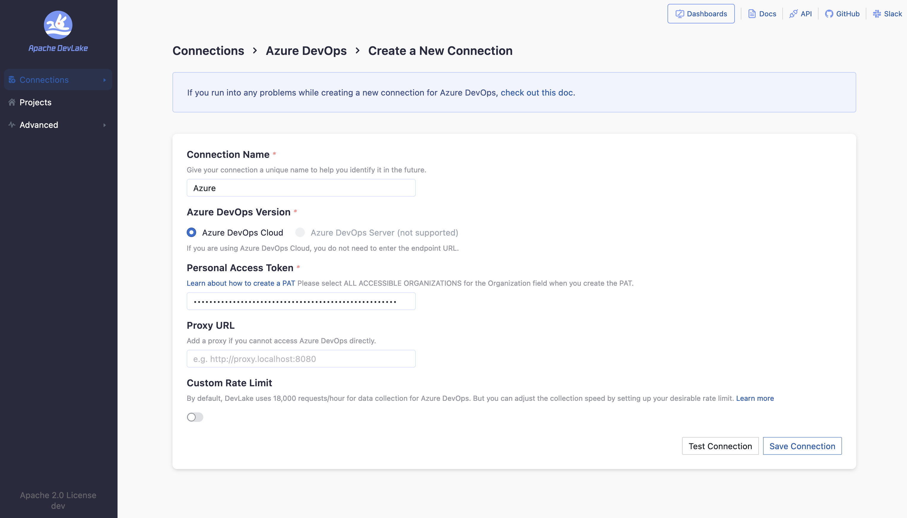
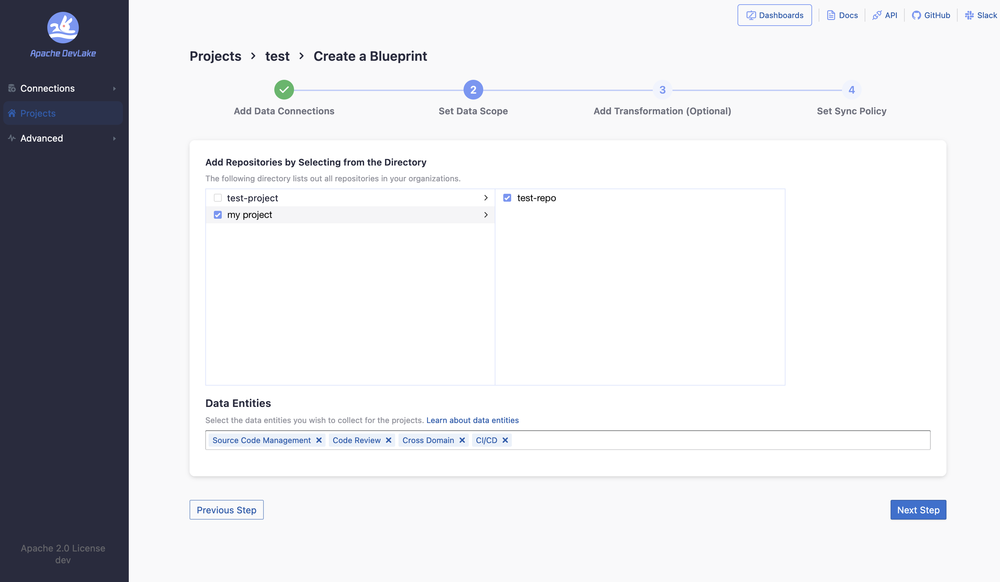
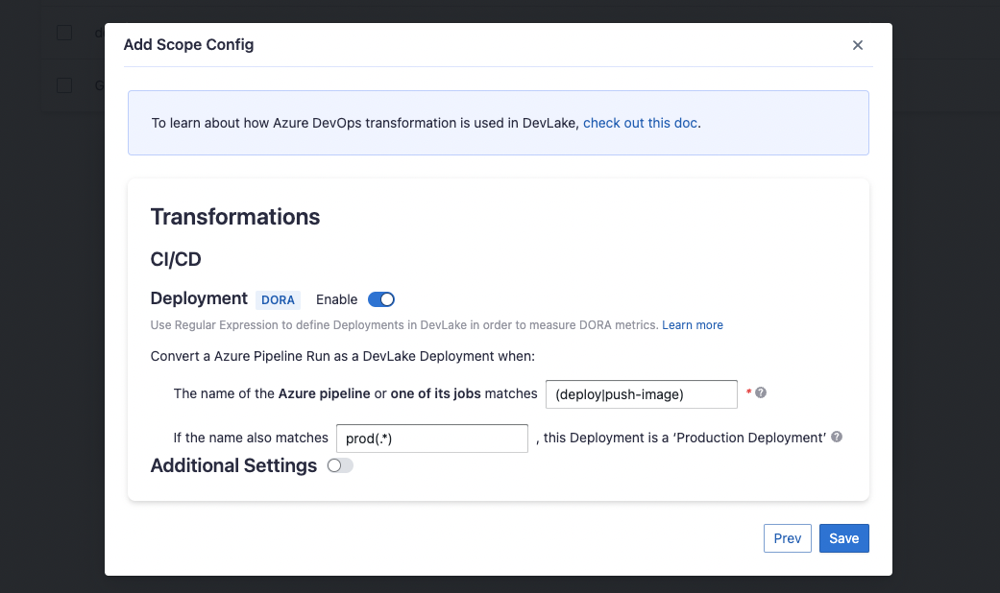
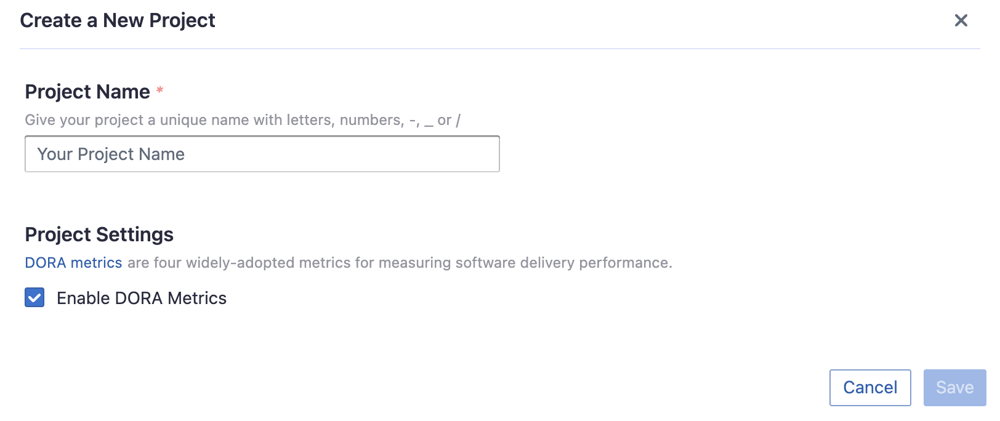
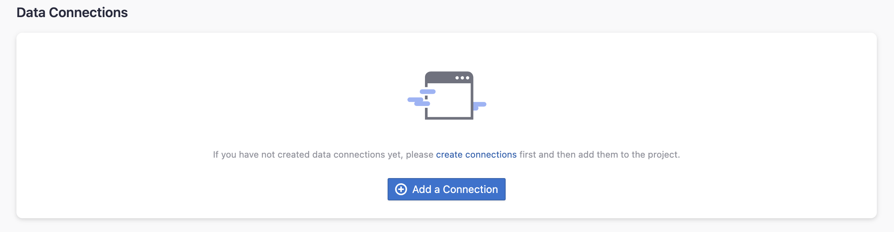
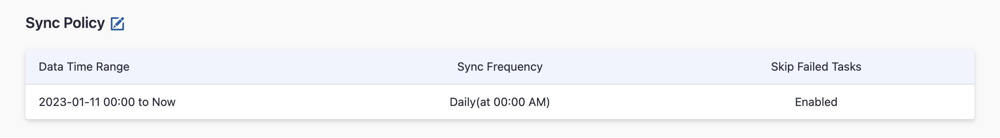
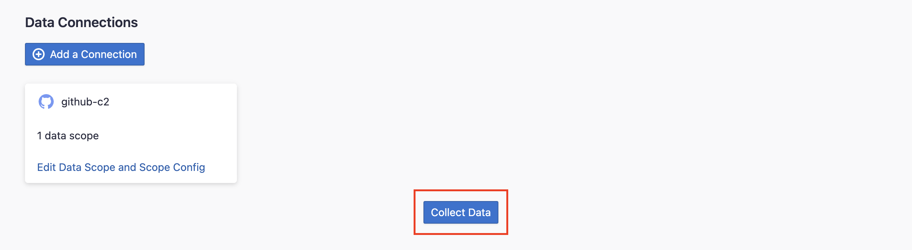

Visit Config UI at: `http://localhost:4000`.

## Step 1 - Add Data Connections

On the Connections page, you can select GitHub and create a new connection or it.

### Step 1.1 - Authentication

#### Connection Name

Give your connection a unique name to help you identify it in the future.

#### Token

Paste your Azure DevOps personal access token (PAT) here. Check [Azure's official doc](https://learn.microsoft.com/en-us/azure/devops/organizations/accounts/use-personal-access-tokens-to-authenticate?view=azure-devops&tabs=Windows#create-a-pat) on how to create a PAT.
Make sure that the Organization field is set to "All accessible organizations" when creating the PAT.

#### Test and Save Connection

Click `Test Connection`, if the connection is successful, click `Save Connection` to add the connection.

### Step 1.2 - Add Data Scopes

#### Select repositories

Select the repositories you want to collect data from.

#### Data Entities

Azure DevOps supports the following data entities.

- CI/CD: builds and jobs.
- Source Code Management: repositories and their commits.
- Code Review: pull requests and their commits.

### Step 1.3 - Add Scope Config (Optional)

Scope config contains two parts: 
- The entities of which domain you wish to collect: Usually, you don't have to modify this part. However, if you don't want to collect certain Azure DevOps entities, you can unselect some entities to accelerate the collection speed.
  - Source Code Management: Azure repos, refs, commits, etc.
  - Code Review: Azure PRs, PR comments and reviews, etc.
  - CI/CD: Azure pipelines, jobs, etc.
  - Cross Domain: Azure accounts, etc.
- The transformations on the Azure DevOps data you are going to collect. 

The transformations are mainly used for calculating [DORA metrics](../DORA.md), so DevLake needs to know what are `deployments` in your Azure Pipelines. You can configure:
    - Regex for `Deployments`: Azure DevOps pipeline or one of its jobs whose names match this regex will be registered as deployments in DevLake
    - Regex for `Production` environment: Azure DevOps pipeline or one of its jobs whose names match this regex will be considered as a PRODUCTION deployment.

The additional settings for transformations are RefDiff options:
- Tags Limit: the number of tags to compare.
- Tags Pattern: Only tags that match the given regex are taken into account.

## Step 2 - Collect Data in a Project
### Step 2.1 - Create a Project
Collecting Azure DevOps data requires creating a project first. You can visit the Project page from the side menu and create a new project by following the instructions on the user interface.

### Step 2.2 - Add a Azure DevOps Connection
You can add a previously configured GitLab connection to the project and select the boards for which you wish to collect the data for. 
Please note: if you don't see the repositories you are looking for, please check if you have added them to the connection first.

### Step 2.3 - Set the Sync Policy
There are three settings for Sync Policy:
- Data Time Range: You can select the time range of the data you wish to collect. The default is set to the past six months.
- Sync Frequency: You can choose how often you would like to sync your data in this step by selecting a sync frequency option or entering a cron code to specify your prefered schedule.
- Skip Failed Tasks: sometime a few tasks may fail in a long pipeline; you can choose to skip them to avoid spending more time in running the pipeline all over again.

### Step 2.4 - Start Data Collection
Click on "Collect Data" to start collecting data for the whole project. You can check the status in the Status tab on the same page.

## Troubleshooting

If you run into any problem, please check the [Troubleshooting](/Troubleshooting/Configuration.md) or [create an issue](https://github.com/apache/incubator-devlake/issues)
