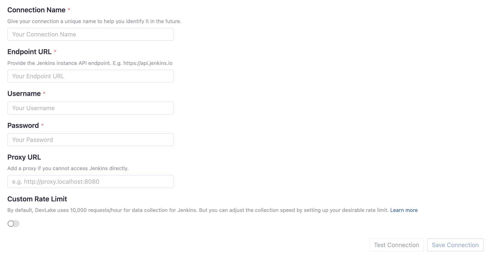
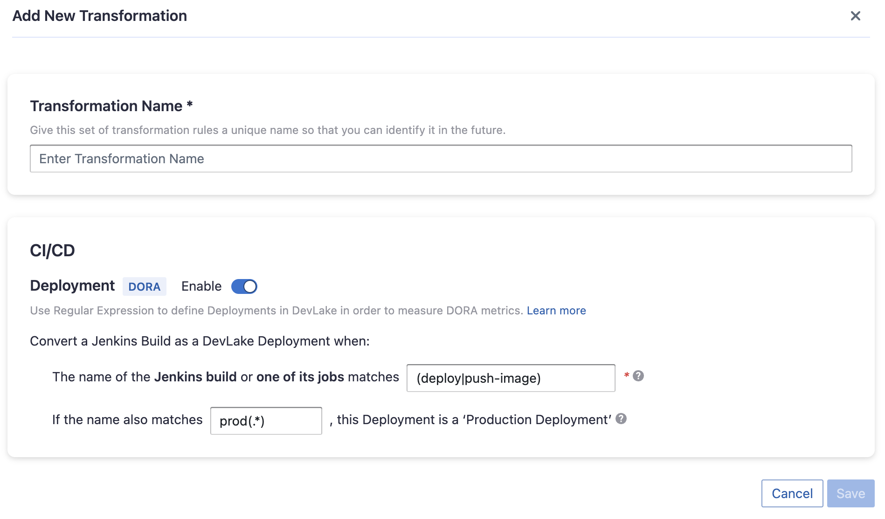

Visit Config UI at: `http://localhost:4000`.

## Step 1 - Add Data Connections

### Connection Name

Give your connection a unique name to help you identify it in the future.

### Endpoint URL

This should be a valid REST API endpoint. Eg. `https://ci.jenkins.io/`. The endpoint url should end with `/`.

### Username (E-mail)

Your User ID for the Jenkins Instance.

### Password

For help on Username and Password, please see Jenkins docs on [using credentials](https://www.jenkins.io/doc/book/using/using-credentials/). You can also use "API Access Token" for this field, which can be generated at `User` -> `Configure` -> `API Token` section on Jenkins.

### Fixed Rate Limit (Optional)

DevLake uses a dynamic rate limit to collect Jenkins data. You can adjust the rate limit if you want to increase or lower the speed.

There is no doc about Jenkins rate limiting. Please create an issue if you find related information.

### Test and Save Connection

Click `Test Connection`, if the connection is successful, click `Save Connection` to add the connection.

## Step 2 - Setting Data Scope

### Jobs

Choose the Jenkins jobs. All `Jenkins builds` under these jobs will be collected.

### Data Entities

Jenkins only supports `CI/CD` domain entities, transformed from Jenkins builds and stages.

- CI/CD: Jenkins builds, stages, etc.

## Step 3 - Adding Transformation Rules (Optional)

This set of configurations is used for calculating [DORA metrics](../DORA.md).

If you'd like to define `deployments` with Jenkins, please select "Detect Deployment from Jenkins Builds", and provide the following regexes

- Deployment: Jenkins stages whose names match the regex will be registered as deployments (if a Jenkins build has no stage, its job name will be used to match the regex)
- Production: Jenkins stages whose names match the regex will be assigned environment 'PRODUCTION' (if a Jenkins build has no stage, its job name will be used to match the regex)

This is how it works behind the scene:

- If a Jenkins build has stages, it's converted to a cicd_pipeline and its stages are converted to cicd_tasks in DevLake's domain layer schema.
- If a Jenkins build has no stage, it's converted to both a cicd_pipeline and a cicd_task whose names are the build's jobName.

After the conversion, the two regexes are applied to the records in the cicd_tasks table.

You can also select "Not using Jenkins builds as Deployments" if you're not using Jenkins to conduct deployments.

## Step 4 - Setting Sync Policy

You can choose how often you would like to sync your data in this step by selecting a sync frequency option or enter a cron code to specify your prefered schedule.

## Troubleshooting

If you run into any problem, please check the [Troubleshooting](/Troubleshooting/Configuration.md) or [create an issue](https://github.com/apache/incubator-devlake/issues)
