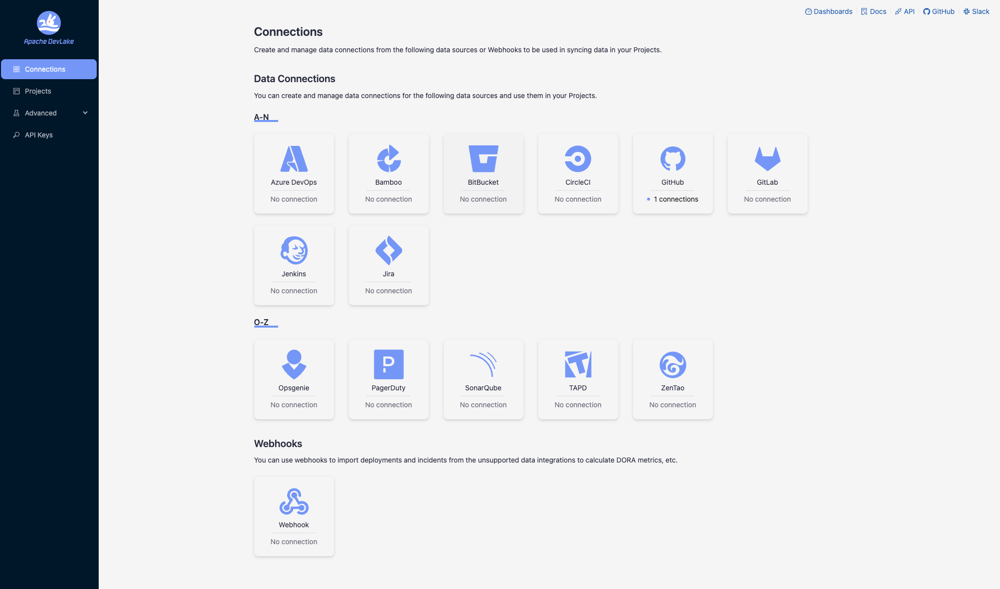

The Apache DevLake Config UI provides a user-friendly interface for configuring the data collection process. To access the Config UI, please visit http://localhost:4000.

## Basic Configuration
To ensure the proper functioning of DevLake, follow these two key steps:

### Step 1 - Add Data Connections

    
- Step 1.1 - Add a connection. Configure the endpoint and authentication details to connect to the source data.

- Step 1.2 - Add data scope, such as Git repositories, issue boards, or CI/CD pipelines, to determine what data should be collected.

- Step 1.3 - Add scope config (optional). Define the specific data entities within the data scope for collection or apply transformation rules to the raw API responses.

### Step 2 - Collect Data in a Project
- Step 2.1 - Create a project. DevLake assesses DORA metrics at the project level. For more information on organizing DevLake projects, please refer to [how to organize DevLake projects](../GettingStarted/HowToOrganizeDevlakeProjects) for more details.

- Step 2.2 - Associate connection(s) with the project. When associating a connection with a project, you can select specific data scopes. All connections linked to the same project will be considered part of the same project for calculating DORA metrics.

- Step 2.3 - Set the synchronization policy. Specify the sync frequency, time range and the skip-on-fail option for your data.

- Step 2.4 - Start data collection. Choose the desired [mode](#step-2---collect-data-in-a-project) for collecting data.

### Step 3 - Check the Data in Grafana Dashboards
To view the collected data, click on the "Dashboards" button located in the top-right corner of Config UI. For detailed instructions, please refer to the [Grafana manuals](Dashboards/GrafanaUserGuide.md).

## Examples
For detailed examples, please refer to the respective documentation files available in this folder, such as [GitHub configuration](GitHub.md), [GitLab configuration](GitLab.md), [Jira configuration](Jira.md) and more. They provide step-by-step instructions and guidance for configuring DevLake with different platforms.

## Q&A

#### Q1. What are the specific sync policies to configure?
- Time Filter: This allows you to select the desired time range for syncing data, optimizing the collection process.

- Frequency: You can determine the frequency of data synchronization by choosing a sync frequency option or specifying a cron code for a custom schedule.

- Running Policy: By default, the "Skip failed tasks" option is enabled. This helps prevent data loss in scenarios where you are collecting a large volume of data (e.g., 10+ GitHub repositories, Jira boards, etc.). When a task fails, this policy allows the pipeline to continue running, preserving the data collected by successful tasks. You can rerun the failed tasks later from the blueprint's detail page.

#### Q2. What data collection modes do DevLake support?
Three modes.
- _Collect Data (Default)_: This mode retrieves data within the specified time range. Tools and entities that support incremental refresh will utilize this method, while those that only support full refresh will perform a full refresh. This mode is the default choice for recurring pipelines.
- _Collect Data in Full Refresh Mode_: In this mode, all existing data within the designated time range will be deleted and re-collected. It is useful for removing outdated or irrelevant data from DevLake that no longer exists in the original tools.
- _Re-transform Data_: This mode does not collect new data. Instead, it applies the latest transformation rules from the Scope Config to the existing data.

## Troubleshooting

#### 1. What can be done when a data collection failed or partially succeeded?
- First, re-run the failed task once all other tasks have completed. If the task still fails, proceed to the next steps.
- Capture a screenshot of the error message associated with the failed task.
- Download the logs from the pipeline for further analysis.
- Visit the [GitHub repository](https://github.com/apache/incubator-devlake/issues) and create a bug report. Include the captured screenshot and the downloaded logs in the bug report.

   

For other problems, please check the [troubleshooting](/Troubleshooting/Configuration.md) doc, [create an issue](https://github.com/apache/incubator-devlake/issues), or contact us on [Slack](https://join.slack.com/t/devlake-io/shared_invite/zt-17b6vuvps-x98pqseoUagM7EAmKC82xQ).
