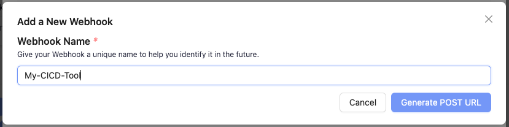
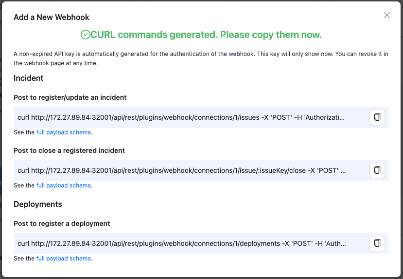

Visit config-ui: `http://{localhost}:4000`.

### Step 1 - Add a new incoming webhook

Go to the 'Connections' page. Create a webhook with a unique name.

### Step 2 - Create webhooks connection

Click on Generate POST URL, and you will find three webhook URLs. 

Copy the ones that suit your usage into your CI/CD or issue-tracking systems. You can always come back to the webhook page to copy the URLs later on.

A non-expired API key is auto-generated for the authentication of the webhook. This API key only shows in the payload when you create the webhook. However, you can always revoke and generate a new token when you view the webhook details.

See the [full payload schema](../Plugins/webhook.md) of webhooks.

### Step 3 - Use webhook in a project

If you want to use the webhook data to measure [DORA metrics](../DORA.md), you have to associate it with a DevLake project.

- Go to the 'Incoming Webhooks' tab on a project's page.
- Add webhook by selecting the existing webhook. 
- Go to the project's blueprint page and click 'Collect Data'. This will trigger the DORA plugin to measure DORA metrics with the data collected by the [data connections and webhooks associated with this project](../GettingStarted/HowToOrganizeDevlakeProjects.md#2-why-is-it-important-to-organize-projects).

#### Put webhook on the internet

For the new webhook to work, it needs to be accessible from the DevOps tools from which you would like to push data to DevLake. If DevLake is deployed in your private network and your DevOps tool (e.g. CircleCI) is a cloud service that lives outside of your private network, then you need to make DevLake's webhook accessible to the outside cloud service.

There are many tools for this:

- For testing and quick setup, [ngrok](https://ngrok.com/) is a useful utility that provides a publicly accessible web URL to any locally hosted application. You can put DevLake's webhook on the internet within 5 mins by following ngrok's [Getting Started](https://ngrok.com/docs/getting-started) guide. Note that, when posting to webhook, you may need to replace the `localhost` part in the webhook URL with the forwarding URL that ngrok provides.
- If you prefer DIY, please check out open-source reverse proxies like [fatedier/frp](https://github.com/fatedier/frp) or go for the classic [nginx](https://www.nginx.com/).

## Troubleshooting

If you run into any problems, please check the [Troubleshooting](/Troubleshooting/Configuration.md) or [create an issue](https://github.com/apache/incubator-devlake/issues).
