This document describes everything you need to know about DORA, and implementing this powerful and practical framework in DevLake.

## What are DORA metrics?

Created six years ago by a team of researchers, DORA stands for "DevOps Research & Assessment" and is the answer to years of research, having examined thousands of teams, seeking a reliable and actionable approach to understanding the performance of software development teams.

DORA has since become a standardized framework focused on the stability and velocity of development processes, one that avoids the more controversial aspects of productivity and individual performance measures.

There are two key clusters of data inside DORA: Velocity and Stability. The DORA framework is focused on keeping them in context with each other, as a whole, rather than as independent variables, making the data more challenging to misinterpret or abuse.

Within velocity are two core metrics:

- [Deployment Frequency](./Metrics/DeploymentFrequency.md): Number of successful deployments to production, how rapidly is your team releasing to users?
- [Lead Time for Changes](./Metrics/LeadTimeForChanges.md): How long does it take from commit to the code running in production? This is important, as it reflects how quickly your team can respond to user requirements.

Stability is composed of two core metrics:

- [Median Time to Restore Service](./Metrics/MTTR.md): How long does it take the team to properly recover from a failure once it is identified?
- [Change Failure Rate](./Metrics/CFR.md): How often are your deployments causing a failure?

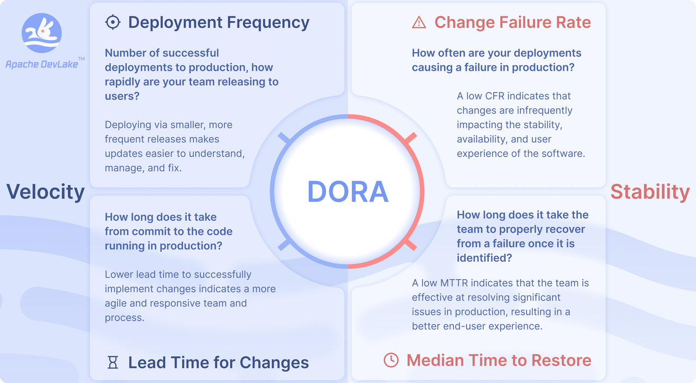

To make DORA even more actionable, there are well-established benchmarks to determine if you are performing at "Elite", "High", "Medium", or "Low" levels. Inside DevLake, you will find the benchmarking table available to assess and compare your own projects.

## Why is DORA important?

DORA metrics help teams and projects measure and improve software development practices to consistently deliver reliable products, and thus happy users!

## How to implement DORA metrics with Apache DevLake?

DevLake measures DORA metrics at the [project level](GettingStarted/HowToOrganizeDevlakeProjects.md#2-why-is-it-important-to-organize-projects). You can set up DORA metrics in a few steps:

- **Install**: via [Docker Compose](GettingStarted/DockerComposeSetup.md) or [Helm](GettingStarted/HelmSetup.md).
- **Configure and collect data**:
  - Create [data connections](Overview/KeyConcepts.md#data-connection) to retrieve the data from various tools such as Jira, GitHub, Jenkins, etc.
  - Configure the DORA-related [scope config](Overview/KeyConcepts.md#scope-config) to define `deployments` and `incidents`.
  - Create a DevLake project, and associate the data connections with the project. Collect data to see DORA metrics
- **Report**: DevLake provides a built-in DORA dashboard and another dashboard to help you debug DORA. See an example screenshot below or check out our [live demo](https://grafana-lake.demo.devlake.io/grafana/d/qNo8_0M4z/dora?orgId=1). 
  
  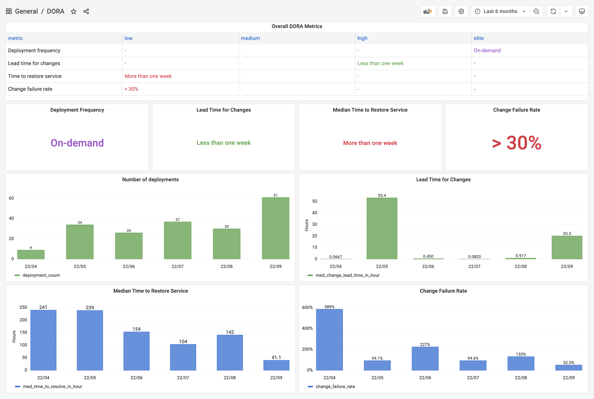

DevLake now supports Jenkins, GitHub Action, GitLab CI, BitBucket and Azure Pipelines as the data sources for `deployments`; Jira boards, GitHub issues, TAPD workspaces and Zentao issues as the sources for `incidents` data; Github/BitBucket/Azure/GitLab repos as the sources for `Pull Requests` and `Commits`.

If your CI/CD or incident management tools are not listed on the [Supported Data Sources](./Overview/SupportedDataSources.md) page, have no fear! DevLake provides incoming webhooks to push your `deployments` or `incidents` to DevLake. The webhook configuration doc can be found [here](./Configuration/webhook.md).

## A real-world example

Let us walk through the DORA implementation process for a [project team](GettingStarted/HowToOrganizeDevlakeProjects.md#43-measuring-dora-at-the-team-level) with the following toolchain

- Source Code Management and Code Review: GitHub
- Continous Deployments: GitHub Actions & CircleCI
- Incident management: Jira

Calculating DORA metrics requires three key entities: **Pull requests**, **deployments**, and **incidents**. Their exact definitions of course depend on a project's DevOps practice and vary project by project. For the project in this example, let us assume the following definition:

- Code Changes: All commits and pull requests in GitHub.
- Deployments: GitHub workflow run whose jobs contain "deploy" and "push-image" in their names and CircleCI deployments.
- Incidents: Jira issues whose type is "DORA Incident"

In the next section, we will demonstrate how to configure DevLake to implement DORA metrics for the aforementioned example project team.

### Step 1 - Configure GitHub & Jira connections

1.1 Visit the config-ui at `http://localhost:4000`.

1.2 Go to the __Connections__ page. Create a Jira connection.

1.3 Add your project's Jira boards. Click the `Associate Scope Config` icon to configure for DORA metrics.

  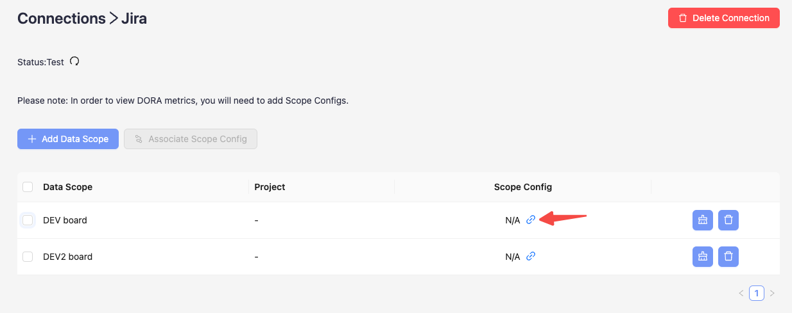

  To make it simple, fields with the  label are DORA-related configurations for every data source. Via these fields, you can define what "incidents" and "deployments" are for each data source.

  This project uses Jira issue type `DORA Incident` as "incident". Please select the `DORA Incident` for the `Incident` field. Jira issues belonging to this type will be converted to 'INCIDENT' in DevLake.
    
  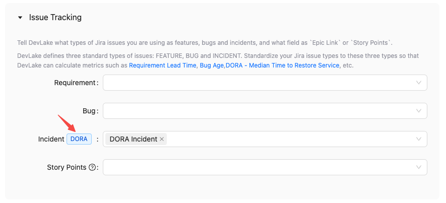


1.4 Create a GitHub connection. Add the GitHub repositories. Once added, associate the scope configuration with the repositories.
  
  In this project, the GitHub CI jobs 'deploy' and 'push-image' are recognized as deployments. To identify these deployments, please use the pattern '(?i)(deploy|push-image)'. GitHub Workflow runs that match this pattern will be transformed into 'deployments' and recorded in the table 'cicd_deployments' in DevLake.
  
  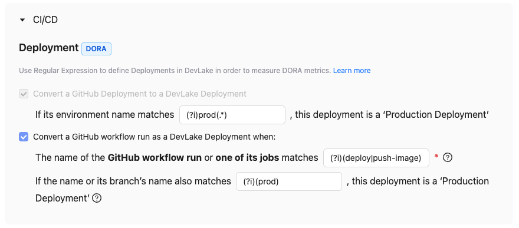
  
  Please note that starting from v0.20, DevLake automatically collects GitHub deployments and converts them into DevLake deployments by default.

### Step 2 - Collect CircleCI deployments via webhook

Using CircleCI as an example, we demonstrate how to actively push data to DevLake using the Webhook approach, in cases where DevLake does not have a plugin specific to that tool to pull data from your data source. Please note that CircleCI will be supported from v0.21.

2.1 Go to the __Connections__ page. Add a webhook called 'CircleCI'.

2.2 Copy the curl command to register deployments to Devlake. This curl command includes a non-expired [API key](Configuration/APIKeys.md) generated automatically.

  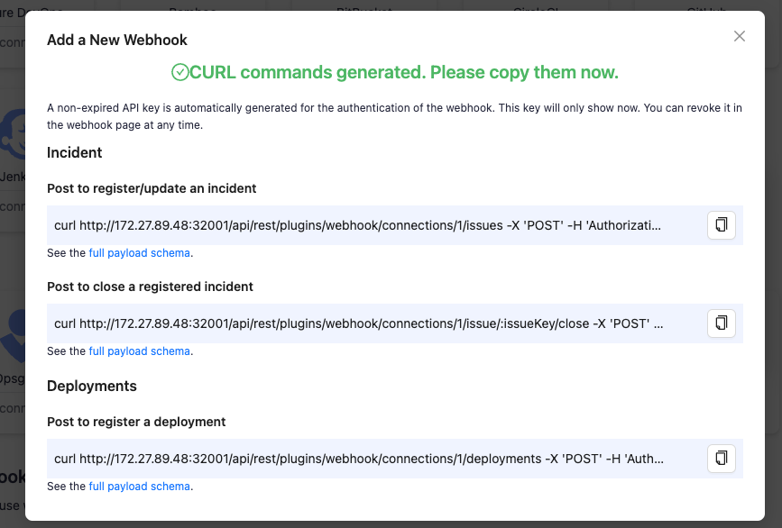

2.3 Head to your CircleCI's pipelines page in a new tab. Find your deployment pipeline and click `Configuration File`.
  
  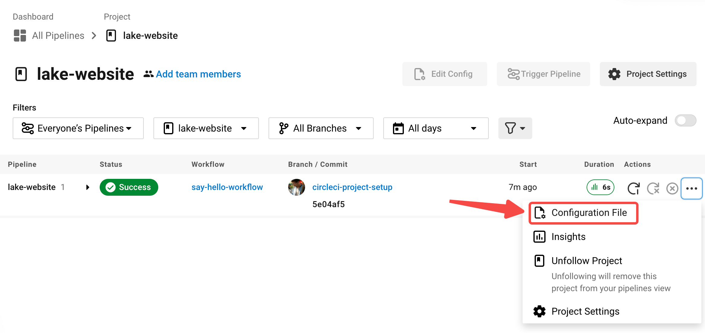

2.4 Paste the curl command to the `config.yml`. Change the key-values in the payload. See the full payload schema [here](./Plugins/webhook.md/#deployment).

```
version: 2.1

jobs:
  build:
    docker:
      - image: cimg/base:stable
    steps:
      - checkout
      - run:
          name: "build"
          command: |
            echo Hello, World!

  deploy:
    docker:
      - image: cimg/base:stable
    steps:
      - checkout
      - run:
          name: "deploy"
          command: |
            # The time a deploy started
            start_time=`date '+%Y-%m-%dT%H:%M:%S%z'`

            # Some deployment tasks here ...
            echo Hello, World!

            # Send the request to DevLake after deploy
            # The values start with a '$CIRCLE_' are CircleCI's built-in variables
            curl http://127.0.0.1:4000/api/plugins/webhook/2/deployments -X 'POST' -d "{
              \"commit_sha\":\"$CIRCLE_SHA1\",
              \"repo_url\":\"$CIRCLE_REPOSITORY_URL\",
              \"start_time\":\"$start_time\"
            }"

workflows:
  build_and_deploy_workflow:
    jobs:
      - build
      - deploy
```


2.5 Run the CircleCI pipeline. Visit DevLake's DB to check if the deployments have been successfully pushed to DevLake. The deployments will appear in table [cicd_deployments](DataModels/DevLakeDomainLayerSchema.md#cicd_deployments) and [cicd_deployment_commits](DataModels/DevLakeDomainLayerSchema.md#cicd_deployment_commits) in DevLake's database.

  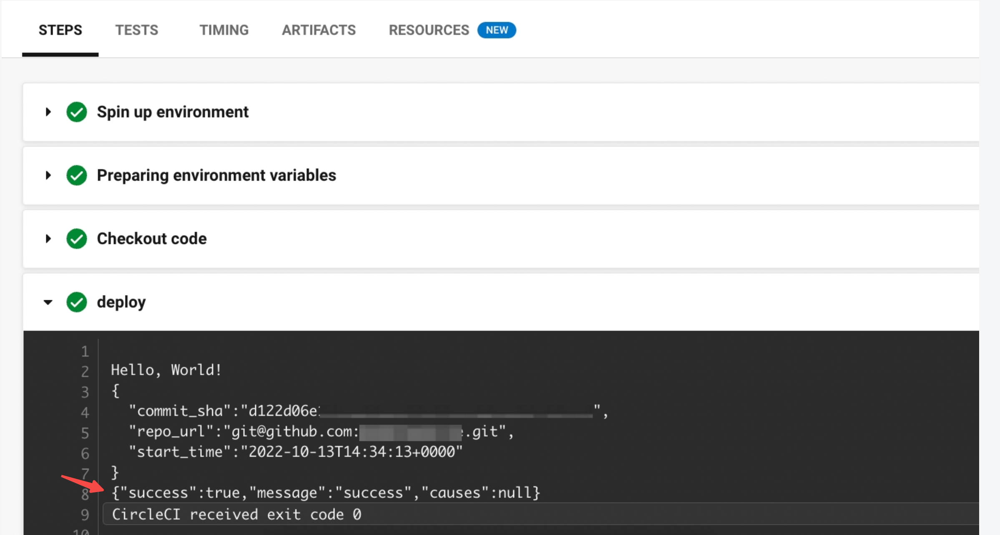

  


### Step 3 - Create a project and collect data
Once all the data connections and webhooks have been configured, it is essential to associate them with a DevLake project. This association is necessary to accurately measure DORA metrics.

3.1 Go to the __Projects__ page. Create 'project1' and enable DORA metrics.
  
  

3.2 Add Jira and a GitHub connections to this project. 

   

  Choose the Jira boards and GitHub repos that belong to 'project1'.

   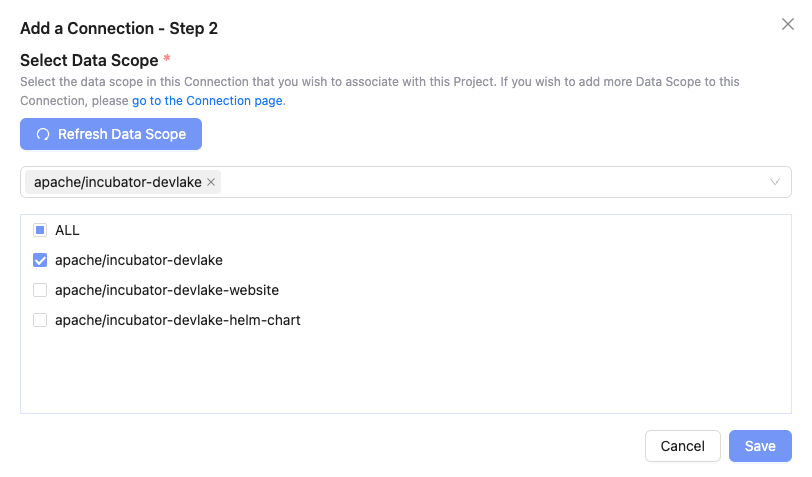

3.3 Go to the __webhooks__ tab. Add the existing webhook 'CircleCI' to this project.

   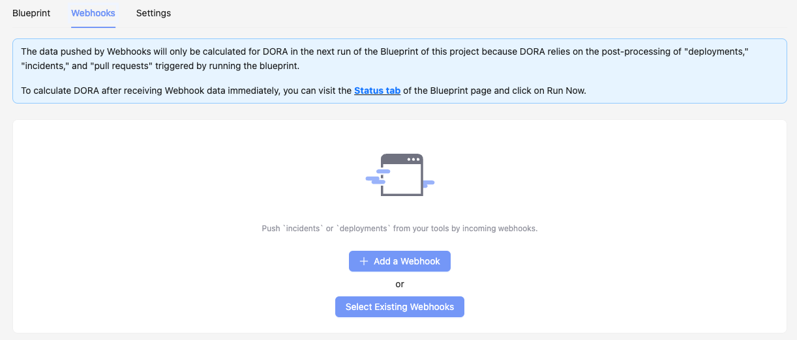

   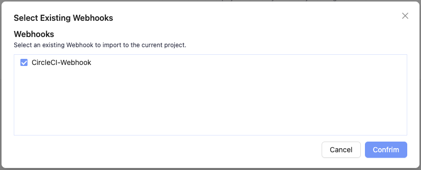

3.4 Go to the __blueprint status__ tab, click `Collect All` to start data collection.

### Step 4 - View and customize DevLake's DORA dashboard

With all the data collected, DevLake's DORA dashboard is ready to deliver your DORA metrics and benchmarks. 

Click the `Dashboards` on the top right corner. You can find the DORA dashboard within the Grafana instance shipped with DevLake, ready for you to put into action.

You can customize the DORA dashboard by editing the underlying SQL query of each panel.

For a breakdown of each metric's SQL query, please refer to the corresponding metric docs:

- [Deployment Frequency](./Metrics/DeploymentFrequency.md)
- [Lead Time for Changes](./Metrics/LeadTimeForChanges.md)
- [Median Time to Restore Service](./Metrics/MTTR.md)
- [Change Failure Rate](./Metrics/CFR.md)

If you are not familiar with Grafana, please refer to our [Grafana doc](Configuration/Dashboards/GrafanaUserGuide.md), or jump into Slack for help.

<br/>

:tada::tada::tada: Congratulations! You are now a DevOps Hero, with your own DORA dashboard!

<br/><br/>

## Try it Out

To create the DORA dashboard with your own toolchain, please look at the [configuration tutorial](Configuration/Tutorial.md) and [project organization documentation](GettingStarted/HowToOrganizeDevlakeProjects.md) for more details.

<br/>

## Troubleshooting

If you run into any problem, please check the DORA debug dashboard, [DORA troubleshooting documentation](/Troubleshooting/Dashboard.md#debugging-dora-issue-metrics) or [create an issue](https://github.com/apache/incubator-devlake/issues) on GitHub.
