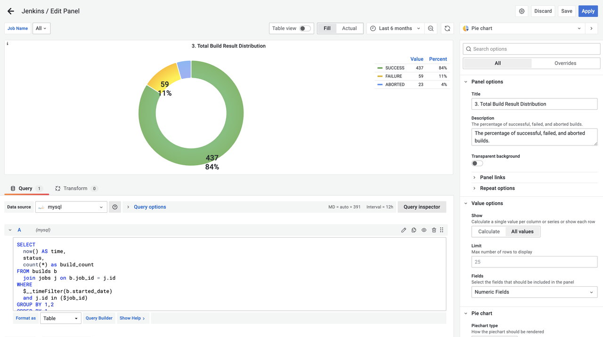

<head>
    <title>Introduction to Apache DevLake and Implementing DORA Metrics</title>
    <meta name='description' content={'Discover how to implement DORA metrics for your software development process. Improve your engineering performance with our open-source platform.'}/>
    <meta name='keywords' content={'DORA Metrics, Open-Source DORA, DORA Metrics DevOps, Implement DORA Metrics, DevOps DORA Metrics'}/>
</head>

## What is Apache DevLake?

Apache DevLake (Incubating) is an open-source dev data platform that ingests, analyzes, and visualizes the fragmented data from DevOps tools to extract insights for engineering excellence, developer experience, and community growth.

Apache DevLake is designed for developer teams looking to make better sense of their development process and to bring a more data-driven approach to their own practices. You can ask Apache DevLake many questions regarding your development process. Just connect and query.

## What can be accomplished with DevLake?
- Unified data integration: Bring together DevOps data from across the Software Development Life Cycle (SDLC) with our [standard data model](/docs/DataModels/DevLakeDomainLayerSchema.md).
- Out-of-the-box insights: Access key engineering metrics through intuitive, use-case driven dashboards.
- Customizable: Extend DevLake to align with your unique needs, adding [data sources](SupportedDataSources.md), [metrics](/docs/Metrics/), and [dashboards](/livedemo/EngineeringLeads/DORA) as required.
- Industry standards implementation: Use DevLake to apply recognized [DORA metrics](/docs/DORA.md) to optimize DevOps performance.
- Create a thriving culture: DevLake is centered on healthy practices that may help teams adopt and build a practical data-driven culture.

## How do I use DevLake?
### 1. Setting-up DevLake
- To implement a proof of concept for Apache DevLake tailored to your specific use cases, you can install it on your local machines using Docker Compose. The detailed instructions for this setup can be found in the [Docker Compose setup documentation](/docs/GettingStarted/DockerComposeSetup.md).
- Alternatively, if your infrastructure is powered by Kubernetes, you can explore the [Helm setup](../GettingStarted/HelmSetup.md) option. The Helm setup documentation provides guidance on deploying and configuring Apache DevLake using Helm.

### 2. Configuring Data Source
- Once Installed, you can start configuring DevLake with [supported data sources](SupportedDataSources.md) like GitHub, GitLab, Jira, Jenkins, BitBucket, Azure DevOps, SonarQube, PagerDuty, TAPD, ZenTao, Teambition, and we are extending our support to many other tools, feel free to check out the [roadmap](Roadmap.md).
- However, if your CI/CD tool is not currently supported by DevLake, you can utilize the [webhooks](https://devlake.apache.org/docs/Plugins/webhook/) feature. The Webhooks feature allows you to actively push data to DevLake when there is not a specific plugin available for your DevOps tool.

   

   

### 3. Creating your Project
- Once you have connected a data source to Apache DevLake, you can create a "Project" to ensure that you are all set for execution. The process of setting up a project in DevLake typically involves four steps:

   

### 4. Checking the Dashboards and Metrics
- After configuring your project in DevLake, you can access pre-built dashboards in Grafana. These dashboards provide visualizations and insights for various metrics related to software development.

   

- To customize the dashboards according to your specific goals and requirements, you can tweak them using Grafana's features. Additionally, if you prefer to create your own dashboards, you have the option to use SQL queries to fetch the necessary data from DevLake referring to the [domain layer data schema](/docs/DataModels/DevLakeDomainLayerSchema.md) and SQL examples in the [metrics documentation](/docs/Metrics/).

   