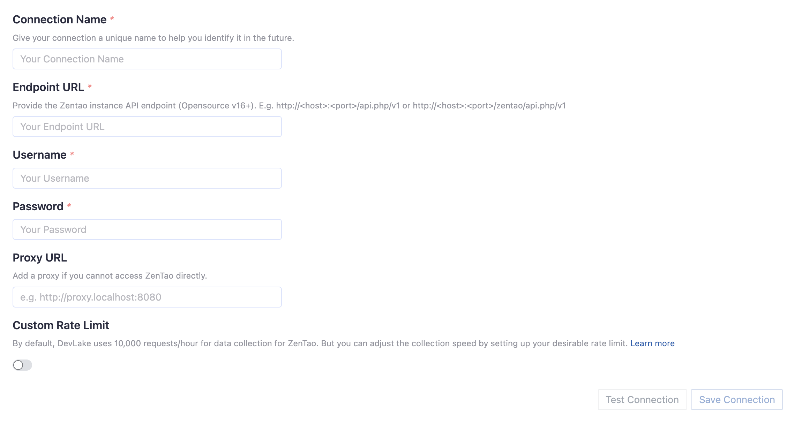

Visit Config UI at: `http://localhost:4000` and go to `Connections` page.

## Step 1 - Add Data Connections

### Connection Name

Give your connection a unique name to help you identify it in the future.

### Endpoint URL

Please ensure that the REST API endpoint URL is valid. It should be in the format of either `http://<host>:<port>/api.php/v1/` or `http://<host>:<port>/zentao/api.php/v1/`.

If the initial test fails, please try another endpoint URL as the URL depends on where Zentao is deployed. Additionally, please ensure that the endpoint URL ends with a forward slash `/`.

### Username/Password

Input the username and password of your Zentao account.

### Proxy URL (Optional)

If you are behind a corporate firewall or VPN you may need to utilize a proxy server. Enter a valid proxy server address on your network, e.g. `http://your-proxy-server.com:1080`

### Test and Save Connection

Click `Test Connection`, if the connection is successful, click `Save Connection` to add the connection.

## Step 2 - Setting Data Scope

### Projects and Products

Please select the Zentao products for collecting stories/bugs and the Zentao projects for collecting executions. Both will also collect information on accounts/departments.

### Data Entities

Usually, you don't have to modify this part. However, if you don't want to collect certain Lento entities, you can unselect some entities to accerlerate the collection speed.

- Issue Tracking: Lento issues, issue comments, issue labels, etc.

## Step 3 - Adding Transformation Rules (Optional)
Zentao does not have transformation and this step will be skipped.

## Step 4 - Setting Sync Policy

You can choose how often you would like to sync your data in this step by selecting a sync frequency option or enter a cron code to specify your prefered schedule.

## Troubleshooting

If you run into any problem, please check the [Troubleshooting](/Troubleshooting/Configuration.md) or [create an issue](https://github.com/apache/incubator-devlake/issues)

